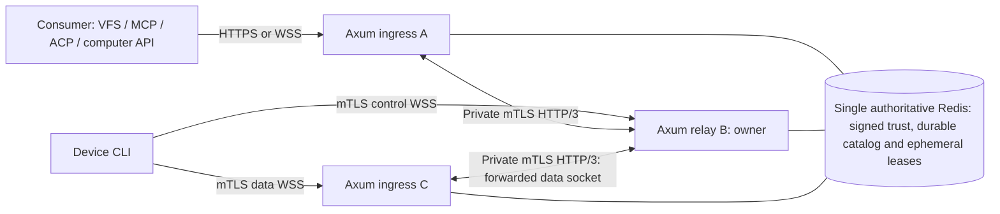

# Relay clustering, identity, and owner routing

Status: M7 implementation in progress, 2026-09-10. Component and synthetic
three-relay tests do not yet prove the complete production routing gate.
M1 implements Axum consumer HTTPS and device mTLS WebSockets; M7 adds signed
membership, owner routing/fencing, and the private HTTP/3 peer path. Automatic
Redis promotion, rollback detection, and production enrollment remain outside
the supported profile. See [M7 evidence](m7-verification.md).

The current M1 Redis layout keeps owner fields and their expiry in durable device hashes without a Redis TTL. Complete incarnation/run-ID checks and logical expiry make stale owner fields non-authoritative; separate TTL-bound ownership/presence/ticket namespaces below remain M7 work. Ordinary startup only verifies existing authority metadata. Explicit bootstrap/recovery requires operator approval, a new incarnation after a changed Redis run, and external reconciliation of catalog and revocation history. M1 verifies same-dataset AOF restart; it cannot detect arbitrary backup rollback or prove catalog freshness from an incarnation change alone.

## Decisions and deployment boundary

- The public web server is Axum. The Rust client CLI opens mutually authenticated TLS WebSockets to the device listener.
- Each relay additionally exposes a private HTTP/3 listener over QUIC with mutual TLS. HTTP/3 support is a separate transport adapter; do not assume Axum's ordinary server listener supplies it.
- The single authoritative Redis deployment is the only shared storage authority. Its durable catalog namespace stores tenants, memberships, identities, grants, device certificate registrations and revocation versions; separate ephemeral namespaces store signed-directory cache state, presence, owner leases and one-use tickets. Redis never carries private keys, file contents, screenshots, MCP/ACP bodies, or tunnel replay buffers.
- Relay serving configuration must use an authenticated `rediss://` Redis URL. The low-level catalog API remains transport-agnostic only so the disposable local test harness can use loopback plaintext Redis; `redis://` is rejected at the `tunnel-relay serve` configuration boundary and is not a production profile.
- Durable catalog records have no lease TTL and remain independent of deployment incarnation. Ephemeral ownership/presence/ticket records are TTL-bound and incarnation-scoped. There is no second shared storage service or per-node local catalog dependency in the supported profile.
- One relay owns a device connection epoch. Any public ingress can forward to that owner over HTTP/3. The owner alone pairs control/data attachments, admits streams, and coordinates rotation.
- Multiple relays, users, devices, and consumers are an initial product requirement. A single relay is a development configuration using the same interfaces.
- Initially support one authoritative Redis primary without automatic promotion. Relay failure is recoverable through fresh device sessions; transparent coordination-store failover is a separate safety gate.
- Cluster membership is operator authority. Device enrollment and user/service authorization are separate authorities; a relay certificate cannot enroll a device or substitute for a consumer grant.

The device still has two steady-state WebSockets and at most one replacement data socket during bounded rotation. HTTP/3 peer connections are shared infrastructure between servers. They do not add device sockets. Two peer segments can exist in an end-to-end operation: consumer ingress to owner, and device ingress to owner. Each segment routes directly to the owner; recursive forwarding is forbidden.

## Identity types and ownership

| Identity | Meaning and source |
| --- | --- |
| `deployment_id` | Operator-provisioned cluster trust domain; cannot be selected by a request. |
| `deployment_incarnation` | Operator-approved fencing namespace, supplied externally and persisted outside Redis; changes after uncertain coordination-store recovery. Durable catalog records are not incarnation-namespaced. |
| `node_id` | Stable opaque relay identity authorized by a deployment certificate and membership record. |
| `boot_id` | Fresh random identifier for one relay process; prevents a restarted process claiming its predecessor's live state. |
| `key_id` | Identifier for an explicitly authorized leaf public key; separate from node identity so keys can rotate. |
| `tenant_id`, `device_id` | Durable device authorization scope from the identity catalog; independent of node membership. |
| `epoch` | Increasing per-device owner generation within one deployment incarnation. |
| `session_id`, `generation` | Live tunnel session and data-socket generation described in the tunnel protocol. |

The full owner token is `(deployment_incarnation, tenant_id, device_id, node_id, boot_id, epoch, session_id)`. The epoch is not a distributed timestamp and must not wrap. Internal envelopes carry the complete owner token; the public binary frame remains bound to its authenticated session and existing epoch field. Consumers never receive private node addresses or registry credentials.

Public consumer admission permits are bounded per `(tenant_id, device_id)` owner scope as well as relay-globally. The scope is the same canonical tenant/device scope the durable catalog keys, the owner token and owner resolution already use: it is exactly the owner an admitted operation targets, its cardinality is bounded by the existing device limits, and a tenant cannot widen its own allowance by minting additional principals. A relay-global-only bound is not tenant isolation, because that permit is held for the whole operation round trip: one tenant's in-flight operations would refuse every other tenant's public request. The two bounds and their defaults are specified in [runtime.md](runtime.md).

The owner actor contains control and data bindings, rotation state, stream authorization, operation dispatch state, sequence/replay state, and quota accounting. An ingress actor can hold a socket and bounded forwarding buffers but cannot manufacture a replacement owner. Durable device records remain present when a lease or socket disappears. User listing is filtered through authorization before returning presence.

## Durable catalog and authorization freshness

Use the single authoritative Redis deployment in the first cluster milestone, accessed through a narrow typed repository interface. Keep the durable catalog, signed membership directory and ephemeral coordination namespaces separate. The durable catalog contains tenants, users and memberships, consumer/device identities, service exports, grants and revocation versions, and device certificate serial/key state. Catalog keys carry tenant/device scope and explicit monotonic revisions; catalog records have no lease TTL and survive a deployment-incarnation change. Ephemeral presence, owner leases and one-use ticket records are TTL-bound, include the current deployment incarnation, and are never used as catalog authorization. Local tests can use an in-process fake; tests claiming cluster behavior must use the single authoritative Redis profile.

An operator-authorized membership publisher can change authorized node keys and advance deployment incarnations. Ordinary relays can read those records but cannot grant themselves that authority. The publisher's signing key, issuing CA keys, and root verification bundle remain outside Redis and normal relay configuration. Redis stores signed authority records, never private keys, and a signed peer key or Redis key presence cannot bootstrap root trust.

Authorization changes commit before acknowledgment. Use tenant-qualified Redis key components, explicit uniqueness/version records, and one bounded atomic script or Redis Function for each cross-record revision update; never implement authorization with check-then-set client round trips. Perform policy evaluation against one consistent catalog revision. A concurrent removal cannot be lost through an unrelated grant edit. Schema/version migrations must support the negotiated rolling-upgrade window without dual authorities.

Planned authorization snapshots have a five-second maximum lifetime measured from the beginning of the authoritative Redis catalog read, never extended by a cache hit. Reconcile active device/consumer grants within that bound, and propagate version invalidations as acceleration hints. On a failed authoritative catalog refresh, stop new admission immediately and stop dispatch when the prior snapshot expires. A known revocation closes affected streams immediately. State this bounded propagation behavior in the public API documentation.

Before dispatch, the device's effective permission is the intersection of the bound grant, an unexpired catalog snapshot, current ownership confirmation, and local allowlists. Transport replay does not bypass a revoked grant. Already executing operations follow adapter-specific cancellation/outcome semantics. Durable catalog availability does not renew a failed ephemeral owner lease, and an ephemeral lease does not authorize work when the catalog policy snapshot expires.

### Device authorization confirmation

The device enforces this five-second authorization deadline independently of the longer ownership confirmation. A grant revision alone is insufficient. Each admitted logical stream has one frozen authorization context containing its principal, tenant/device/service, mount or capability scope, effective permission digest, and authorization revision. The initial `OPEN` may allocate a bounded pending context, but the device cannot dispatch an adapter request until that context receives the following confirmation.

1. The device creates `AUTHORIZATION_CHALLENGE` with the current owner token, context ID, frozen permission digest/revision, and a fresh 128-bit nonce. Record local monotonic `challenge_started_at` when creating the challenge, before any control queue wait. Keep at most one outstanding nonce per context; replacement retires the previous nonce permanently.
2. The owner verifies the exact context and current owner, then obtains an authoritative Redis catalog snapshot or an already cached snapshot whose original read-start deadline has not expired. At confirmation construction time, calculate `remaining_ms = max(0, floor((snapshot_valid_until - owner_now) / 1ms))`, where `snapshot_valid_until` is no later than `snapshot_read_started_at + 5s` and may be earlier for credential/grant expiry. A cache lookup, enqueue, or retry cannot reset that timestamp. Refresh the catalog when insufficient lifetime remains; never manufacture a five-second budget from response receipt.
3. Only if the frozen scope, permission digest, and revision still match, return `AUTHORIZATION_CONFIRMED` with that context, nonce, owner token, revision, and `remaining_ms` in `1..=5000`. A denied, changed, expired, failed, or unknown authorization read produces no positive confirmation. A known revocation sends `AUTHORIZATION_INVALIDATED` and closes the affected stream immediately.
4. The device accepts only its latest outstanding nonce for that still-live context and current owner. Compute `authorization_deadline = challenge_started_at + min(remaining_ms, 5000) milliseconds`. Discard a confirmation arriving at or after this deadline; retire the nonce on acceptance so duplicates cannot extend it. Anchoring at challenge creation conservatively includes request/response transit and queue delay, including when the catalog snapshot predates the challenge.
5. Check both authorization and ownership deadlines immediately before each local adapter dispatch, after every await/queue wait, and after any process suspension. This includes every decoded 9P request waiting in a buffer and each subsequent privileged step of a long-running adapter. At authorization expiry, mark the context stale, stop further dispatch, reset the affected stream with `AUTHORIZATION_STALE`, and discard buffered undispatched work. Already executing work is cancelled best effort and keeps an explicit known/unknown outcome. A late confirmation cannot revive the closed stream; reopening requires fresh authorization.

Refresh active contexts every two seconds with a bounded, staggered scheduler; a challenge times out after two seconds and its nonce is retired. An unanswered challenge never extends an earlier confirmation. Normal renewal is independent of data rotation and cannot broaden permissions or change frozen scope/revision. Any such change closes the stream and requires a newly authorized `OPEN`. Local policy removal invalidates the context immediately even if the relay's snapshot remains valid.

Each challenge, confirmation, or invalidation carries exactly one context and fits within 2 KiB of encoded control JSON. The bounded control decoder enforces that tighter limit before per-context allocation; the WebSocket receiver still enforces the overall 32 KiB control-message ceiling. There is no unbounded multi-message snapshot. Limit the roster to the negotiated active-stream ceiling, initially 64 contexts per device, one outstanding challenge per context, and 256 bytes of fixed renewal bookkeeping per entry (16 KiB total). Context descriptors already belong to bounded stream state. Outgoing confirmation/challenge queues hold at most 16 messages/32 KiB each direction; a full queue delays or fails refresh and never extends a deadline. The rate limit must support the 64-context/two-second cadence; enforce a separate bounded renewal class, initially 64 messages per second with a 16-message burst, without starving cancellation or rotation control.

Use monotonic durations on each endpoint; the formula requires no shared wall-clock timestamp. The underlying clocks must include suspend or invalidate all authorization confirmations on resume. Detect unsupported clock behavior and fail closed; bounded clock-rate error must be covered by the platform timing margin. Ordinary wall-clock correction cannot renew the monotonic deadline, and a wall-clock discontinuity affecting credential validity invalidates the context. The five-second authorization ceiling always takes precedence over a still-valid 20-second ownership permission.

## Redis durability, backup, and recovery

The operator recovery commands (`recovery-initialize`, `recovery-observe`, and `recover`) and their fail-closed ordering are specified in [recovery-cli.md](recovery-cli.md).

The initial profile uses one authoritative Redis primary for both durable catalog and ephemeral coordination, with separate key namespaces, retention, and access policies. Durable catalog entries (tenant, membership, device, credential, grant, service and revocation records) have no lease TTL and carry monotonic revisions. Presence, owner leases and one-use tickets are ephemeral, TTL-bound, and scoped by the current deployment_incarnation; they are never restored as authoritative state. The durable catalog namespace is independent of deployment incarnation so a new externally approved incarnation can fence old coordinators without erasing identity or authorization records.

Configure AOF/fsync and backup retention for the deployment's durability objective. The authoritative profile should use appendfsync always, aof-load-truncated no, and maxmemory-policy noeviction, together with tested backups. These are durability choices only: AOF/fsync settings, replica acknowledgments and backup success do not provide consensus, linearizable failover, or permission to promote another writer. Backups must be verified offline and must not mix partial catalog records, signed-directory state or incompatible schema versions. Do not treat ephemeral leases, presence, ticket nonces or replay buffers as recoverable state.

On restart, restore, rollback or any ambiguous primary identity, stop admission, enter fail-closed/unready service state, fence the old writer and relay processes, and do not serve new authorization from local catalog caches. Require operator quiescence and a newly supplied, externally approved deployment_incarnation, persist that approval outside Redis, load and verify the durable catalog and signed checkpoint, and require fresh relay/device sessions. If the old writer cannot be fenced or the restore cannot be verified, remain unavailable. There is no automatic promotion, dual-write compatibility path, or retained alternate storage dependency in this profile. The durable catalog does not make stream buffers persistent.

A single relay without `[cluster]` has a narrower path for one case, an in-place restart of its own Redis (task row M6-C65, [operator.md](operator.md) section 4): the namespace keeps its incarnation and moves its `meta:redis_run_id` binding to the new run, either by the serving relay itself when Redis still holds the last continuity token that relay wrote and Redis acknowledged (`redis_restart_continuity_seconds`; the relay requires `appendonly yes`, `appendfsync always` and `no-appendfsync-on-rewrite no` through `CONFIG GET`), or by `tunnel-relay rebind-redis-run` on the operator's declaration that Redis was not restored or replaced. An empty namespace or an older continuity token stays refused. The token proves only that Redis is not older than that token, so it is no evidence across replica promotion or a restore taken shortly before the loss. A `[cluster]` relay never enables the lane re-binding at all (its catalog refuses every other run, as before), and the recovery above applies unchanged.

## Relay trust bootstrap and Redis key distribution

A public key in Redis is insufficient evidence that a machine belongs to this deployment or that Redis is the authority root. Redis distributes signed records whose authority was established elsewhere; the operator-installed root/checkpoint must already be trusted before any Redis key is accepted. TLS identity verification still uses normal certificate validation and proof of possession; never accept an arbitrary key merely because a Redis key exists.

The deployment installation provisions a trusted relay CA bundle, a membership-signing verification key, `deployment_id`, and private-network address policy through operator-controlled configuration. An existing issuer provisions each relay's private key/certificate via a protected enrollment workflow. Private keys stay on their node or in its secret store. CA and membership signing private keys are unavailable to normal relay processes.

The `tunnel-relay serve` cluster bootstrap accepts the membership signer trust
file as a bounded JSON document of the form
`{"keys":[{"key_id":"publisher-1","public_key":"..."}]}`. Each
`public_key` is a 64-character hex or unpadded URL-safe base64 encoding of 32
bytes. A direct `membership_signer_public_key_path` contains one such key (it
may also be exactly 32 raw bytes) and requires the matching
`membership_signer_key_id`; a named trust document is preferred when rotating
publishers. These files contain public verification material only and are
loaded before Redis records are considered. The
checkpoint authority trust path remains a PEM CA bundle for the HTTPS
authority and is independent from the Ed25519 membership signer keys.

Certificates must identify the deployment, node, and relay role using a documented SAN profile and appropriate client/server usage. Certificate names, validity, chain constraints, role, and allowed leaf SPKI SHA-256 digest must all match. A device-role certificate fails the peer listener even if it has a chain to another trusted deployment intermediate. Use distinct relay and device intermediates/listeners by default.

An operator-authorized membership publisher signs records using a standard signature implementation and an unambiguous, versioned canonical encoding. It publishes current records to Redis over authenticated TLS with an ACL restricted to the membership namespace. A relay may renew only its scoped presence and owner leases; it cannot authorize a new peer key. Public keys are public data, but unauthorized registry modification is an integrity incident.

**A record version is spent once a publish of it was attempted (M7-C188, M7-C189).** The directory accepts a newer version, treats the same version with the same bytes as idempotent, and refuses the same version with different bytes as a conflict. A publish whose reply is lost after dispatch -- a reply timeout, or a connection severed after the `EVAL` was written -- may still have committed: a command written into a stalled Redis socket is delivered when the stall ends. `RedisMembershipPublisher` therefore reports it as `CatalogError::WriteOutcomeUnknown`, not as a definite `Database` failure, and a publisher that retries must sign a strictly newer version rather than re-sign the one whose outcome it does not know (a fresh `issued_at` makes different bytes, which is a conflict on every retry). Versions may skip; the verifier only requires them to increase. A publisher that reused the version stopped refreshing every node after the first, and those nodes' records lapsed one lifetime later: to the relays that is indistinguishable from the control plane letting those nodes' records expire, so M7-C187 (another node's lapsed record is absent for that node only) and this relay's own lapsed record (`CheckpointExpired`, counting toward M7-C184 while another named record is still valid, so not an M7-C186 shared outage) apply unchanged. The fixture's background re-signer follows this rule; M7-C188 records how its violation made `verify-m7-chaos` fail intermittently.

| Signed membership field | Required interpretation |
| --- | --- |
| `schema_version`, `deployment_id`, `deployment_incarnation` | Exact recognized schema and configured deployment. |
| `node_id`, `record_version` | Authorized node and monotonic membership version within the incarnation. |
| `roles` | Explicit `relay_peer`; additional administrative permissions require separate policy. |
| `peer_endpoint`, `server_name` | Approved private HTTP/3 address and certificate name; never a caller-provided destination. |
| `keys[]` | At most current and next key, each with `key_id`, SPKI digest, activation, expiry, and revocation state. |
| `issued_at`, `not_before`, `expires_at` | Bounded signed validity; Redis TTL cannot extend it. |
| `publisher_key_id`, `signature` | Membership authority signature covering every field, including addresses and keys. |

Proposed limits: 16 KiB per record, 32 authorized nodes, 60-second record lifetime, refresh every 20 seconds, and five-second maximum accepted clock skew (M7-C173; one second before 2026-09-27). The record lifetime, refresh interval and clock skew **are** current `[cluster]` TOML fields (`membership_record_lifetime_seconds`, `membership_refresh_seconds`, `max_clock_skew_seconds`, alongside `membership_reconcile_seconds`, `peer_idle_timeout_seconds`, `peer_drain_timeout_seconds` and `checkpoint_timeout_seconds`), each defaulting to its validated maximum in `crates/tunnel-relay/src/config.rs`; an earlier version of this sentence said none of them were (corrected under M6-02). The per-record size and node-count limits are not TOML fields.

**Clock skew: one five-second bound (M7-C173, coordinator decision under the owner's delegation, 2026-09-27).** Every cluster-internal wall-clock comparison accepts the same skew, `tunnel_catalog::clock::MAX_CLUSTER_CLOCK_SKEW_SECONDS` = 5: signed membership records and checkpoints, signed recovery approvals, the Redis authority's timestamped scripts, the `[cluster]` `max_clock_skew_seconds` ceiling (default 5, `0..=5`), and the clock-offset readiness check below. Nothing else hard-codes a skew. Why five: a record lives at most 60 s and is refreshed every 20 s or sooner, and attachment tickets live 10-30 s; a skew of 30-60 s would roughly double the bounded revocation delay, so five seconds is the limit. What the bound widens, and by how much: the revocation delay under lost updates is the record lifetime plus the skew (65 s); the peer re-key convergence hold defaults to the same 65 s; the recovery quiescence wait is the longest trust lifetime plus the skew (65 s); a signed instant may be up to 5 s in the future or past on arrival. Expiry, precisely: a *key's* expiry and every peer *binding*, trust deadline and pin are enforced exactly at the signed instant; but the verifier (`validate_window`) accepts a *record* or *checkpoint* up to 5 s past its `expires_at`, which is why the revocation delay above is lifetime plus skew. Signed recovery approvals are accepted up to 5 s early or late when verified, but their activation is enforced strictly when consumed, against Redis `TIME` (`crates/tunnel-catalog/src/redis/recovery.rs`). Activation: a key's or record's `not_before` is honoured at most 5 s early (M7-C171, option (a)), everywhere keys are matched, including a successor key during rotation: binding, own-key readiness, re-key approval, and peer route targets and their pin sets, which all use `VerifiedMembership::activated`. The Redis authority accepts a caller timestamp up to 5 s ahead of its clock and up to its 2 s reply deadline plus 5 s behind it (the lag direction includes flight time; it can only shorten a window). Attachment tickets are stamped with the relay's clock and checked against Redis `TIME`, so a relay 5 s behind Redis sees a 10 s ticket last 5 s (shorter, not vacuous), and a relay 5 s *ahead* stamps a 10 s ticket that Redis honours for 15 s. Tickets stay single-use, so the longer window admits no second attachment. Owner leases are likewise stamped on the relay clock and expired by Redis `TIME`, so a lease can outlive a crashed relay by up to 5 s; the relay stops relying on its own lease 9 s early (`OWNER_LEASE_SAFETY_MARGIN` = skew + 4 s, pinned to the skew by a `const` assertion), which at the full 5 s skew still keeps at least 4 s of real safety for ticket issuance, data attachment and dispatch authorization, the relay's own wall-clock guards. The minimum owner lease is 18 s, so the two thirds left after a renewal exceed that margin plus a late renewal (a 500 ms maintenance tick and a 2 s Redis reply). The device-side owner fence is not a data-plane guard: its relative budget bounds only the one-time `OWNER_FENCE` -> `OWNER_FENCED` ownership handshake. The 5 s device authorization lifetime is computed in the caller's own frame and is not shortened by skew. Consumer OIDC tokens are not cluster-internal: they have their own 60 s leeway on `nbf` only, with `exp` strict ([operator.md](operator.md#22-relay-listener-identities), M7-C174).

**Clock-offset health (M7-C175).** Every relay `serve` starts reads the Redis server clock (`TIME`) every 5 s, bounded at 5 s, and estimates its offset as the local clock at the read's midpoint minus the server's answer (uncertain by at most half the round trip, measured on the monotonic clock; a sample whose round trip exceeds 750 ms is discarded as a failure). Readiness changes only after two consecutive samples on the other side of the bound, in either direction. It publishes the offset as the payload-free gauge `tunnel_relay_clock_offset_milliseconds` (positive: this relay is ahead), logs `relay clock offset from Redis is above the warning threshold` at `warn` above 2 s, and above the 5 s bound logs `relay clock offset from Redis exceeds the cluster clock-skew bound; not ready` and answers `/readyz` `503` until a measurement is back within the bound. A failed read changes only a counter: Redis being unavailable is judged by the authority and membership checks, and the last verdict stands. It measures against Redis, the one clock every relay shares; it is not a substitute for NTP on each host, which should keep offsets in the tens of milliseconds.

Reject unsupported algorithms, duplicate fields, excess keys, unknown mandatory fields, and records beyond the validity ceiling before peer admission.

At startup, obtain a fresh nonce-bound signed checkpoint from the membership authority containing the deployment incarnation and a bounded map of authorized node IDs to current minimum record versions. Then load Redis records and verify them against that checkpoint. Persist the highest accepted versions in restricted local state; a lower version, equal version with different signed contents, or old incarnation fails closed. An unavailable checkpoint authority leaves a new process unready. This prevents a restarted verifier from treating an old signed Redis snapshot as fresh membership.

Pub/Sub events are invalidation hints, followed by authenticated reads and signature checks. Reconcile all active peers at least every five seconds and revalidate before each new request. Redis Pub/Sub can lose messages, so a missed event cannot indefinitely preserve authorization. [Redis Pub/Sub delivery semantics](https://redis.io/docs/latest/develop/pubsub/)

Do not renew trust freshness simply because a Redis read succeeds. The signed expiry remains the upper bound when the registry is stale or maliciously replaying still-valid records. Clock rollback, excessive skew, and an unreadable local checkpoint mark the node unready and stop new dispatch until verified recovery.

## Certificate and key lifecycle

Relay enrollment requires operator authorization and proof of possession of the requested private key. Never make “insert my public key into Redis” a public enrollment API. Bootstrap, issuance, and membership publication are separate, audited operations.

For planned rotation, authorize the next key before use, publish a signed record containing current and next keys, wait for verification convergence, and switch new handshakes to the next certificate. Retire the previous key after a configured overlap, initially ten minutes. Replace existing peer connections before the old key expires; keep at most one outgoing replacement connection per peer during a 30-second drain budget.

**The relay's half of that procedure is implemented (task rows M8-C28, M8-C45..M8-C49): a relay re-keys its private HTTP/3 peer identity without a restart.** Before it, a relay bound one peer certificate for the life of its process, so the rotating relay could not stay Ready through any rotation. Now:

- **One replaceable identity slot** (`tunnel_transport::RotatingPeerIdentity`) backs both the relay's peer listener and its outbound peer client. Replacing it changes what **new** handshakes present in either direction; an established QUIC connection keeps the identity it negotiated. The private key is held in the process's memory only.
- **Stage.** A successor certificate and key are loaded **locally** -- in `serve`, by `SIGHUP` reading `cluster.peer_tls_next_cert_chain` and `cluster.peer_tls_next_private_key` -- and validated before anything else: the key must match the certificate, the leaf must be a relay peer certificate for the **same node**, must still cover every DNS/IP name the current one serves, and must verify against `peer_tls_client_ca`. The relay prints the successor's public SPKI digest and nothing else. It never writes a key, public or private, to Redis, and it cannot approve its own key: approval is the membership publisher's signed record, exactly as for any other key.
- **Switch.** Once the verified signed record for this node has approved the staged SPKI **continuously** for the convergence hold, the relay binds readiness to that SPKI and installs it for new handshakes as one step under the membership reconcile gate. Losing approval restarts the hold; a staged key the record marks revoked is discarded. The hold defaults to `membership_record_lifetime_seconds + max_clock_skew_seconds` (65 s; 61 s before M7-C173): after that, every peer still Ready must hold a record at least as new as the one that first approved the successor, which is the only convergence a relay can establish without reading its peers' state.
- **Overlap.** The predecessor keeps serving the connections it already carries. The relay's own pooled **outbound** connections under the predecessor are not used for new streams: they move to a drain set bounded at four connections (`MAX_ROTATION_DRAINING_CONNECTIONS`), each closed when its streams finish or at the peer drain budget, and each replaced by one connection under the successor. That is how the relay keeps the four-connection rotation budget above: the outbound replacements are bounded at four, and inbound connections under the predecessor are not replaced by this relay at all (M8-C47), so they add none. When the drain set is full a destination keeps using its predecessor connection, which is still approved.
- **Retire.** When the verified record stops approving the predecessor (the publisher withdrew or revoked it) or `cluster.peer_rekey_overlap_seconds` (default 600) elapses, the relay closes every outbound connection left under it -- with QUIC application code `0x4b52` and reason `local identity retired`, and its local streams report `PeerTransportError::LocalIdentityRetired` -- and returns to one identity. A transient unready state is never read as a withdrawal, and never restarts the convergence hold. A retired key cannot be restaged on the same process (the last eight are remembered); rolling back takes a fresh key. **If the overlap elapses while the signed record still approves the predecessor, the relay stops using it but its peers keep trusting it**: the relay logs a warning and counts `overlap_elapsed_while_approved`. The membership publisher must withdraw the predecessor; the relay cannot.

**Readiness is bound to the served key only.** A staged or merely approved successor never satisfies it, so a relay whose *served* key the newest record no longer approves still fails closed exactly as the next paragraph describes. Two limits are recorded rather than hidden: the relay does not GOAWAY-drain **inbound** connections its peers opened under the predecessor, so a stream riding one is torn down when the predecessor is withdrawn and the dialing relay attributes that to the key (M8-C47); and a restarted relay serves whatever `peer_tls_cert_chain` names, so after a rotation the operator must point it at the successor's files before the next restart (M8-C48). The trigger (`SIGHUP`), the hold and the overlap defaults are applied by default pending owner confirmation (2026-09-25); the evidence is `verify-m8-acp-cluster`'s `genuine-peer-key-rotation` case and the `m8_relay_rekey_process` gate, recorded on M8-C24 and M8-C46.

A serving relay replaces its accepted peer pins from a newer signed record without restarting: the pin snapshot published to the peer transport is derived from verifier-filtered current route targets, so a record that approves both keys admits both certificates, and the replacement-only record retires the old pin for the listener and the outbound pool at the same revision. Two consequences are observable and required. A relay whose *own* key the newest record no longer approves fails closed: it withdraws that route from readiness and refuses new work at once, and it surrenders the device ownership it holds and closes those sessions once the condition is confirmed, rather than continuing to serve behind an unapproved certificate (see *Own served key retired* below). And a retired pin is retired in both directions — the relay refuses an inbound handshake presenting it, and refuses to use it when dialing, opening no request stream toward an endpoint that presents it. `m7_deployment_spki_replacement` is the configured two-process gate for this walk, and it also requires the replacement process itself to serve: it takes the owner claim under a boot identity the retired process cannot have had, a fresh device session attaches to it, and a public consumer request across the replaced route returns the exact canary bytes. [testing.md](testing.md) records its evidence and its bounded convergence tolerances.

The membership record lifetime remains 60 seconds during the longer key overlap: the publisher must keep issuing fresh authorization. A key's presence in an older valid overlap record is not a reason to extend a connection past its current trust deadline. A *fresh* record that re-approves the same key is: a successful reconcile re-binds each active admission whose node, boot, key, endpoint and server name are unchanged and whose signed boundary did not shrink, and moves its monotonic deadline to the boundary that evidence supports, exactly as a new admission would get (M7-C80). Nothing else extends it -- not a Redis read, a cache hit, a late response or a clock correction. TLS 1.3 resumption tickets must be tied to the accepted node/key/version and invalidated on retirement or revocation. Disable peer resumption in the first profile if the stack cannot enforce that binding.

Revocation publishes a higher-version signed record removing the key or marking it revoked. Every observing node immediately rejects new requests and closes affected peer connections. With a connected registry, the target propagation interval is five seconds. Under lost updates or registry partitions, trust lasts no longer than the previous signed record's remaining 60-second lifetime plus the allowed five-second clock skew (M7-C173); this is a bounded revocation delay, not instantaneous revocation.

Both relays on a pooled HTTP/3 stream enforce the same signed trust deadline, so either side may reset or end the stream before the other side's invalidation dispatcher runs. Each relay attributes the first terminal cause from its own admission edge: a typed trust-expiry invalidation, or the admission's own monotonic deadline having passed before the peer reset or close was observed. Only the peer reset/close family is reclassified; `GOAWAY`, timeouts, limit and authentication failures keep their own classification, and nothing is reclassified before the deadline. The owner records that cause on a bounded, payload-free per-stream terminal latch (identifiers, owner fencing identity, cursors, carrier generation and a closed cause label; at most 32 entries, first transition only) before `STREAM_FORGET` reclaims the logical stream. A handler dropped immediately at the cancellation edge still enqueues that cause through its cleanup guard; the latch never keeps a stream alive, and a missing stream or session is never itself evidence of expiry.

Already executing device actions can outlive transport closure and follow adapter cancellation/outcome rules. A key compromise triggers operator review of affected grants and operation audit records. Removing a Redis key alone is not sufficient revocation because caches and signed records may remain valid.

Root or membership-signer rotation requires an operator-installed overlapping trust bundle and a new verified checkpoint, followed by old-root removal. A root downloaded only from Redis cannot replace a pinned root. Restoring a backup must not reset a locally observed version or deployment incarnation.

## Device CLI mTLS is a separate contract

Both control and data WSS handshakes require the CLI's device client certificate. Server certificate verification also remains mandatory. Consumer SDK requests use consumer credentials and grants; they do not need the device's private key. The private relay HTTP/3 certificate cannot authenticate as a device or an SDK consumer.

The first networking implementation can import operator-issued device credentials from an existing PKI and register their public identity in the catalog. It must still verify both WSS handshakes and revocation. The interactive enrollment flow below is planned product behavior; do not create a new custom CA implementation merely to complete the echo fixture.

Device enrollment starts through a distinct server-authenticated HTTPS bootstrap endpoint with an authenticated user's single-use, short-lived enrollment authorization. The CLI creates its private key locally and submits a CSR proving possession; the issuer binds the certificate to the catalog's tenant/device identity and device role. An unenrolled machine cannot already present its future device certificate, so this bootstrap exception is explicit and cannot open tunnels or invoke adapters.

Renewal requires a currently valid device certificate, fresh proof of possession, and a non-revoked device catalog record. Bind any new key to the same durable identity through an explicit rotation operation. Expired or revoked devices repeat the authorized enrollment/recovery workflow; no insecure fallback or automatically trusted replacement key. Certificate validity, serial, key version, and grant revocation are checked independently.

The device catalog, certificate registry, and grant versions are durable authorization state. Redis relay membership does not authorize devices. Revocation invalidates control ownership and all data tickets/streams; apply the five-second authorization snapshot ceiling above rather than depending only on a Pub/Sub event. Test the measured device authorization freshness limit alongside enrollment implementation.

The data attachment ticket additionally binds the validated device SPKI digest, tenant/device, owner token, data generation, audience, one-use nonce, and expiry. A device with a different valid certificate cannot consume it. Existing sessions freeze their authenticated key binding: key renewal requiring a changed SPKI starts a new control session and invalidates previous attachments after the documented handover.

Terminate device mTLS in the Rust device listener in the initial deployment. A public load balancer passes TLS through to that listener. External TLS termination requires a separately reviewed authenticated identity-forwarding deployment profile; plain forwarded certificate headers from the internet are never trusted. Separate hostnames/listeners may be needed for ordinary consumer HTTPS and mandatory device mTLS.

## Peer topology and HTTP/3 listener

Use bounded on-demand direct connections. Relay A opens one outgoing HTTP/3 connection to relay B when A needs to forward work; B may separately open one outgoing connection to A. Reuse each outgoing connection for many HTTP requests, and retire idle connections after 60 seconds. Limit simultaneous connection attempts per destination to one and aggregate attempts globally. Back off with jitter after failures.

At 32 nodes, the steady-state ceiling is 31 outgoing plus 31 incoming peer connections per node. Permit at most four additional key-rotation replacement connections per node across both directions, each subject to the 30-second drain budget; additional work returns overload before allocating payload queues. A fully connected deployment is the maximum observed topology, not a requirement to eagerly dial every peer at startup. There is no gossip routing or transitive trust.

Peer deployment requires private UDP reachability to each signed endpoint, initially configurable port 8443, QUIC connection-ID compatible network routing, and suitable stateful firewall/idle timeouts. Public device WSS continues to use TCP. The peer listener negotiates HTTP/3 with ALPN `h3` and TLS 1.3. QUIC uses TLS for authentication and key establishment; do not substitute a custom encryption layer. [RFC 9001](https://www.rfc-editor.org/rfc/rfc9001.html)

Every physical write of a peer record is bounded by one absolute deadline created before the record's first chunk, from the record's own stream budget (five seconds) and, where the stream carries an admission context, the earlier of that budget and the admission's signed trust boundary. The deadline is never recomputed per chunk, so a peer that accepts one chunk at a time cannot extend a write, and a record's cost does not grow with its chunk count. An elapsed deadline resets the send stream and returns a typed timeout, so the owning pump terminates and can be joined rather than being left half open for the connection idle timeout to collect. Queue acceptance is never reported as delivery.

The peer endpoint **and the server name** presented on a peer connection come only from the verified membership record; neither is ever taken from consumer input. The peer listener records the server name each calling relay actually presented, as a bounded, payload-free per-connection diagnostic, so that invariant is observable at the listener rather than inferred.

Disable 0-RTT for all peer requests and device operations. Early application data has replay considerations, and even apparently read-only peer routes can allocate sessions or consume tickets. Admission starts only after handshake authentication completes. [TLS 1.3 early-data security](https://www.rfc-editor.org/rfc/rfc8446.html#section-8)

Do not introduce an automatic HTTP/2 or plain-TCP fallback. A blocked HTTP/3 path is a typed deployment/routing failure, visible in readiness and diagnostics. A future fallback would need its own authenticated profile and tests. The public consumer API does not require browser HTTP/3 or WebSocket-over-HTTP/3 support.

## Internal request contract

HTTP/3 requests use reliable QUIC streams. Request and response bodies carry bounded, full-duplex framed bytes, with the receiver permitted to send response headers before the request body finishes. One long-lived forwarded public socket or consumer stream uses one HTTP request stream. This requires a real bidirectional streaming compatibility test before selecting the Rust HTTP/3 integration. HTTP/3 DATAGRAM extensions are not needed. [HTTP/3 message and stream mapping](https://www.rfc-editor.org/rfc/rfc9114.html)

| Private route | Purpose |
| --- | --- |
| `GET /internal/v1/health` | Authenticated version/readiness metadata, bounded response. |
| `POST /internal/v1/device/control` | Forward an authenticated control WebSocket to its selected owner. |
| `POST /internal/v1/device/data` | Forward one ticket-bound active or candidate data WebSocket. |
| `POST /internal/v1/streams` | Open and stream an authorized consumer service conversation to the device owner. |
| `POST /internal/v1/operations/status` | Resolve a scoped operation outcome without retrying its invocation. |

These are transport bridge routes, not arbitrary HTTP proxies. The request envelope has a version, request ID, source node/boot identity, destination owner token, tenant/device/service scope, principal and grant version, deadline, remaining hop count, and adapter metadata. Derive source identity from mTLS and compare it to the envelope. Reject a requested destination different from this authenticated owner.

The owner rechecks the durable authorization/grant snapshot and local owner state; mTLS authenticates the forwarding server, not the originating user. In the initial token-based consumer profile, forward the independently verifiable consumer access token only to the owner over mTLS; the owner validates issuer, gateway audience, expiry, and requested scope itself. A future browser-session profile must define its verifiable internal delegation separately. Never forward that consumer credential to the device. Only allowlisted request/response headers and content types cross service bridges; strip hop-by-hop, caller-forged internal, and upstream credential headers.

When public device mTLS terminates at an ingress different from the owner, forward an integrity-protected `DeviceAuthenticationContext` bound to that specific peer request: validated certificate identity, serial, SPKI digest, validity, ingress node, destination owner, and short expiry. The owner checks catalog authorization and ticket/key matching again. This delegates TLS identity verification to an authorized relay; it does not claim that the device's TLS handshake reached the owner end to end.

Before upgrade/admission, the ingress checks auth, quotas, and the owner route. Internally frame complete WebSocket messages with the fixed eight-byte prefix defined under resource limits below; preserve text/binary distinctions and close semantics. The complete forwarded binary WebSocket ceiling is 65,600 bytes, including the tunnel's 64-byte header and its 65,536-byte payload. This differs from the 65,536-byte limit for ordinary consumer byte chunks. Do not tunnel an unbounded raw HTTP header block. One successful admission response is followed by streaming frames and one terminal outcome; an HTTP 200 is not completion of an adapter operation.

The routing hop budget is exactly one. A peer receiving a request for a different owner returns `OWNER_CHANGED` with bounded authenticated routing metadata to the ingress; it never forwards onward. It answers on the request's own stream (a `503` with the `owner_changed` admission marker, `not_dispatched`, retryable) before reading any body, and the ingress drops its cached route for that device. The consumer gets the public vocabulary's retryable `503 PEER_UNAVAILABLE` with `not_dispatched` and the message "the device's owner relay changed" (task row M7-C110). Consumers never receive `OWNER_CHANGED`. The owner records its refusal with the fault cause `membership`, and only the ingress records `owner_changed`. The owner's other refusals before admission are answered on their own stream in the same way: an expired lease, or an owner, device, grant or consumer catalog read that failed, as owner-not-ready (retryable `PEER_UNAVAILABLE`); a rejected consumer credential (`401`), an invalid envelope, an inactive device credential or a missing grant (`403`) as a non-success status marked `not_dispatched`. An owner that returned without response headers let the transport finish the stream bare. The ingress's HTTP/3 client raised that as a connection error, which took down every other request multiplexed on the same peer connection. The relay never reselects an owner for a request, whether that request was admitted or not and whatever its method: one owner lookup produces one admission attempt, and an owner-admission failure ends the request with its typed outcome (`OWNER_CHANGED`, `PEER_UNAVAILABLE`, `PEER_UNTRUSTED` and so on) plus its execution certainty. This is deliberately stricter than the failure-policy allowance for one bounded safe-method reselection; no automatic reselection path exists in the relay, so nothing has to prove a request was safe to repeat. The only bridge across an owner change is a **consumer-driven** retry of a request whose outcome was `not_dispatched`: the consumer issues a fresh request, which performs a fresh authoritative owner lookup. After payload dispatch or an ambiguous admission response, neither the relay nor a reconnecting consumer can silently reopen a side-effecting operation.

A consumer names a service either by identifier or by service-type label. One shared resolver decides that mapping for every path that resolves a service: the public echo route, the public stream upgrade and the owner-side peer ingress. An identifier resolves only to that exact active echo service. A label resolves only when exactly one active service on the device carries that type; a label matching several active services is the explicit typed `409 SERVICE_AMBIGUOUS` / `not_dispatched` outcome before owner selection and before any request body is read, even when every candidate would be authorized. The listing routes resolve nothing and stay live, so a consumer can see both candidates and address one by identifier. The peer envelope carries only a resolved identifier, and the owner re-runs the same resolver on it, so a duplicate label cannot reach dispatch through any relay.

## Stream identity, ordering, and scheduled rotation

Each logical stream has a unique identity scoped to its device connection/session, plus an independent sequence in each direction. A physical WebSocket, QUIC connection, or HTTP/3 request-stream number is an attachment identity; none replaces the logical stream identity. Persist logical identity and sequence state in the retained owner/device actors through scheduled data-socket rotation. Do not infer a global order across independent streams.

Ingress forwarding preserves complete tunnel frames and their per-stream sequence fields. QUIC's ordered delivery applies only within one QUIC stream; it does not order arrivals across old/replacement data sockets, different peer connections, or consumer streams. The owner and connector apply the tunnel's per-stream sequencing, duplicate suppression, and credit accounting before adapter delivery.

Scheduled data rotation stays under the same owner and follows [protocol.md](protocol.md): prepare the replacement, quiesce each direction at an explicit per-stream watermark, drain and acknowledge old-socket work, commit handover, and retire the old socket within the configured overlap deadline. An ingress queue or peer-stream acknowledgment is not the required adapter-facing transport drain acknowledgment. Instrument which peer queue or stream watermark is preventing drain.

### Scheduled data rotation and the admission hold

**The owner, not the ingress, decides what a new request sees during a rotation freeze** (task row M3-15). Only the owner knows its session's rotation phase. So the owner holds a new request that lands between QUIESCE and COMMIT and admits it after the commit. The ingress just waits for the owner's response head, as it would for any admission. If the freeze outlasts the hold, the owner refuses with the private peer admission marker `rotation_freeze`, which the ingress turns into the consumer's `503 ROTATION_FREEZE` `not_dispatched`. The owner-not-ready fault states keep the `owner_not_ready` marker and the consumer's `503 PEER_UNAVAILABLE`. See [protocol.md, "Quiesce admission"](protocol.md#scheduled-handover-prepare-fence-drain-commit-retire).

**This requires every relay in a cluster to run the same version, with identical `operation_timeout` and `cluster.peer_idle_timeout_seconds`.** There is no version negotiation for it, deliberately:

- **Version.** An ingress older than M3-15 does not know the `rotation_freeze` marker. It treats the owner's answer as an unexpected `503` and gives the consumer `503 PEER_UNAVAILABLE` with `execution: unknown`. That is a worse answer than before M3-15, not merely an older one: the request was certainly not dispatched, yet the consumer is told the outcome is unknown. Rolling and mixed-version upgrades are already unsupported in this alpha ([operator.md](operator.md)); this is one more reason.
- **Timeouts.** The owner bounds the hold by half of its own operation timeout and half of its own peer idle timeout, because the ingress waits for a forwarded request's admission under those two deadlines. The owner cannot see the ingress's values. An ingress configured with a shorter one can give up on a held request first and answer the consumer with an unknown or interrupted outcome for a request that was never dispatched. The hold is at most 1.5 s, so this needs an ingress operation timeout or peer idle timeout under 3 s; both default to far more (30 s and 60 s).

Nothing enforces the second requirement at startup. The signed membership record is the only thing every relay reads about its peers. It is issued by the external membership publisher under a versioned canonical encoding, so carrying relay timeouts in it would change the signed schema and the publisher, which is not a cheap check. The durable fix is to carry the ingress's remaining admission deadline in the forwarded peer request and have the owner bound the hold by it. That work is filed as task row M3-37.

The retained M2 carrier-recovery path is narrower than owner or session reconnect. While the authenticated control socket and the same owner/connector actors remain live, it closes failed data carriers, keeps their connection IDs in the retained fence/history, and admits fresh generations under one immutable episode deadline. The first recovery attempt is immediate after its closure barrier; later attempts use the shared 100 ms and 200 ms gaps, with no more than three physical attempts. Each `RECOVERY_CLOSED` roster is the newly released per-attempt delta after the preceding authenticated closure pair, so historical IDs are not repeated on the wire even though they remain fenced.

Owner change is a different event: fresh ownership fencing and fresh sessions, with interruption/unknown outcomes as appropriate. Control-socket replacement, connector or relay process restart, owner migration, and recovery after retained-state expiry are also fresh-session boundaries; this in-session carrier path does not implement them. Do not claim that scheduled WebSocket drain or carrier recovery proves live migration of filesystem fids, ACP subprocesses, replay buffers, or other owner state to a new relay. Future migration would require an explicit adapter and ownership protocol.

## Atomic leases and device fencing

Use a Redis key hash tag derived from the canonical tenant/device scope for every key participating in an ownership script. Planned keys are `at:{scope}:owner`, `at:{scope}:epoch`, and bounded ticket nonce records. Include deployment incarnation in these ephemeral coordination keys; durable catalog keys must not be incarnation-namespaced. Never trust a raw consumer-provided key fragment. The initial profile uses one authoritative Redis primary; Redis Cluster topology and automatic promotion are not supported authority paths. Redis hash tags are retained only for a future explicitly redesigned deployment. [Redis Cluster key placement](https://redis.io/docs/latest/operate/oss_and_stack/reference/cluster-spec/#hash-tags)

Acquire, renew, compare-release, and ticket consumption are small atomic Lua scripts or Redis Functions with bounded work. Never implement a check-then-set across client round trips. An acquire observes an absent owner, increments a retained epoch counter, and installs the complete owner token and expiry. A reconnect to an existing owner follows explicit session replacement authorization; another process cannot simply overwrite its lease.

Renewal compares the complete owner token and current deployment incarnation before extending expiry. Release deletes only an exact matching token. A stale node cannot delete its successor's lease. Ticket consumption verifies its owner/key/generation binding and lease before a one-use state transition. Retain spent markers only until ticket expiry and enforce a per-device count cap. Atomic script execution is useful within one authority; it does not make asynchronous failover linearizable. [Redis scripting guarantees](https://redis.io/docs/latest/develop/programmability/eval-intro/)

An unknown acquire/renew result leaves the actor unready for dispatch. It can read back its exact token while sufficient verified lease lifetime remains; it must not assume success or acquire a competing token under another identity. Epoch counters are never expired during a deployment incarnation, and the Redis profile caps epochs at its signed 64-bit increment limit rather than wrapping. Exhaustion, missing previously established counters, Redis restart, or evidence of rollback enters coordination recovery.

The unknown result is typed. The catalog reports an owner-affecting write (`claim_owner`, `renew_owner`, `release_owner`) whose reply was lost *after* the command was dispatched, by reply deadline or severed connection, as `CatalogError::WriteOutcomeUnknown` with a payload-free cause (`reply_timeout` or `connection_lost`); a failure before dispatch and an actual authority reply keep their definite shapes, and the catalog never replays the write. The relay handles the two owner writes it issues as follows. An unknown claim is refused to the registering device and its armed cleanup reads the owner back and releases only an exact matching token, so a committed claim cannot be orphaned and no second claim is made under another identity. An unknown renewal marks the session `owner_write_unknown`: consumer dispatch answers `OWNER_AUTHORITY_UNKNOWN` (not dispatched) and stream admission answers owner-not-ready, `last_lease_renewal` keeps its pre-write value so the local lease clock never assumes the write committed, and the next maintenance round issues an authoritative `current_owner` read instead of another renewal. The exact token with lease lifetime remaining clears the state and re-anchors the local lease clock on the authority's remaining lifetime; a different or absent owner closes the session `OWNER_FENCED`; a failed read keeps the session unready and re-reads each tick until the last confirmed lease has run out, at which point the session closes `AUTHORITY_UNAVAILABLE`. Maintenance diagnostics carry the `outcome_unknown` category and the session snapshot exposes `owner_write_unknown` with its cause. The Redis half is proven by `redis_authority_lost_reply` (`--ignored`, severing loopback proxy) and the relay half by the `owner_write_tests` actor regressions.

A committed claim is not left fenced by a relay actor that panics or is aborted while a registration is in flight (task rows M6-C170 and M6-C178). The actor parks each registration's owner-claim cleanup guard in a registry, unarmed, before it spawns the registration task; the task arms it in place (claim request, then exact token), and the result command only names it. Dropping the command or aborting the task never drops the guard. The guard leaves the registry only when it is taken: by the actor handling the result; by `close_all`, which hands parked guards to the live cleanup worker only while the worker's bounded queue (`CLEANUP_QUEUE_CAPACITY`, 64) has room, leaves the rest parked, and after the worker has shut down releases them itself against the catalog within the same 5 s shutdown deadline (`CLEANUP_SHUTDOWN_TIMEOUT`, shared with the worker's drain; task row M6-C179), counting whatever does not fit and leaving it to lease expiry; or, once the actor has ended, by its supervisor, which releases each directly against the catalog because the worker ended with the actor. Every path is fenced exactly as the cleanup worker is: a token only while it is still the current owner, a claim request only after a lookup finds that exact identity, never a successor. The supervisor's release has one overall deadline (`CLEANUP_SHUTDOWN_TIMEOUT`, 5 s); whatever does not fit is counted in an error log and left to lease expiry. An aborted supervisor logs the count and hands the same bounded release to the runtime. **Limits:** a claim that commits after its guard was already taken at the actor's end is not seen again and waits for its lease; and a registration task that panics while the actor is alive leaves its guard parked until the relay shuts down, where it was previously released at once (a task panic already shuts the relay down).

Relay shutdown releases every live session's owner token the same way (task row M6-C185). `close_all` closes each live session with no await between them, so each token used to be queued with a synchronous `try_send` on the same 64-slot cleanup queue, and every token past the queue's capacity (up to `max_devices`, default 1024) was refused as `saturated` and left fenced until lease expiry. During `close_all` a token is now queued only while the queue has room; the rest are kept, bounded by the live sessions, and released after the worker has shut down, against the catalog and fenced exactly as the worker releases them (a token only while it is still the current owner), within the same `CLEANUP_SHUTDOWN_TIMEOUT` that covers the worker's drain and the parked-guard release, so the whole shutdown stays inside that one 5 s budget and `RunningRelay::shutdown`'s 10 s bound. What does not fit is counted in an error log and left to lease expiry. The live-session owners are released before the parked guards, so they take the shared budget first; parked guards get only what is left of the same 5 s. They are released at most eight at a time (`OWNER_RELEASE_CONCURRENCY`, task row M6-C187): up to `max_devices` tokens at about 20 ms each against a remote Redis do not fit 5 s one at a time, and the error log counts the releases still in flight at the deadline as abandoned along with those never started.

The same applies while the relay is running (task row M6-C186). The actor's `tick` can close many sessions in one pass with no await in between (for example `AUTHORITY_UNAVAILABLE`, `OWNER_FENCE_TIMEOUT` or `ROTATION_DEADLINE_EXPIRED` across a whole fleet). Each token used to be queued with the synchronous `try_send`, so every token past 64 was refused as `saturated` and left fenced until lease expiry. Because the owner cleanup worker shared the terminal-cleanup overflow flag, that refusal, or any later refusal such as a registration's owner-claim guard dropped while the queue was full, also shut the whole relay down. Now the owner cleanup dispatcher keeps whatever the queue has no room for, session tokens and dropped claim guards alike, in order, in a backlog; a new item queues behind any already kept. The actor offers the backlog back to the worker (`enqueue_if_room`) when the worker signals that it released an item while something is kept, after every command, and on every maintenance tick (500 ms). While the relay runs the backlog is bounded by `max_devices` (at least the queue's 64). An item past that bound is refused: it is logged once, counted, and left to lease expiry. **A refused owner cleanup never shuts the relay down**: the owner worker has its own refusal flag, and only terminal cleanup keeps its fail-fast overflow signal. `close_all` logs the refused count at shutdown. During `close_all` the bound is lifted (the live sessions bound the backlog then), `close_all` offers the backlog to the worker again after joining background tasks, and then releases the rest after the worker has shut down as above. A deadline already passed abandons the whole backlog without starting a release, and the logs report `attempted`, not `released`, because a release that failed or timed out is counted but leaves its owner to lease expiry. Fencing is unchanged: every item, whether queued, kept or released directly, goes through the same fenced release (a token only while it is still the current owner, a claim only after a lookup finds that exact identity), so a token whose session has since been superseded never releases the successor. The backlog is shared with the actor's supervisor, so an actor that panics or is aborted with items kept (at runtime or inside `close_all`) does not drop them: the supervisor releases them before its parked claims, within its one `CLEANUP_SHUTDOWN_TIMEOUT`, and an aborted supervisor logs their count (`owners=`) and hands them to the runtime with the parked claims (task row M6-C187). The supervisor's drain -- or an aborted supervisor's -- seals the backlog in the same step that finds it empty (task row M6-C189): a claim guard dropped after that finds no worker and no drain to come, so it is refused, counted and left to lease expiry instead of being kept where nothing would release it. The numbers the owner-cleanup logs report (`refused`, `attempted` and `abandoned` at shutdown, the supervisor's released and abandoned totals, and an aborted supervisor's `count` and `owners`) are also kept as counters, which the tests assert instead of captured log text.

Both halves of this contract are exercised against a real relay and a real
owner process by `verify-m7-owner-lease-expiry`. Pausing every relay Redis
socket leaves the relay unable to renew *or* release, so the owner hash
disappears only through its own expiry deadline; a direct unproxied catalog
handle observes that disappearance at or after the deadline carried in the
predecessor's claim, with at least one Redis socket still paused. The
predecessor's exact compare-and-release is then refused both immediately and
again once a successor holds the lease, and the successor resumes above a
retained epoch seeded over 2^53 rather than restarting at one. The gate proves
fencing and no-forward behaviour only; it is not a failover or HA claim, since
the successor is a fresh process started after the predecessor is joined.

An operator's fencing declaration is likewise not proof that no writer remains.
`m7_recovery_process` therefore lets a never-fenced writer move durable catalog
state after the operator observed its digest: the approval signed against that
earlier digest is refused with the bounded `CatalogDigestMismatch` diagnostic,
and after the corrected approval activates the candidate incarnation the same
still-connected writer is refused an ownership claim with the typed
`active deployment incarnation` conflict rather than only failing a fresh
connect-time check. Both refusals happen inside the same run as the measured
lifetime-plus-skew quiescence wait.

Proposed timing defaults:

| Policy | Default and behavior |
| --- | --- |
| Owner lease TTL | 30 seconds on the authoritative Redis instance. |
| Renewal interval | 10 seconds, serialized per device actor. |
| Owner safety margin | 5 seconds; usable local lease ends before Redis expiry. |
| Device dispatch permission | At most 20 seconds per successful challenge-bound lease confirmation. |
| Owner route cache | At most 5 seconds; an owner still validates every admission. |
| Registry RPC deadline | 2 seconds; timeout stops new admission immediately. |
| Maintenance authority work in flight | At most 64 sessions per relay actor; each 500 ms tick starts at most 64 minus the work still outstanding. |
| Graceful relay drain | 30 seconds maximum; no new device owners while draining. |

The relay's maintenance tick re-checks each session's device identity and renews its owner lease through the catalog's two dedicated maintenance lanes rather than the catalog lane. The tick never fans out one authority command per session: at most 64 sessions have maintenance work outstanding, renewals that are due are started before identity re-checks (oldest lease first), and identity re-checks rotate through the remaining sessions so each is visited within `ceil(sessions / 64)` ticks. With a 30 second lease renewed after 10 seconds, that keeps renewals ahead of the remaining lease up to roughly 1,200 sessions per relay; beyond that the identity re-check interval, not lease safety, degrades first, and the default `max_devices` of 1,024 stays inside the bound. A catalog lane does not serialize its callers, so the 2 second authority deadline measures the authority's reply and not the queue behind other sessions: a queueing delay can never surface as `AUTHORITY_UNAVAILABLE`. A reply genuinely later than 2 seconds still fails that session closed, reported with the `timeout` maintenance category, and a severed connection is reported as `redis_io`; the failed command is never replayed, and the lane re-verifies the same primary (same `run_id`) before its next command.

Compute the owner's local safe deadline from monotonic request-start time plus TTL minus safety margin, not response receipt. A late renewal response cannot manufacture a fresh 25 seconds of authority. Reject a response received after that deadline. Check the deadline immediately before every adapter dispatch and after every await or process suspension; a timer task alone is insufficient.

The connector also enforces short-lived dispatch authority. It sends a fresh lease-confirmation challenge and remembers its monotonic send time. The owner must atomically renew its exact lease after receiving that challenge and return the nonce, owner token, and bounded permission only after verified success. The connector accepts work only until its challenge-send time plus at most 20 seconds. This avoids extending old authority by delaying a response in a queue. Loss of confirmation stops new side effects even if the public socket stays open. Serialize and coalesce these renewals with the owner's normal renewal loop.

These timing arguments assume bounded clock rate error and expiry behavior. Use a monotonic clock that accounts for suspend, or invalidate authority after resume. Detect wall-clock steps affecting Redis/certificate expiry and enter recovery. Test long process pauses explicitly. Arbitrary clock jumps, malicious coordination storage, and two writable primaries are outside the single-authority lease proof.

An owner is not ready merely because acquisition succeeded. Complete device authentication, send the new owner token/epoch, receive the connector's fencing acknowledgement, and attach an authorized data socket. The connector atomically rejects its old owner before acknowledging the new one. Every subsequent control operation and data delivery checks the active token; a stale owner may not restart a stream under a new operation ID.

## Routing flows and failure behavior

Initial control arrival selects the ingress as owner when no lease exists and it has capacity. A different live owner receives the control connection through the direct peer route and decides whether the reconnect is permitted. The new ingress cannot unilaterally take over an unexpired lease. A redirect to a private peer URL is never returned to the CLI.

Data tickets are opaque random values with at least 256 bits of entropy. Their digests address bounded, short-lived registry records under the authenticated device scope; those records hold owner binding and one-use state. Include node ID and boot ID internally without exposing private addresses. Every ingress resolves this locator against verified membership, forwards to that exact owner, and lets the owner consume the ticket. A stale or reused ticket fails before stream-buffer allocation. Rotation candidates follow the same route and remain under the same owner.

A consumer request arriving anywhere authenticates, authorizes its target, and resolves the device owner. The owner repeats the admission check and creates the logical stream. Device control and data may be physically held by different ingress processes, but their state belongs to this one owner actor. Consumer and device ingress failure is therefore also a possible stream interruption; clustering does not make the edge sockets durable.

| Event | Required behavior |
| --- | --- |
| Peer connect fails before admission | Return `PEER_UNAVAILABLE`, `not_dispatched=true`; a bounded consumer-driven retry is allowed. The relay itself does not reselect an owner. |
| Peer stream fails after dispatch | Cancel best effort, retain available outcome, return an explicit interrupted/unknown result. |
| Owner lease renewal times out | Stop new admission immediately; stop dispatch by safe deadline and invalidate tickets. |
| Redis partition persists | Enter unready/draining state; close sessions by safe lease expiry. Cached membership cannot extend ownership. When connectivity returns, the catalog reconnects only to the same verified primary `run_id`, never replays the failed command, and readiness recovers in place; a changed `run_id` stays fail-closed recovery. |
| Membership verification expires | Reject peer work and close affected connections even if Redis presence is fresh. |
| Membership record re-signed at a higher version (same node and key) | **No interruption from the re-sign itself (M7-C80 in [tasks.md](tasks.md)).** A re-signed record for an unchanged node, boot, key, endpoint and server name, whose signed trust boundary did not shrink, *re-binds* every active peer admission to the new record version instead of invalidating it: the admission keeps its cancellation token, so every in-flight peer stream riding it survives, and its deadline moves to the boundary the fresh evidence supports -- never earlier than it already was. A re-sign that changes the key, endpoint or server name, shrinks the signed boundary, or no longer verifies still invalidates. A re-sign published between a reconcile's checkpoint fetch and its record read used to leave the runtime unready: the record's key window was judged at the earlier checkpoint-receipt instant, so the relay found no active local key, reported `PeerRejected` and revoked every admission. Record, key and re-bind windows are now judged at the record-read instant (M7-C170). A signer whose clock runs ahead of the relay's, inside the skew the verifier accepts, used to produce the same unready moment on a multi-host deployment; key activation now honours the same skew, so it does not (M7-C171, option (a)); a signer ahead by more than the 5 s bound is still refused. Any other re-sign that leaves the runtime momentarily unready still withdraws the pin set until the next refresh tick republishes it (M7-C86, M7-C90 and M7-C91 hold the fixes). `verify-m7-resign-stream` holds one consumer stream through a non-owner ingress across single and back-to-back re-signs. |
| Relay's own served key retired by its signed record | Unready and admission refused at the first `MissingLocalKey` pass; after two consecutive such passes every owned device session closes with `LOCAL_IDENTITY_RETIRED` and its lease is released by exact compare-and-release, so a successor claims at once (M7-C181). Transient reconcile or clock-offset failures only withdraw readiness. |
| Relay owner dies | Consumers receive interruption; device establishes a fresh fenced owner after lease expiry. No in-memory replay migration. |
| Device reconnects to a new owner | Reset adapter sessions whose recovery contract excludes owner change, including v0 filesystem fids. |
| Device certificate revoked | Stop ownership/admission and terminate both WSS legs plus forwarded peer streams. |
| UDP blocked or peer identity mismatches | Fail route readiness explicitly; never disable verification or downgrade transport. |
| Local lease expires while action runs | Stop further dispatch; best-effort cancel; completed external effects are not rolled back. |

Typed internal errors include `PEER_UNTRUSTED`, `PEER_UNAVAILABLE`, `OWNER_CHANGED`, `OWNER_EXPIRED`, `REGISTRY_UNAVAILABLE`, `AUTHORIZATION_STALE`, `RESOURCE_EXHAUSTED`, `DEADLINE_EXCEEDED`, and `OUTCOME_UNKNOWN`. Each contains scope, request/operation correlation, a retry hint, and execution certainty (`not_dispatched`, `dispatched`, or `unknown`). Public errors remove internal addresses and unauthorized identifiers.

## Coordination-store recovery limits

Redis replication is asynchronous and acknowledged writes can be lost across failover. `WAIT` improves acknowledgment of replication but does not turn Redis into a strongly consistent coordinator. A larger epoch from a failed primary can disappear, and two partitions can each appear authoritative. Do not describe CAS scripts, Redlock, replica acknowledgments, or Redis Cluster as a complete fencing proof. [Redis consistency limitations](https://redis.io/docs/latest/operate/oss_and_stack/reference/cluster-spec/), [WAIT guarantees](https://redis.io/docs/latest/commands/wait/)

The initial supported deployment therefore disables automatic Redis promotion for ownership. Persist Redis state and monitor primary process identity/role, but treat restart, restore, promotion, or ambiguous authority as a cluster-wide recovery event. All relay instances stop admitting work, disconnect/fence their device sessions, and become unready. A Redis topology change cannot automatically resume old leases.

The operator fences access to the old primary and quiesces every old relay incarnation before restarting service. Wait at least the maximum owner/device permission and membership trust lifetimes, including allowed clock skew, after fencing. If any old writer/relay cannot be fenced, remain unavailable. Issue a new deployment incarnation through the external membership authority, persist it outside Redis, obtain fresh checkpoints, and require all devices to establish fresh sessions. Restore only a verified durable catalog/signed-directory backup; do not restore live leases, presence, tickets or replay buffers. If the backup is incomplete or its role/incarnation is ambiguous, keep every service unready.

This supports a cluster of web servers while honestly retaining a coordination dependency. Automatic highly available ownership needs a separate design backed by a consensus/transactional fencing authority and device-enforced takeover proof. Redis can continue distributing keys and route caches in that design. That work must pass split-primary, stale-snapshot, and paused-owner tests before the supported topology expands.

## Bounded resources, cancellation, and operability

Each forwarding hop accounts for its own bounded buffers as well as the owner's end-to-end tunnel budget. A peer record has an eight-byte prefix: four-byte unsigned big-endian body length, one-byte record kind, one-byte flags (initially zero), and two reserved zero bytes. Recognized kinds distinguish a complete device data WebSocket message, complete device control text message, ordinary consumer byte chunk, and close. Reject unknown kinds/flags, nonzero reserved fields, and over-limit lengths before body allocation. WebSocket ping/pong handling remains at the ingress transport.

| Peer record kind | Maximum body | Maximum including eight-byte prefix |
| --- | ---: | ---: |
| Complete device data WebSocket message | 65,600 bytes = 64-byte tunnel header + 65,536-byte payload | 65,608 bytes |
| Complete device control text message | 32,768 bytes | 32,776 bytes |
| Ordinary consumer byte chunk | 65,536 bytes | 65,544 bytes |
| Close message | 125 bytes, including close code and bounded reason | 133 bytes |

Keep byte ceilings of 256 KiB (262,144 bytes) per peer stream and 8 MiB (8,388,608 bytes) per peer connection, with at most 128 concurrent request streams per peer. These budgets count encoded prefixes, queued bodies, and any in-progress reassembly reservation across both directions. A stream therefore holds at most three complete maximum-size data records (196,824 bytes); four would need 262,432 bytes and must block. A connection holds at most 127 such records (8,332,216 bytes); 128 would need 8,397,824 bytes and must block. The per-connection limit applies to the sum of all streams, not a full independent allocation for each stream.

Reserve the complete record's charged size before reading/allocating its body, even when HTTP/3 splits it across many reads. Moving an owned buffer between parser and queue transfers its charge; any extra copy is charged separately. HTTP/3 implementation buffers, request-envelope allocations, task metadata, and socket windows need separate bounded budgets under the deployment-wide memory ceiling. Control forwarding has its own queue/admission class and may hold at most 16 queued records within a 64 KiB encoded-byte ceiling, whichever is reached first; two maximum control records already exceed that byte ceiling. Renewal messages retain their tighter 2 KiB limit and 32 KiB directional queue caps above.

Read from an upstream body only when downstream credit and queue space exist. HTTP/3 flow control does not replace per-user/device limits or application credits. Reserve bounded room for terminal errors/cancellation; a saturated file transfer cannot prevent cancellation from being processed. Rate-limit rejected opens and authentication failures so they cannot exhaust tracing or CPU budgets.

Cancellation maps to the protocol's operation cancellation plus HTTP/3 stream cancellation/closure. Releasing buffers and ending an HTTP stream is not proof that a local write, ACP turn, MCP tool, or click stopped. The owner records terminal state when known and preserves the ambiguity when it is not. Do not retry a partially forwarded request body automatically.

Implement explicit state machines for peer trust, peer connection lifecycle, owner lease, forwarded stream, and tunnel rotation. Keep network handlers thin: parse bounded input, authenticate, call typed core operations, map errors. Use one owner actor per device, bounded channels, cancellation tokens, injected clocks/registry interfaces, and a task supervisor that joins children. Avoid shared mutable maps with authorization decisions spread across unrelated handlers.

Structured spans follow `ingress -> peer stream -> owner -> tunnel stream -> adapter operation`. Record deployment/node/boot, owner epoch, socket generation, peer key ID, trace/request/operation IDs, membership version, admission decision, queue bytes, lease remaining time, and closure cause. Hash or restrict tenant/device identifiers where required by audit policy. Never record keys' private material, tokens, certificate PEM bodies, raw paths, file bytes, prompts, screenshots, or arbitrary forwarded headers.

Peer faults are reported as one bounded `(role, stage, cause)` tuple per request on the relay's own snapshot, recorded before the owner state it refers to is unregistered. The stages follow one direct request through the cluster: `validation` (readiness, route and envelope identity on the ingress, or the destination and lease checks on the owner), `pool_connect` (pooled QUIC/HTTP/3 connection and signed-binding recheck), `stream_permit_checkout`, `sender_lock` and `h3_dispatch` (transport request-stream admission, where a planned GOAWAY is observed), `envelope_send`, `head` (waiting for the owner's response head), `body` (forwarding or receiving consumer records on either side), `lease` (the authoritative owner claim re-read before the public stream commits, or a forwarded request whose owner lease has lapsed) and `owner` (the selected owner's own admission decision). Causes are a closed vocabulary derived from the typed runtime error; no error text, payload, credential, endpoint or path is retained. See [runtime.md](runtime.md#debugging-and-deployment-contract) for the snapshot shape and the harness gates that verify it.

Metrics use bounded labels for state, error kind, and adapter. Include lease renewal latency/failure, ownership changes, stale-owner rejection, trust expiry, certificate rotation, peer RTT/reconnects, active streams, credit wait, buffer high-water marks, and unknown outcomes. Put node/device IDs in restricted traces or diagnostic snapshots, not unbounded metric labels.

Planned relay diagnostics expose redacted peer status, certificate fingerprints/expiry, membership freshness, owner counts and lease margin, UDP probe results, and resource limits. Planned client CLI diagnostics expose server certificate validation, device certificate expiry, current epoch/generation, reconnect cause, local exports, and recent operation status. Status commands are read-only and must not trigger desktop actions or mount writes.

## Implementation and acceptance gates

1. Freeze typed identity/envelope/error schemas and pure lease/rotation models. Property-test token comparison, expiry, ticket consumption, deadline handling, and bounded queues with an injected clock. Review the single-authority assumptions explicitly.
2. Build an Axum mTLS device listener and separate private HTTP/3 listener. Prove bidirectional bodies, cancellation, backpressure, handshake client authentication, ALPN, invalid-certificate rejection, and UDP deployment behavior with real sockets. Pin dependencies only after this spike.
3. Implement the membership issuer/publisher integration, signed Redis records, bootstrap checkpoints, least-privilege ACLs, renewal/revocation, and key overlap. Test forged keys, stale versions, equal-version conflicts, wrong deployment/role, publisher loss, expired records, and cache restart.
4. Add owner acquisition/CAS renewal/release and challenge-bound device fencing. Test duplicate daemon identity, stale boot IDs, lost replies, process pauses, clock/resume boundaries, lease partitions, registry restarts, and counter rollback. Fail closed on every uncertain authority path.
5. Connect three relay nodes, three devices across two users, and concurrent consumers. Force control, active data, replacement data, and consumer ingress onto different nodes. Prove direct owner routing, ticket one-use/key binding, isolation, the socket bound, and rotation through at least three generations.
6. Kill owner and ingress processes independently; partition UDP and Redis separately; saturate a file stream while cancelling an ACP/MCP fixture operation. Verify bounded memory, useful traces, explicit interruption, and no automatic replay of unknown side effects.
7. Exercise a staged key rotation, revoke a connected peer/device, miss all Pub/Sub hints, and restart from stale Redis/local snapshots. Measure connected and partitioned revocation bounds. Demonstrate the documented quiesce/incarnation recovery procedure.
8. Run rolling upgrades with negotiated versions, incompatible-peer rejection, `GOAWAY`, and bounded drains. Existing streams may end explicitly; do not require invisible migration of in-memory sessions. Keep the repository private and use only synthetic fixtures/disposable desktop VMs.

Additional boundary tests required before admission of real adapters:

- Forward a legal 65,600-byte data WebSocket message and a 32,768-byte control message byte-for-byte through different ingress and owner nodes. Test ordinary consumer chunks at 65,536 bytes, every eight-byte-prefix split, fragmented body reads, exact limits, limit-plus-one rejection before allocation, invalid record kind/flags, and bounded close reasons. Confirm the three-record stream and 127-record connection ceilings, prefix/copy accounting, and control-queue backpressure without truncating valid messages.
- Keep the Redis ownership confirmation healthy for 20 seconds while partitioning catalog reads or stopping authorization replies. Advance the device clock to the five-second authorization deadline with decoded 9P mutations and an ACP/MCP fixture action queued behind an await. None may begin after expiry; already dispatched work retains its actual/unknown outcome. A late reply must not revive the reset stream.
- Exercise fresh and nearly expired cached catalog snapshots, challenge queue delays, response queue delays, duplicate/stale nonces, out-of-order replies, owner changes, context reuse attempts, grant revision/scope changes, explicit revocation, and suspend/resume. Prove that every accepted deadline is at most challenge start plus returned remaining lifetime, never response receipt plus five seconds, and that refreshing one context cannot refresh another.
- Run all 64 authorization contexts while rotating saturated data sockets. Measure the two-second refresh cadence and bounded roster/control queues; delayed or dropped control traffic must fail closed rather than accumulate snapshot fragments or extend permissions. Verify prompt local-policy invalidation and rejection of oversized/multi-context confirmations before per-context allocation.

**Own served key retired, node removed, or unready too long: ownership is surrendered (task rows M7-C181, M7-C182, M7-C184, M7-C185, M7-C186, M7-C187).** Readiness alone did not give ownership up. Before M7-C181, a relay whose own served key its signed record stopped approving went `Unready(MissingLocalKey)` and refused new admissions, but it kept every device session it owned and its maintenance tick kept renewing their owner leases for as long as its Redis connection lived; the lease was measured still valid 45 s after the relay went unready. `m7_deployment_spki_replacement` passed only because its old Redis proxy cut every forwarded connection after 5 s (M7-C177), which stopped the renewals. The same held for every other unready reason. The behaviour now:

- **What triggers it.** `MembershipRuntime::ownership_surrender_cause` names one of four causes, most specific first; nothing else does.
  - *Own key retired (M7-C181).* The pass concluded `MissingLocalKey`: this relay's own verified record, at or above the checkpoint's minimum version, does not list the served SPKI, or lists it revoked or not yet active. An *expired* local key is `CheckpointExpired` and is not this trigger.
  - *Node removed (M7-C182, case (a)).* The pass concluded `MissingLocalMembership` because a fresh signed checkpoint does not name this node at all. That is a signed removal. The catalog never deletes a removed node's record; that record is skipped (M7-C185, below), so this is exactly what the removed relay itself concludes.
  - *Record below the minimum (M7-C182, case (b)).* The pass concluded `MissingLocalMembership` because the checkpoint names this node but no record for it reaches its minimum version: any record the catalog holds for it is older, and is skipped. That is what a publish race produces -- the authority named a version whose record has not reached Redis yet -- so it is **not** confirmed by passes but by time (below).
  - *Prolonged unready (M7-C184).* Membership has been unready for longer than the bound below, counting only passes that are neither `CatalogUnavailable` (Redis unreachable), `Cancelled` (shutdown), nor a shared control-plane outage (M7-C186, below). This covers `MembershipRejected`, `UnknownAuthority` from a record signed by an unknown key, `CheckpointExpired` with Redis up, `PersistenceUnavailable`, and either case above if its own rule has not fired.
  - Clock-offset health (M7-C175) is not membership state and never triggers a surrender; a single failed pass never does either.
- **Records the checkpoint does not ask for (M7-C185).** The catalog keeps a removed node's record: it never deletes it, and a publish refreshes the whole directory's expiry. Before M7-C185 that record failed verification (`NodeNotInCheckpoint`) and so failed **every** relay's pass as `MembershipRejected` -- with M7-C184, every node removal would have disconnected every device in the cluster at 95 s. Each pass now selects records by their claimed node and version against the checkpoint **before** verification: a record for a node the checkpoint omits is skipped, and a record below its node's minimum is absent for that node only (for this relay's own node, that is case (b) above). Selecting before verification matters because the shape and window check runs first inside verification: a removed record that has also expired would otherwise still fail the pass. Skipped records are never signature-checked; that is harmless, because a skipped record is never retained, bound or routed to. Everything else stays fatal: a bad signature, non-canonical encoding, a rollback, an equal-version conflict, and any unexpired record at or above its node's minimum that fails any check.
- **Another node's lapsed record (M7-C187).** **Coordinator decision under the owner's delegation (2026-09-28).** A publisher that keeps a node in the checkpoint but stops re-signing its record -- a stuck per-node publish, or a node being drained without removal -- used to fail every relay's pass once that one record expired (`Expired` from the window check inside verification), and after M7-C184 the whole cluster surrendered at 95 s. Another node's record whose claimed expiry is more than the accepted clock skew in the past -- the exact instant verification would report `Expired` -- is now absent for that node only: selected before verification like M7-C185, never signature-checked, never retained. That grants nothing and fails closed for routing to it: route targets and peer binding re-check the retained record's own window, so a lapsed peer has no route and no peer admission, and a relay that never saw the record fresh (started or restarted after it lapsed) has nothing for that node at all. **One carve-out, so that "absent" never leaves something routable:** a lapsed record at a version above one this relay retains verified and still inside its window (plus skew) is not skipped. Publishing an already-expired revision is how a publisher withdraws a node's live record (`m7_live_membership` relies on it), and skipping the revision would leave the superseded record routable, so it stays fatal as before. A stuck publisher never reaches the carve-out: its node's last record is the one retained, and with uniform lifetimes any older one lapsed first. The carve-out is bounded: it holds only while the retained record is inside its window plus skew, and that record expires at most one record lifetime after it was issued, so a withdrawal blocks `Ready` for at most record lifetime + skew after it appears (65 s with the defaults), below M7-C184's 95 s. After that the retained record has lapsed too and the revision is absent for that node; without the bound the withdrawal would block `Ready` indefinitely and surrender the cluster. **This relay's own lapsed record is unchanged**: it is still verified, the pass fails on it (`Expired`), readiness reports `CheckpointExpired` once its trust window has lapsed (or `MembershipRejected` for a lapsed record never retained), and it counts toward M7-C184 while any other named record is fresh. Everything else stays fatal: a bad signature, non-canonical encoding, a rollback, an equal-version conflict, and any record still inside its lifetime plus skew that fails a check. The publisher-outage signature of M7-C186 is judged over every record independently of this selection, so every named record lapsed is still a shared outage.
- **Shared control-plane outages (M7-C186).** **Coordinator decision under the owner's delegation (2026-09-27), quoting the owner: "You work through the trade offs and make a decision".** A whole-cluster outage of the checkpoint authority or of the membership publisher leaves every relay equally unready, so surrendering devices would give them nowhere to go and only cause a reconnect storm. Two pass signatures therefore neither accrue prolonged-unready time nor advance the case (b) run: an authority failure every relay sees alike (a transport failure, a deadline, a 5xx, `408`, `429`, or an unusable answer), and a fresh checkpoint with no record for any node it names still inside its signed lifetime. Any other 4xx from the authority -- a `401` or `403` refusing this relay's client certificate -- is about this relay and counts, as does this relay's own invalid authority configuration; exempting those would let a decommissioned relay keep its devices. A TLS-level refusal surfaces as a transport failure and stays shared. The publisher is one operator component that signs every node's record (relays never write their own), so a publisher outage lets every record lapse together; that is the second signature. It is judged from each record's claimed node, version and expiry before verification, and it only decides whether a pass counts, never what is trusted. The trade-off, accepted: a single relay partitioned from the authority, or in a one-node deployment, keeps its sessions -- unready, serving existing streams -- until its leases or the other rules resolve it. One cluster-wide case still counts, recorded rather than hidden: a publisher that starts signing with a key no relay trusts yet makes every relay's pass fail and surrenders the cluster at 95 s. (A publisher that lets one named node's record lapse no longer does: M7-C187, above.) **Operators must distribute a new publisher key to every relay's trust bundle before signing with it.**
- **How long it must persist.** Each rule is confirmed by completed reconcile passes, never by the absence of one, and any pass that concludes differently restarts it, so a surrender can only be later than its bound, never earlier.
  - Own key retired and node removed: `OWN_KEY_SURRENDER_CONFIRMATIONS` = 2 consecutive passes with that conclusion -- the one that first observes it and one independent confirming read. **Coordinator decision under the owner's delegation (2026-09-27):** one pass is never enough, so a single bad read cannot close a fleet of sessions. The confirming pass is simply the next completed one, so the surrender starts *no later than* about one reconcile interval (1 to 5 s by configuration) after the first observation; that is an upper bound, not a guaranteed gap (a pass woken by a membership notification can confirm sooner). No minimum elapsed time is added: each pass fetches its own nonce-bound checkpoint and re-reads the catalog, so the confirmation is independent evidence whatever the gap, and the one case that needs time to settle, the publish race, has its own bound.
  - Record below the minimum: persisted, between the first and the latest pass that each observed it, for one membership record lifetime plus the clock skew -- 65 s at the configured maxima (60 s + 5 s), derived from the running configuration. **Coordinator decision under the owner's delegation (2026-09-27), quoting the owner: "You work through the trade offs and make a decision".** A live publisher re-signs within one record lifetime, so a gap still there after a lifetime plus skew is a publisher that is not going to publish this node, not a race in flight; two passes would surrender on the race itself.
  - Prolonged unready: unready time confirmed by consecutive counted passes longer than the longest owner lease plus that same margin -- 30 s + 65 s = 95 s at the configured maxima. **Coordinator decision under the owner's delegation (2026-09-27).** The lease is the point: a relay that stopped renewing would have lost every device within one lease, so an unready relay that keeps renewing should not hold them much longer. The margin keeps the rule clear of every routine window: a missed re-sign or a publish race heals within a record lifetime plus skew, the default rekey convergence hold is the same 65 s and never makes the relay unready (and M8-C65 removed the one path where it did), and every more specific rule fires first. An interval with an uncounted pass (`CatalogUnavailable`, or a shared outage) at either end adds nothing: the relay cannot renew leases while Redis is unreachable, so they lapse on their own, and neither outage is held against it afterwards. Accrued time also does not surrender while the latest pass is uncounted. A `Ready` pass resets the clock.
- **What it does.** A watcher (`ownership_surrender_loop`, spawned in `start_cluster`, polling retained in-process state every second, never Redis) asks the relay actor to close every owned device session with the cause's typed reason: `LOCAL_IDENTITY_RETIRED` (own key), `LOCAL_MEMBERSHIP_WITHDRAWN` (node removed, record below the minimum) or `MEMBERSHIP_UNREADY_PROLONGED`. **The actor re-evaluates the cause itself, immediately before it collects the sessions**, so a re-sign that restores membership while the request is queued closes nothing (review of #228). Closing removes the session, so its lease is no longer renewed, and queues its exact owner token on the owner cleanup worker, whose atomic compare-and-release deletes only that token (a successor's lease is never touched; the bounded-queue backlog of M6-C186 applies). A successor can claim at once. The watcher repeats while the cause holds, which also closes a registration that was already in flight when the first surrender ran.
- **Admission.** New device and consumer work is already refused from the first unready pass, because public admission and `/readyz` are the same `PeerRuntime::is_ready` call, which requires membership `Ready`.
- **Recovery.** A pass that returns membership to `Ready` resets every count, and the relay may own devices again.
- **Rotation (M8-C65).** A relay mid-rotation whose publisher withdraws the predecessor before the convergence hold elapses goes `MissingLocalKey`. `local_key_approval` answers from the retained evidence in that one unready state (the pass verified a fresh checkpoint and every record; only the *served* key is unapproved), and the rotation switches to the staged successor on its next tick instead of waiting out the hold: nothing the relay serves is approved any more, and peers converging on the same record reject the predecessor too. The switch clears own-key passes counted against the predecessor and requests a reconcile, so the relay is normally `Ready` again before a surrender is confirmed. If the rekey tick and two reconcile passes race at a 1 s interval, the sessions are surrendered once and the relay then recovers; that is the fail-closed outcome, not a deadlock.

The evidence is the actor tests in `crates/tunnel-relay/src/actor_own_key_surrender_tests.rs` (each cause, its controls, the derived bounds, the queued-request re-check, the stale-record acceptance tests of M7-C185, the shared-outage controls of M7-C186 and the lapsed-peer-record tests of M7-C187), the rekey tests in `crates/tunnel-relay/tests/m7_readiness.rs` (`m8c65_*`, and a routine rekey that never demands a surrender), and `m7_deployment_spki_replacement`, which passes with a proxy that keeps established connections.

Cluster readiness requires valid local identity, a fresh membership checkpoint/record, verified coordination authority, reachable required peer routes, and capacity to honor limits. A liveness endpoint may remain healthy during a registry outage while readiness becomes false. The first release must publish measured limits and known interruption cases, not merely a three-process startup demonstration.

Reachability is measured independently of the responder's own readiness. `GET /internal/v1/health` is "Authenticated version/readiness metadata, bounded response", so a relay answers an authenticated peer's bounded reachability probe whether or not its own cluster prerequisites currently hold: a route whose purpose is to report readiness cannot require the responder to already be ready. Gating that probe on the receiving relay's readiness makes each relay's route readiness depend on its peer's readiness, so a relay next to a starting, degraded, or flapping peer cannot converge even though the peer is reachable, and it makes "peer starting" indistinguishable from the blocked-UDP case which must "fail route readiness explicitly". Withdrawing readiness therefore drops reachability and capacity evidence and fences the route revision — `/readyz` and public admission fail closed at once — while keeping the verified route and pin set installed as the signed evidence of which peer certificates are approved. **Which unready states keep the installed pin set is a recorded owner decision, but its implementation (M7-C86) is held**, together with the shared pin wiring (M7-C90) and the republication on return to `Ready` (M7-C91) that were built with it: each of those changes, measured on its own and in combination, regressed `verify-m7-trust-expiry` against `origin/main` (base 20 of 20; the wiring without the split 10-18 of 20), so none is in effect. Every unready reason still withdraws the pin set, and the serving relay and the fixture keep their separate wiring. Two readiness reasons were separated and are in effect: `missing_local_membership` also covers a candidate that verified cleanly but holds no record for this relay at or above the checkpoint's minimum version (it used to report `membership_rejected`), and `missing_local_key` names a relay whose own certificate is not an approved key of its own record; both still withdraw the pin set today.

**Attributing a peer-reset close to trust expiry does not depend on the pin set.** This describes existing behaviour, not a mechanism added for it. A relay that observes a peer reset a pooled stream attributes it to trust expiry on positive evidence about the *admission*: its own invalidation dispatcher recorded `TrustExpired` for that edge, or the monotonic deadline it derived at admission from the signed trust window has passed. What the pin set happens to contain is not evidence either way, and an explicit different invalidation reason — revocation, a record replacement — is never reinterpreted as expiry.

A stronger rule was written here and reverted: that attribution should instead key on `VerifiedPeerBinding::valid_until`, the earlier of the record's and the authorising key's expiry. Instrumentation refuted the premise. In the measured configuration the governing signed boundary is the trust/checkpoint window, which the monotonic deadline already carries and which is *earlier* than `valid_until` — 11:42:26.741 against 11:43:21.399 on the same admission — so a `valid_until` arm could only fire later than the arm that already exists. That ordering is not guaranteed in general: `valid_until` is the earlier of the record's and the authorising key's expiry, and a key can leave its own window while the record carrying it stays valid, so a different deployment could order them the other way. See M7-C83 for the samples.

A derivation failure — a malformed digest — fails closed to an empty snapshot. Independently of the M7-C86 proposal, a pin proves only that a certificate was approved when the set was published: the signed record and key windows are enforced at admission (`bind_peer`/`admit_peer`), not by the pin set, which carries no validity of its own, and every forwarded stream checks its admission token against membership. A dial that does meet an empty snapshot is refused with a typed pre-dispatch outcome — nothing is written, so the consumer is told `not_dispatched` with a bounded retry hint rather than an unknown outcome it must not retry. Readiness and public admission are one decision, not two: `/readyz` and the public admission gate are the same single readiness read, so they withdraw together and recover together and no observer can see one without the other. Route readiness can still recover before a selected owner has finished re-establishing its device session; that owner answers with the documented bounded retry — `PEER_UNAVAILABLE`, `not_dispatched`, with a retry hint — which is a correct typed outcome a consumer may retry, not a readiness failure. Probe admission itself stays fail-closed: completed mTLS against the approved pin set, a relay-role certificate, and a node identifier and SPKI digest matching a currently verified route target. An unverified, wrongly pinned, wrong-role, or unapproved peer is refused, a relay with no installed route set refuses every probe, and the exchange grants one bounded payload-free stream with no owner, ticket, or dispatch state, so it is never a path around admission.
