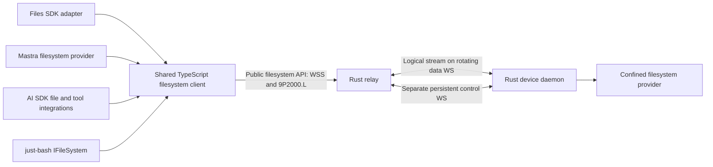

# Filesystem endpoint contract

Status: implementation specification, 2026-09-09; amended 2026-09-17 with the [confinement and capability model](#confinement-and-capability-model) and a numbered list of [implementation gates](#implementation-gates). **All four native adapters now exist, and the shared client and one of them have now been run against actual relay and device sockets.** `packages/client` carries the shared client and, as export subpaths of it, the Files SDK `Adapter`, the Mastra `WorkspaceFilesystem`, the just-bash `IFileSystem` and the AI SDK `FilesV4` — each compiled against its exact-pinned installed package and each depending on it by type only, so the package keeps zero runtime dependencies (task row M4-14, **implemented awaiting verification**; see [Pinned in code (gate 6)](#pinned-in-code-gate-6)). That is six of the seven components [filesystem-adapters.md](filesystem-adapters.md) lists; the seventh, the AI SDK live directory tools, is unwritten. The client half of gate 6 is described next — `packages/client` has `connectFilesystem`, the descriptor fetch with its `grantRevision` header, an authenticated WebSocket upgrade, the consumer-side session and lifecycle, and the bytes and limits of the [shared client API](#shared-client-api) (task row M4-13), on top of the independent 9P2000.L codec that reads gate 3's fixtures (task row M4-10). Both rows are **implemented awaiting verification**; every socket in that package's **own tests** is a loopback socket to a harness that speaks the wire and is not the product, and the endpoint evidence for the client is task row M4-15's harness gate instead. Implementation gate 1 — the confined virtual path namespace, the capability and primitive authorization model, the negotiated limits, the payload-free error vocabulary and the descriptor — is implemented in `crates/tunnel-fs-core`, with the choices it pins listed under [Pinned in code (gate 1)](#pinned-in-code-gate-1); it is **implemented awaiting verification** (task row M4-07). Implementation gate 2 — the OS-confined resolver — is implemented in `crates/tunnel-fs-host`, with the choices it pins listed under [Pinned in code (gate 2)](#pinned-in-code-gate-2); it too is **implemented awaiting verification** (task row M4-08), exercised on macOS only, with the Linux `openat2` path compiled but never run and filesystem exports declared unsupported on Windows. Implementation gate 3 — the 9P2000.L codec and the session state machine — is implemented in `crates/tunnel-fs-ninep`, with the choices it pins listed under [Pinned in code (gate 3)](#pinned-in-code-gate-3); it too is **implemented awaiting verification** (task row M4-09), and it is pure: no socket, no clock, no filesystem, so everything it proves is about bytes and state rather than about a running endpoint. Implementation gate 4 — the descriptor endpoint, the WSS upgrade, the dispatcher and the read path — is implemented across `crates/tunnel-relay/src/http/fs.rs`, the new `crates/tunnel-fs-provider`, `crates/tunnel-client/src/fs_export.rs` and a new `metadata` module in `crates/tunnel-fs-host`, with the choices it pins listed under [Pinned in code (gate 4)](#pinned-in-code-gate-4); it too is **implemented awaiting verification** (task row M4-11), and it is the first gate with a socket: it is exercised against a real three-relay cluster, a real Redis catalog and a real device connector, but only at the relay that owns the device, and it enforces no clock. Implementation gate 5 — write grants and partial failure — is implemented in `crates/tunnel-fs-host`'s new `write` module and in `crates/tunnel-fs-provider`, with the choices it pins listed under [Pinned in code (gate 5)](#pinned-in-code-gate-5); it too is **implemented awaiting verification** (task row M4-12). It is the first gate in which a request can have **happened**: gate 4 refused every mutation at three layers and every refusal it could produce was `not_started`, so the outcome vocabulary had nothing to describe. It still enforces no clock, still admits a session only at the owning relay, and still performs its host call inline on the exchange task. Gate 6 is **the shared client and the native adapters** — the client is one of the seven components [filesystem-adapters.md](filesystem-adapters.md) lists (task rows M4-10 and M4-13) and the four adapters are four more (task row M4-14), all **implemented awaiting verification**, with the choices they pin listed under [Pinned in code (gate 6)](#pinned-in-code-gate-6). The gate's own must-prove — that each of these runs against **actual relay and device sockets**, because "compilation against a source interface or a fake in-memory adapter is insufficient to claim remote compatibility" — is now discharged for the shared client and for one adapter (task row M4-15, **implemented awaiting verification**): a harness gate stands up the three-relay production cluster, a real Redis catalog and a real device connector, and drives `packages/client`'s own sources under `node` over TLS, through the relay's real descriptor endpoint and WSS upgrade, with a real grant. **What the gate still owes**: the seventh component, the AI SDK live directory tools, is unwritten; and three of the four adapters have still never spoken to a relay, so their own tests remain loopback sockets to a harness that speaks the wire and is not the product. The shared fuzzing [testing.md](testing.md) requires is done and gate 3's residue for it is closed. This document defines M4; it takes precedence over earlier filesystem-specific sketches in other documents. The device tunnel invariants in [protocol.md](protocol.md) still apply.

Gate 1 is pure and performs no I/O, so it proves the **lexical** half of confinement only. It does not prove confinement against an operating system: symlinks, hard links, mount points and every TOCTOU race between resolving a path and acting on it are invisible to a crate that never opens a file, and are gate 2's obligation. Gate 2 now discharges that obligation against a real temporary filesystem, on one host; what it could not demonstrate there is named in its own residue rather than implied to be covered.

## Outcome and layers

Expose an enrolled computer's granted filesystem as an API that applications can use through Files SDK, Mastra, AI SDK, or just-bash. Applications select an endpoint and credential, then supply the appropriate adapter to their framework. They do not run another agent on the computer, mount a kernel filesystem, or hand remote shell scripts to the daemon.



The public API is a documented WebSocket/9P binding plus an authenticated capability descriptor. A shared client handles that wire protocol; framework adapters translate their native APIs. A bare endpoint URL cannot be passed to an unrelated SDK protocol and assumed compatible. The [adapter contracts](filesystem-adapters.md) identify supported entry points and explicitly distinguish Files SDK's own HTTP gateway protocol.

One consumer connection selects **one service export, one root, one grant context**. A service may represent a workspace directory, an isolated VM volume, or another confined provider. Give separate roots separate service IDs. Applications combine mounts at their framework layer. Every adapter can use a separate connection, or share an explicitly injected client for the same principal/export; never pool connections across users or grant contexts.

## Endpoint and discovery

Canonical endpoint example (synthetic):

```text
https://relay.example/v1/devices/device-123/services/workspace/fs
```

| Request to that endpoint | Response |
| --- | --- |
| Authenticated HTTPS GET, no Upgrade | JSON descriptor with `Content-Type: application/json` and `Cache-Control: no-store` |
| Authenticated WSS upgrade, subprotocol `agent-tunnel.9p.v1` | Binary 9P2000.L connection, after grant and device readiness checks |
| Other methods | 405; no JSON per-operation filesystem RPC at this URL |

The URL scheme becomes `wss:` for the upgrade; hostname, port, path, and authentication scope stay the same. Do not follow cross-origin redirects or trust an arbitrary WS URL returned in JSON. TLS certificate verification is mandatory outside the explicit loopback development harness. Do not use endpoint URL parameters for paths, tokens, root names, or user identity.

The descriptor has schema ID `agent-tunnel.fs.v1`. See [schema](contracts/filesystem-capabilities.schema.json) and [example](contracts/filesystem-capabilities.example.json). It reports the selected device/service IDs, opaque `grantRevision`, transport profile, live availability, root path policy, effective operations, semantic features, and enforced limits. It contains no host path, credential, host UID, or executable. It is informative, never an authorization credential.

Discovery reads the current authorized catalog; it can show `offline` for a previously enrolled device without claiming its backend is ready. Only an online device with a current capability manifest can admit a filesystem session. The upgrade rechecks authorization and snapshots effective capabilities/limits. Node clients send the descriptor's `grantRevision` as `X-Agent-Tunnel-Grant-Revision`; mismatch returns 409 `CAPABILITIES_CHANGED`, requiring a fresh descriptor. This check is in addition to authorization, not a replacement. An observed capability or grant change closes that session and requires fresh discovery; never silently broaden access. Cluster authorization snapshots have a maximum five-second lifetime from read start; failed refresh stops new admission and expired state stops dispatch, as specified in [cluster.md](cluster.md). Revocation is immediate once observed, with that documented propagation bound rather than a claim of instantaneous global invalidation.

### HTTP failures before upgrade

JSON errors use `{ "error": { "code": "...", "message": "...", "requestId": "..." } }`, without host details. Messages are diagnostic; callers branch on `code`.

| HTTP | Code and meaning |
| --- | --- |
| 401 | `UNAUTHENTICATED`; missing/invalid/expired consumer token; standard Bearer challenge. The message distinguishes only a missing token ("a consumer access token is required") from a refused one ("the consumer access token was not accepted"), the same text every consumer route uses (M6-C53) |
| 404 | `EXPORT_NOT_FOUND`; nonexistent or undiscoverable device/service; same external response for both |
| 403 | `ACCESS_DENIED`; authenticated, discoverable export but requested operation/session permission is absent, or a valid token without the `fs:connect` scope (M6-C53) |
| 409 | `CAPABILITIES_CHANGED`; descriptor revision no longer matches; no filesystem work admitted |
| 429 | `RESOURCE_EXHAUSTED`; consumer/tenant/session admission limit; bounded `Retry-After` |
| 503 | `DEVICE_OFFLINE` or `BACKEND_UNAVAILABLE`; no filesystem session created. `ROTATION_FREEZE`: the device's scheduled data rotation outlasted the relay's bounded admission hold, or the hold was full; no session created, bounded `Retry-After`, safe to retry (task row M3-15). `CONNECTION_LIMIT` (flat body, `retry_after_ms` and `Retry-After`): the relay listener was at its connection limit and refused before any route ran, so it can answer any request, this endpoint's included; the shared TypeScript client reports it as `CONNECTION_LIMIT` with `retryAfterMs`, and a caller must wait that long before a fresh connect (task rows M6-C153, M6-C200) |
| 400 / 426 | Invalid upgrade or unsupported subprotocol; report supported profile without credentials |

## Authentication and ownership

Node is the first certified runtime. Use an access-token supplier and a WebSocket implementation that can send Authorization on upgrade; native browser WebSocket cannot set that header. The supplier provides fresh tokens for explicit connects, without placing tokens in config files or logs. Validate consumer issuer, audience, expiry and grant scope independently of the device's own credentials. Token expiry ends the session; refreshing it requires fresh discovery/attachment and never silently resubmits a mutation.

A later browser profile uses same-site secure HttpOnly cookies and strict Origin checks at discovery and upgrade. It must supply equivalent grant-revision protection through a reviewed same-origin handshake. CORS alone is insufficient. Browser-cookie support, cross-origin embedding, and raw native browser WebSocket are **not** advertised in M4's first Node release.

The relay binds the stream to authenticated tenant/principal/device/service/grant revision. The Rust provider enforces the effective operation grant on every 9P dispatch and rechecks it after asynchronous queue waits. A read grant is not a write grant; filesystem access never implies desktop, clipboard, arbitrary process, or general network access. Membership/device/export revocation closes streams and stops dispatch of queued work. Already executing effects may have an unknown outcome; do not claim rollback.

### Primitive authorization and derived capabilities

The descriptor's high-level `operations` are **derived client capabilities**, not independently enforceable wire verbs. The server sees 9P primitives and their flags, not a trusted `copy` or `readFile` label. Compute each advertised method from all required primitive permissions and provider features; a custom 9P client receives the same restrictions. A grant allowing copy necessarily permits its underlying read/create/write actions. This profile cannot promise copy-only, grep-only or framework-only access.

| Primitive family | Required server policy checks |
| --- | --- |
| `Tversion`, `Tattach`, `Tflush`, `Tclunk` | Authenticated session, fixed export, quotas and lifecycle; cleanup cannot broaden authority |
| `Twalk` | Confined traversal; requires no capability, per the [recorded decision below](#twalk-and-its-disclosure). Every resolved fid retains export and permission context |
| `Tgetattr`, `Treaddir` | Granted `list`; a fid reached by walking does not carry metadata rights |
| `Treadlink` | Granted `read` **and** the `symlinks` feature |
| `Tlopen`, `Tlcreate`, `Tread`, `Twrite` | Decode `.L` flags explicitly: check read vs write access, create/exclusive/truncate/append permissions and node type before opening or changing anything; recheck fid rights and fresh authorization on each I/O |
| `Tmkdir`, `Tunlinkat`, `Tremove`, `Trenameat`, `Trename` | Granted create/remove/rename on relevant parent/source/destination; root confinement on both sides and no implicit cross-export move |
| `Tsetattr` | Validate the mask field by field; size changes require write/truncate authority, mode/time changes require their explicit permissions; reject unsupported ownership fields |
| `Tsymlink`, `Tlink` | Explicit link grant plus platform capability and confinement; default denied |
| Other opcodes/flags | Deny unless the negotiated profile specifies, implements and tests them |

Read-only policy denies every mutating opcode and flag, including `O_TRUNC` on open and size-changing `Tsetattr`. Reject unsupported combinations before backend dispatch. Stream-level admission is not enough: the connector enforces the independent authorization freshness confirmation from [cluster.md](cluster.md) after queue waits and immediately before each primitive side effect.

## 9P binding and lifecycle

1. After HTTP 101, first send `Tversion(tag=NOTAG, version="9P2000.L", msize<=65536)`. Wait for `Rversion` before further requests. M4 accepts negotiated `msize` from 256 to 65536 bytes, including 9P framing; reject smaller or different dialects.
2. Send `Tattach` for a fresh root fid, `afid=NOFID`, empty `uname`/`aname`, and `n_uname=NOUID`. Authentication has already occurred. The provider maps the session to its configured OS identity and virtual `/`; these fields cannot choose host identity or another export. Unexpected values fail. No custom `Tauth` bearer-token scheme.
3. Every consumer WebSocket binary message contains one complete length-prefixed 9P message. Reject text, inconsistent lengths, unsupported mandatory features, or excess allocations. WS fragmentation is reassembled under the same size limit. Disable per-message compression initially.
4. The relay forwards an ordered byte stream over the existing tunnel DATA frames; a 9P record may span those frames. The Rust provider and shared client enforce framing and `msize`. Do not create a second tunnel or socket for every file operation.
5. Fids and outstanding tags are session-local. Handle partial walks, short reads/writes, directory cookies, valid metadata masks, and `Tclunk` cleanup. Reserve `NOTAG`; do not reuse a tag until its response or completed flush lifecycle. Decode 64-bit fields as BigInt.
6. Close gracefully by cancelling pending operations according to 9P flush rules, clunking remaining fids within a deadline, and closing the consumer connection. Repeated `Tversion` after attachment is outside this profile; terminate rather than implicitly reset hidden adapter state.

Scheduled device data-socket rotation preserves this logical stream, fids, tags, and consumer WebSocket. One device still has two steady-state sockets and at most a temporary third during handover; consumer sockets are separate. A failed data socket can recover only while the same control owner and ordered stream state remain. Consumer loss, control-epoch change, grant expiry, or process restart invalidates the filesystem session. Explicit reconnect creates fresh fids and a new adapter session; no transparent reconnect retry of application operations.

`Tflush` is cancellation, not rollback. Respect a normal reply arriving before `Rflush`, and reserve the flushed tag until the flush response. A transport ACK only means transport delivery/retention. Neither ACK nor connection close proves a filesystem mutation succeeded, failed, or was durable.

## Shared client API

Proposed package: `@agent-tunnel/client` (name is a design placeholder, not a published dependency). Public entry point:

```ts
// Proposed API, not executable today.
const remote = await connectFilesystem({
  endpoint: 'https://relay.example/v1/devices/device-123/services/workspace/fs',
  token: async () => obtainConsumerAccessToken(),
});
try {
  const bytes = await remote.readFile('/notes.txt');
  // Supply remote to any one of the framework adapters.
} finally {
  await remote.close();
}
```

All network operations are asynchronous and accept `AbortSignal` plus a bounded deadline. Common methods below are the shared semantic contract; the precise framework signatures belong in their adapter packages. The client exposes its immutable effective descriptor and lifecycle state (`connecting`, `ready`, `closed`), never raw tokens or raw host paths. It offers explicit `close()`; a closed instance is not reusable and must not reconnect behind the caller's back.

| Shared method | Contract / 9P implementation |
| --- | --- |
| `readFile(path, options?)` | Bounded `Uint8Array`; open/read/clunk; default 16 MiB materialization ceiling, enforce while reading even if size grows |
| `readStream(path, options?)` | Async byte chunks with optional offset/length, backpressure, cancellation, exact short-read/EOF handling |
| `writeFile(path, bytes, options?)` | Create or truncate, no parent creation by default; `overwrite:false` uses exclusive create; not an atomic replacement |
| `writeStream(path, chunks, options?)` | Same semantics, bounded streaming; report acknowledged bytes on partial failure; no automatic replay |
| `appendFile(path, bytes, options?)` | Atomic append positioning per write if advertised; a multi-chunk append is not one transaction; never stat-then-write emulation |
| `stat(path, {followSymlinks?})` | BigInt size, scoped qid, valid fields, kind/mode/mtime and optional birth time; final-link behavior explicit |
| `readDirectory(path)` | Async immediate-child records using directory cookies; no snapshot or stable sort promise |
| `mkdir(path, {recursive?})` | Explicit parent creation; never interpret path as a host directory |
| `remove(path, {recursive?,force?})` | Nonrecursive by default; recursive traversal bounded; force suppresses only absence |
| `copy(source, destination, options?)` | Bounded composed read/write/traversal in one export; no server-side-copy or atomic-copy claim |
| `rename(source, destination, options?)` | Native in-export rename; cross-export operations reject `EXDEV`; do not substitute copy/delete |
| `chmod`, `utimes`, `symlink`, `link`, `readlink`, `realpath` | Implement only when advertised; unsupported operations fail rather than invent semantics |

The primitive required 9P mapping remains in [integrations.md](integrations.md). Extensions are negotiated separately; we do not alter 9P frame layout to smuggle JSON operation IDs, version tokens, arbitrary metadata, or framework objects into the baseline.

## Paths, consistency, and mutation semantics

The shared namespace is POSIX-style virtual `/`, independent of host OS. Canonical shared-client paths are absolute; adapters convert their relative paths/keys explicitly. No percent-decoding or Unicode normalization occurs on 9P path components. Reject NUL, backslash, control characters, drive/UNC path syntax, unsupported host filenames, and path length above the descriptor limit. The just-bash adapter retains its upstream pure lexical root-clamping behavior before calling the shared client. Object keys and Mastra relative paths reject parent traversal rather than inheriting that special shell behavior.

Absolute symlink targets refer to the exported virtual root, never host `/`. The provider performs descriptor-relative confinement at every operation, including link/rename races; lexical normalization is not confinement. Restricted providers may advertise no links. Special files, sockets, FIFOs, and device nodes remain denied. A writable exported inode also linked outside the root is a separate policy risk; write support requires a tested hard-link policy. *Gate 5 ships write support and that policy is the reason it can: `hardLinks` is absent by default, and a multiply-linked regular file refuses `OpenWrite`, `OpenTruncate` and a size-changing `Tsetattr`. It is **not** broader than that, and the difference is deliberate: a `Twrite` through a fid opened before the second link appeared still extends the file, because the rule governs the three primitives rule 4 names and not every byte that reaches an inode.*

Report actual case behavior (`sensitive` or `insensitive-preserving`); do not lowercase keys or claim a case-sensitive object store on a case-insensitive host. File identity/metadata must not leak host inode, UID, or directory details. No persistent content/negative cache in the first release. Framework indexes are caller-owned derivatives of authorized reads, not a coherent copy of the live host.

Reads and directory enumeration observe a live filesystem. They are not a snapshot; concurrent host writers can change bytes or entries during an operation. Return available observed metadata; never invent an ETag or version ID that implies conditional-update safety. Birth time may be absent. Where an upstream interface requires a created date, document a modification-time fallback as an adapter compatibility convention, not actual birth-time evidence.

Overwrite, copy, recursive delete, and parent creation may partially apply. Native in-filesystem rename is the only baseline single namespace operation with backend atomicity; it is not a multi-file transaction or durability promise. `overwrite:false` must use exclusive creation, not an exists-then-create race. If a platform cannot provide required flags/semantics, advertise them unsupported. Plain close/write acknowledgment does not mean fsync; durable writes need a separately advertised and tested fsync feature.

Conditional mutation (`expectedMtime`, if-match, if-none-match except exclusive create), versioning, arbitrary object metadata, public/signed URLs, resumable uploads, server-side search, and locks are not baseline features. Reject corresponding requested semantics with `ENOTSUP` before mutation. Do not implement conditional writes using an unprotected stat/read followed by write. Future extensions need a separate wire contract and conformance gate.

Mastra has an explicitly selected adapter-only `mtimePolicy: 'check-before-write'` compatibility profile, described in [filesystem-adapters.md](filesystem-adapters.md). It reproduces Mastra's advisory timestamp preflight using ordinary stat and write, with an acknowledged race. It does not send a conditional-write operation, change `conditionalWrites: false`, or provide atomic compare-and-swap. The default adapter policy rejects timestamp conditions until the application deliberately selects that weaker upstream-compatible behavior.

## Confinement and capability model

This section is normative and settles what earlier sections gestured at. It governs the device-side provider; the adapters and the shared client inherit it and may not widen it.

### The virtual path namespace

A **virtual path** is an absolute POSIX-style path inside one export's root. Validation **rejects; it never rewrites.** No implementation may normalise, fold, percent-decode, Unicode-normalise, case-fold, or otherwise repair an attacker-supplied path. Anything a resolver would have to fix is refused instead. These are refused, each with its own diagnostic rule:

| Refused | Reason |
| --- | --- |
| The empty string, or any path not beginning with `/` | Relative paths cannot be resolved against a caller-chosen base |
| A `..` component, in any position | Parent traversal is refused, never resolved |
| A `.` component | A normaliser would fold it away; refusing keeps one path per file |
| An empty component, from a repeated or trailing `/` | Two spellings must not name one file |
| A NUL byte | Truncates the path in every C-string host API |
| A C0 control character or `DEL` | Terminal and log injection, and host ambiguity |
| A backslash | A separator on Windows hosts |
| A colon | Drive-letter syntax and NTFS alternate data streams |
| A component whose stem matches `CON`, `PRN`, `AUX`, `NUL`, `CONIN$`, `CONOUT$`, `COM0`–`COM9`, `COM¹`, `COM²`, `COM³`, `LPT0`–`LPT9`, `LPT¹`, `LPT²` or `LPT³`, ASCII-case-insensitively, **after trailing ASCII spaces are removed from the stem** | Reserved Windows devices, refused on **every** host so an export's namespace does not change meaning when the serving device changes operating system. The trim is load-bearing: `ntdll` strips trailing spaces from the stem before comparing, so `CON .txt` opens the console device. The superscript spellings are reserved by Microsoft alongside the ASCII-digit forms |
| A component ending in `.` or a space | Windows silently trims both, so two virtual paths would alias one host file |
| A path above the negotiated `maxPathBytes`, or a component above 255 UTF-8 bytes | Bounded before allocation |
| More components than the negotiated `maxPathComponents` | Bounded before allocation |

A component supplied to a path-building helper that itself contains a `/` is refused under its own rule, not reported as an empty component: it is several components, and calling it empty would misdescribe the input.

**Non-UTF-8 input is not this layer's gate.** A virtual path is a UTF-8 string by construction, so a byte sequence that is not valid UTF-8 cannot reach path validation at all. Rejecting it is the **codec's** obligation (implementation gate 3), which must refuse a 9P string that is not valid UTF-8 before it is ever decoded into a path, rather than replacing invalid bytes. A host filename that cannot be represented in UTF-8 produces the documented explicit result from the resolver; it is never transliterated. *Gate 3 discharges the inward half — every `string[s]` in the profile is required to be valid UTF-8 and is otherwise refused by field — and pins the outward half as a gate-4 obligation, because that conversion happens where an `OsStr` becomes a `String`. The documented explicit result for an unrepresentable **directory entry** is that the whole `Treaddir` fails with `EINVAL`: see [Pinned in code (gate 3)](#pinned-in-code-gate-3).*

Deliberate narrowings and acceptances, recorded as named limits rather than left implicit:

* The colon is legal in a POSIX filename and is refused anyway, for drive and alternate-data-stream syntax.
* `...`, and any other name ending in a dot or a space, is refused although POSIX permits it, because Windows trims both.
* `<`, `>`, `"`, `|`, `?` and `*` are **accepted** — they are legal POSIX filenames. A host that cannot represent one must produce an explicit documented error from the resolver rather than a silent substitution.
* Only C0 controls and `DEL` are refused. **C1 controls (U+0080–U+009F), the bidirectional overrides U+202A–U+202E and U+2066–U+2069, U+2028 and U+2029, and zero-width characters are accepted.** This is a deliberate narrowing of the injection rationale to the byte range that is hazardous in a C-string host API and a terminal escape. It means a filename can be constructed that renders misleadingly in a terminal or a UI; consumers that display filenames are responsible for their own rendering, and this is not treated as a confinement property.

Containment is decided component-wise, never by string prefix: `/ab` is not inside `/a`.

### Two spellings, one file

The provider reports the host's observed case behaviour in `root.caseSensitivity` and never assumes it.

**Gate 1 provides no collision key, deliberately.** An earlier draft exposed an ASCII case fold; it was removed, because no string comparison can decide these collisions and a key that is right most of the time reads as though the problem were solved. At least four distinct classes map two accepted virtual paths onto one host file, and gate 1 accepts both members of every pair:

| Class | Example pair | Where |
| --- | --- | --- |
| ASCII case | `/Dir/File.TXT`, `/dir/file.txt` | Case-insensitive volumes |
| Unicode case pairs | `/σ`, `/Σ`; `/straße`, `/STRASSE` | Case-insensitive volumes |
| NFC versus NFD | `/café`, `/cafe` + U+0301 | APFS, HFS+ |
| NTFS 8.3 short names | `/LONGFI~1.TXT`, `/longfilename.txt` | NTFS with 8.3 generation enabled |

The last is the same two-spellings-one-file hazard the refusal table exists to prevent, and it cannot be refused lexically: a short name is well-formed and indistinguishable from an ordinary name. All four are the resolver's obligation in gate 2, which must decide them by asking the host — anchored resolution plus file identity — rather than by comparing strings. On NTFS a provider may alternatively require 8.3 generation to be disabled on the exported volume and state that as a precondition.

### TOCTOU, symlinks and hard links

Lexical validation is **not** confinement. A validated virtual path means "this text cannot itself express an escape", never "this path is safe to open". The resolver must therefore:

1. Resolve every path component by anchored traversal from a retained root descriptor, never by concatenating text and calling a path-taking syscall. A path-taking syscall re-resolves the whole path and reintroduces every race. The anchoring mechanism is per host:
   * **Linux:** `openat2`. The `resolve` flag follows the `symlinks` feature and the two are mutually exclusive: `RESOLVE_NO_SYMLINKS` when `symlinks` is **off**, `RESOLVE_IN_ROOT` when it is **on**. *Amended 2026-09-24 (task row M4-45): with `symlinks` **on**, the implementation uses the per-component walk below instead, because `RESOLVE_IN_ROOT` hands link following to the kernel, whose bound is its own `MAXSYMLINKS` (40) with no bound on a target's component count, so the 32-hop and per-target bounds this provider pins would not hold.* `RESOLVE_BENEATH` is *not* usable with links enabled — it rejects an absolute symlink target with `EXDEV` rather than re-rooting it, so it cannot satisfy rule 3. Fall back to per-component `openat` with `O_NOFOLLOW` on kernels without `openat2`, re-checking the parent's identity after each step.
   * **macOS and other BSDs:** per-component `openat` with `O_NOFOLLOW`, with link targets re-rooted by the provider rather than by the kernel.  The provider bounds its own traversal, refusing a chain of more than 32 links with `ELOOP` so a cycle is refused by count rather than by hanging.
   * **Windows:** `NtCreateFile` with a `RootDirectory` handle and `FILE_OPEN_REPARSE_POINT`, which is the only anchoring primitive that does not re-resolve from a drive root.  `FILE_OPEN_REPARSE_POINT` surfaces junctions and volume mount points as reparse points rather than following them, so rule 5 and gate 2's mount-point obligation cover them on this host too. Windows device hosts are in scope for the product ([architecture.md](architecture.md)), so a gate-2 implementation that omits this must state that filesystem exports are unsupported on Windows rather than leaving the mechanism unnamed. **The gate-2 implementation takes that second option**, for the reason recorded under [Pinned in code (gate 2)](#pinned-in-code-gate-2): a Windows provider would need a different identity primitive for the 8.3 alias class, and anchoring alone would not give it one.
2. Act on the descriptor it resolved, not on the path it resolved from. Checking a path and then opening it by name is a TOCTOU bug regardless of how carefully the path was checked.
3. Deny symbolic links unless the `symlinks` feature is advertised: with the feature off, `Tsymlink` and `Treadlink` are refused and a link encountered during traversal fails the walk with `ELOOP` rather than being followed. With it on, resolve an absolute link target against the **exported virtual root**, never host `/`.
4. **Hard links.** "Deny hard links" is not directly implementable — a hard link is not observable during a path walk, since every directory entry is a link and the second one is indistinguishable from the first. The testable rule is therefore stated in terms of what *is* observable, `st_nlink` and file identity:
   * `Tlink` is refused unless the `hardLinks` feature is advertised. This is the only part that is a simple capability check.
   * With a write grant and `hardLinks` **off**, `OpenWrite`, `OpenTruncate` and size-changing `Tsetattr` are refused with `EPERM` on any regular file whose `st_nlink` is greater than 1 (directories always carry a link count of at least 2 and are not covered by this rule), because such an inode may also be linked outside the root and writing through it would be an escape no path check can see.
   * Reads of a multiply-linked inode are unaffected: the link count discloses nothing the grant does not already permit.
   * This is the "tested hard-link policy" that write support is conditional on. *Gate 2 proved it in the resolver's own tests and gate 5 makes it reachable on a real write, over the real path, with the file's content verified intact afterwards.* It is deliberately conservative — it refuses writes to legitimately multiply-linked files inside the root — and a provider that needs those writes must advertise `hardLinks` and prove containment by file identity instead.
5. Refuse special files, sockets, FIFOs and device nodes.
6. Recheck the grant after every asynchronous queue wait and immediately before each primitive side effect, per the [cluster contract](cluster.md).

Both rename endpoints, both link endpoints and every traversal are confined independently. There is no implicit cross-export move; a cross-export or cross-device operation is `EXDEV` and is never emulated by copy-and-delete.

### Capabilities

An operator grants exactly four capabilities: **read**, **write**, **list**, **delete**. The default is deny. There is no wildcard, no "all" value and no implicit grant; every capability a session holds was named individually. An export granting nothing admits no session at all, rather than admitting a session that can do nothing.

| Capability | Governs |
| --- | --- |
| `read` | File content and symbolic-link targets |
| `write` | Create, modify, truncate, and set metadata |
| `list` | Traverse for metadata, and enumerate directories |
| `delete` | Remove a name from a directory |

The server enforces **primitives**, not labels. Each 9P opcode family — with its `.L` flags decoded, so that `Tlopen` for reading, for writing, for truncation and on a directory are four separate decisions — requires a conjunction of capabilities. Notable consequences, each a deliberate decision:

* Enumerating a directory needs `list`, not `read`, so a grant that may list names cannot thereby read content; and `read` alone does not permit enumeration.
* `Trenameat` requires **both** `write` and `delete`: renaming away removes a name, and a grant that may create but not remove must not remove one by renaming it.
* The recursive operations `copy` and `remove` traverse directories, so both additionally require `list`. `remove` is therefore not available under `delete` alone, and `copy` is not available under read+write alone.
* Session lifecycle primitives (`Tversion`, `Tattach`, `Tflush`, `Tclunk`) require no capability, because a session exists only for a non-empty grant.
* `Tsymlink` and `Treadlink` additionally require the `symlinks` feature, `Tlink` the `hardLinks` feature and `Trenameat` the `atomicRename` feature. All are absent by default.

There is **no append-only or create-only capability**. `write` permits overwriting and truncating existing content. An export that must never destroy data cannot be expressed in this model and must not claim to be.

The **read-only profile is `read` + `list` together**, and that pair is what an integrator should configure. `read` alone is a valid grant — read-by-name, for a caller that knows its paths and must not enumerate — but it has no `stat`, so a Files SDK `head` or `exists` call has nothing to call. Do not reach for `read` alone expecting an ordinary read-only mount.

#### `Twalk` and its disclosure

`Twalk` requires no capability. This is a recorded decision with a named cost, not an oversight.

Requiring `list` to walk would make read-by-name impossible, because every open begins with a walk: a `read`-without-`list` grant could not reach any file at all, and the grant shape would be useless. The cost is that `Rwalk` returns qids, so a grant holding only `write` or only `delete` can probe whether a name exists and whether it is a file or a directory.

Those qids are the **only** metadata such a grant may observe. `Tgetattr` and `Treaddir` both require `list`, so size, times, mode, link count and directory contents remain unreachable, and a fid reached by walking carries no metadata rights. An export for which name-existence probing by a write-only or delete-only consumer is itself unacceptable must not issue such a grant.

The descriptor's `operations` are **derived**, never configured: an operation is advertised only when every primitive composing it is independently permitted. A grant allowing `copy` therefore necessarily allows plain reads and writes, and this profile cannot promise copy-only, grep-only or framework-only access. `root.readOnly` is likewise derived from the grant, so the advertised flag cannot disagree with what is enforced.

An empty grant derives an empty operation list. Discovery must answer `403 ACCESS_DENIED` for such an export rather than serving a descriptor that advertises nothing: an empty `operations` array must never reach a consumer as though it described a usable export.

### Payload-free diagnostics

No path, file name, file content, host path, host identity or credential may appear in a log line, a `Debug` rendering, an error message, a close reason or a descriptor. This is a construction rule, not a review rule: error types carry only static codes and field-free enums, and a validated path type has a redacting `Debug` and no `Display`, so its text leaves only through an explicit accessor. A caller already knows the path it asked for and correlates by request tag; repeating it in the error would put it into every rendering that touches it.

The errno vocabulary is closed. An unmapped host errno becomes `EINVAL` rather than being passed through, so a consumer's handling stays exhaustive and a host cannot disclose which of its own failure modes occurred.

## Errors, retries, and cancellation

Shared errors carry `code`, `operation`, virtual `path` when safe, `outcome`, `retryable`, and optional `bytesAcknowledged`. Outcomes are `not_started`, `failed`, `partial`, or `unknown`; a rejection after a previously confirmed partial chunk cannot become `not_started`. `bytesAcknowledged` is a lower bound confirmed by replies, not proof of final content or durable bytes.

Translate Linux `.L` errno to stable codes including `ENOENT`, `EACCES`, `EROFS`, `EEXIST`, `ENOTDIR`, `EISDIR`, `ENOTEMPTY`, `ELOOP`, `EXDEV`, `ENOTSUP`, `EFBIG`, and `EINVAL`. Separate transport/session errors (`SESSION_LOST`, `AUTH_EXPIRED`, `DEVICE_OFFLINE`, `RESOURCE_EXHAUSTED`, `DEADLINE_EXCEEDED`, `ABORTED`) from filesystem absence. Session loss during a potentially dispatched mutation carries `outcome: unknown`, irrespective of the user-facing code. `exists` converts only confirmed absence into false.

Do not automatically retry mutations, reads, or reconnect the shared client in the baseline. Retrying a read can also change a caller's observation; callers choose to start a new read explicitly. Transport-layer duplicate suppression within a live session remains permitted and does not replay a 9P request into the provider twice. SDK retry wrappers must be disabled or classify partial/unknown mutation errors as permanently nonretryable. Cancellation after dispatch never promises no side effect.

After upgrade use 9P errors for valid failed requests. Protocol violations close with WS 1002, authorization invalidation with 1008, shutdown with 1012, overload with 1013, and unexpected server failure with 1011. A session whose OPEN the device's connector refused closes before any 9P message reached the device: 1013 with reason `ROTATION_FREEZE` or `RESOURCE_EXHAUSTED` (retryable), or 1011 with reason `DEVICE_REJECTED` (read as `SESSION_LOST`; task rows M6-C210 and M6-C215). Close reasons contain only bounded sanitized identifiers. A close code alone cannot encode whether a mutation applied; the shared client classifies in-flight operations conservatively from its dispatch/reply history.

## Initial enforced limits

These are implementable starting defaults/ceilings for the first profile, not measured capacity claims. Negotiation may reduce them. Descriptor capabilities cannot exceed local policy or a tenant/global budget.

| Resource | Initial value |
| --- | ---: |
| Maximum 9P message including header (`msize`) | 65,536 bytes |
| Outstanding request tags / live fids per session | 64 / 256 |
| Queued encoded payload bytes per consumer (advertised, not enforced; M4-21) | 1 MiB |
| Materialized file limit / concurrent internal materialization budget | 16 MiB / 32 MiB |
| Path length in UTF-8 / path components | 4,096 bytes / 256 |
| Recursive traversal entries / depth | 10,000 / 64 |
| Single 9P request default deadline | 30 seconds |
| Composite operation default / maximum deadline | 300 / 3,600 seconds |
| Idle session timeout with no requests or operations | 300 seconds |

**Who enforces each limit (task row M4-21; the 2026-09-25 changes are applied by default pending owner confirmation).** The device enforces `msize`, outstanding tags, live fids, both path bounds, the traversal-entry budget, the **idle session timeout** -- the connector closes a session with nothing queued and nothing received for `sessionIdleSeconds` with `DEADLINE_EXCEEDED` -- and the **single-request deadline as a stall bound**: while a reply is waiting, the carrier must grant some credit at least every `requestTimeoutSeconds`, or the connector ends the session. A slow but steady consumer keeps its session however long a transfer takes; a consumer that stops taking replies (and so could otherwise hold a session that is never idle) does not. Input, including `Tflush`, is still read while a reply waits. If no part of the waiting reply has been sent, the device ends with a close record, `DEADLINE_EXCEEDED` (1011), when the carrier will take it within a second; if part of a reply is already out, or the close cannot be sent, it **resets the stream** rather than splicing a close into the reply, and the relay closes the consumer **1011 `SESSION_LOST`** without forwarding the partial reply. Either way the shared client classifies a dispatched mutation as `unknown`. Because it bounds a stall rather than a duration, it does **not** bound how long a request or operation takes in total: `defaultOperationTimeoutSeconds` and `maxOperationTimeoutSeconds`, like the composite operations they govern, are enforced by the client only. The composite operation deadlines, the traversal depth and the two materialization limits bound things only the client has -- composite operations and its own buffers -- so they remain **client-enforced profile parameters**: the descriptor advertises them so every client applies the same values, and a custom 9P client that ignores them is bounded on the device only by the session limits above. **`maxQueuedBytes` is advertised (1 MiB) but not enforced**: a consumer's queued bytes are bounded more tightly by the relay's stream window and the connector's session budget, not by this field. It stays advertised because of **version skew**: the v0.1.0 tester release's shared client rejects a descriptor without it, while clients from task row M4-21 onward accept its absence. A provider may stop advertising it only once no client older than that is supported. A limit only the client enforces is a courtesy to the client's caller, never a bound on the device. **No request deadline bounds the session itself** (task row M4-55): the connector's `limits.operation_timeout_ms` (30 s by default) bounds one unary echo or one `http-forward/1` request, while a filesystem session, like an echo stream, is bounded by the consumer token, the idle-session timeout and the stall bound above. Before M4-55 the connector gave the session's stream that single-request deadline, so every filesystem session, however live, was reset `AUTHORIZATION_EXPIRED` and closed 1008 `AUTH_EXPIRED` 30 s after it opened.

Budget encoded bytes, pending promises, fids, traversal state, and adapter pagination state. Pause producers before allocation limits are reached; close/fail predictably when consumers cannot be bounded. Streaming bypasses the per-file materialization limit, not aggregate queues, grant byte quotas, or operation deadlines. Bound adapters that convert a stream to Buffer, Blob, text, or model content even when `head` claimed a smaller size. SDK/framework pools share a per-principal budget; every connection does not grant a fresh tenant quota.

The 32 MiB limit covers concurrent client/adapter-owned materialization buffers, conversion copies and retained caches. Release a reservation when the result's ownership transfers to the caller; if an adapter keeps a copy, that copy remains charged. Returned ordinary Uint8Array/Buffer/string values have no release API, so caller-retained results are outside this enforceable internal limit. Applications must bound their own result history. Sequential completed reads must not permanently consume the internal quota, and concurrent reads cannot each reserve the full limit independently. The descriptor field `maxTotalBufferedBytes` has this internal ownership meaning.

## Implementation gates

Six gates, in order. Each names what it must prove; a gate is not closed by code existing, and a later gate does not close an earlier one's residue. [The adapter plan](filesystem-adapters.md) gives per-framework delivery gates; [testing.md](testing.md) covers wire and failure fixtures.

1. **Contract and pure core.** The virtual path namespace, the capability/primitive/derived-operation model, the negotiated limits, the payload-free error vocabulary and the descriptor — with no I/O, no clock, no socket and no dependency. *Must prove:* every refused path class above is refused by its own rule and no accepted path can express an escape; every limit is exact at its boundary and refused one beyond, with no unlimited sentinel; capabilities default to deny and no advertised operation exceeds its primitive grant, exhaustively over every grant and feature set; no error rendering contains a path or content; the emitted descriptor reproduces the checked-in example byte for byte. *Cannot prove:* anything about a real filesystem.
2. **OS-confined resolver.** Anchored traversal on each supported host, symlink and hard-link policy, file identity, case-collision decisions taken from the host, and the special-file refusal. *Must prove:* escape attempts through symlinks, hard links, link cycles, mount points, cross-root rename and links changed concurrently with access all fail, against a real temporary filesystem, including a writer racing the resolver between resolution and use; the `st_nlink` write refusal of rule 4 above; and that each of the four two-spellings-one-file classes — ASCII case, Unicode case pairs, NFC/NFD and **NTFS 8.3 short names** — is decided by file identity rather than by string comparison, or that its precondition is enforced. This is where TOCTOU is proven; gate 1 cannot.
3. **9P2000.L codec and session state.** Bounded incremental encode/decode, `msize` negotiation, tags, fids, directory cookies, `Tflush`. *Must prove:* byte-exact golden fixtures shared with the TypeScript client, messages exactly at and one byte above `msize`, fuzzed incremental decoding that never over-allocates, and exhausted tag/fid quotas.
4. **Descriptor endpoint, upgrade and read provider over the real path.** The authenticated `GET`, the WSS upgrade at the same URL, grant-revision recheck, and a confined read-only provider reached through the relay and the device data socket. *Must prove:* the authorization matrix at descriptor, upgrade, attach and open-fid use; a cached descriptor never authorizes access; and a forged `Tattach` cannot exceed the grant.
5. **Write grants and partial failure.** Creates, truncation, append, rename, composite operations, and structured partial/unknown outcomes. *Must prove:* a read-only grant denies every mutating opcode and flag before backend dispatch; a failure injected after truncation, after a short write and after rename-before-reply reports its outcome accurately; and no ambiguous mutation is ever replayed. *Implemented awaiting verification (task row M4-12), with three narrowings named rather than glossed: **append is not implemented and `nativeAppend` is not advertised**, because the two hosts disagree about whether `pwrite` honours its offset on an `O_APPEND` descriptor; **composite operations are the shared client's** to compose from these primitives and stay gate 6's; and the three named injection points are covered by their equivalents rather than by an injection hook — a truncating open whose refusal is proven to precede the truncation, a short `Rwrite` which is 9P's own partial answer, and a reply produced and never delivered, which is what "before reply" means when the socket is the connector's. See [Pinned in code (gate 5)](#pinned-in-code-gate-5).*
6. **Shared client and native adapters.** `@agent-tunnel/client` plus the Files SDK, Mastra, just-bash and AI SDK Files adapters, end to end through the real endpoint and a rotating device tunnel. *Must prove:* each pinned published package passes against actual relay/device sockets. Compilation against a source interface or a fake in-memory adapter is insufficient to claim remote compatibility. *Six of the seven components exist.* `packages/client` is the shared client: the independent 9P2000.L codec that reads gate 3's checked-in fixtures, plus `connectFilesystem`, the descriptor fetch and its `grantRevision` header, the authenticated WSS upgrade, the consumer session and lifecycle, and the bytes and limits of the [shared client API](#shared-client-api) — with the choices it pins under [Pinned in code (gate 6)](#pinned-in-code-gate-6). The shared fuzzing of one generated corpus against both codecs, with accepted values compared, is done and closes that item of gate 3's residue. Four more components are the native adapters, added as export subpaths of the same package (task row M4-14): each is compiled by `tsc` against its exact-pinned installed package's own declarations and then registered with the real thing that consumes it — `new Files({ adapter })`, `new Workspace({ filesystem })`, `new Bash({ fs })`, `ai.uploadFile({ api })` — which is the [contract-compilation table](testing.md#contract-compilation-and-capability-profiles) satisfied for four of its five rows. *The endpoint half is now discharged for two of the six* (task row M4-15): the shared client and the Mastra adapter are driven by `node` against the three-relay production cluster, a real Redis catalog, a real grant and a real device connector, over TLS the client verifies, through the relay's own descriptor endpoint and WSS upgrade — a checksummed multi-message read and write, a listing, a grant revision moved in the catalog between the client's descriptor read and its upgrade, a read-only grant refusing mutations at both layers, and twenty-four dispatched unanswered writes classified `unknown` with the device's own ledger read beside them. The messages the read and the write span are **counted at the transport** rather than derived from the file size, and the ledger numbers are recorded rather than pinned: `SocketTransport.close()` discards node's userland write buffer, so in the recorded runs most of those twenty-four writes never leave the process. See [Pinned in code (gate 6)](#pinned-in-code-gate-6). *Still to come, and it is still the larger half:* the fifth row, the AI SDK live directory tools, which do not exist; and the **other three adapters** against actual relay and device sockets, whose own tests remain a loopback harness. Compilation against an installed interface is not the exception to that sentence: it is the thing the sentence names.

### Pinned in code (gate 1)

`crates/tunnel-fs-core` is dependency-free and performs no I/O. It pins these choices, each of which is a decision this document did not previously settle:

* The refused path classes and their per-class diagnostic rules. The table above is **unordered**; the checking order is fixed but different, and it is what determines which rule a path violating several of them reports. That order is: empty, then total byte length, then the leading separator, then a whole-path byte scan for NUL, backslash, colon and control characters, then per component — empty, component length, `.`, `..`, a contained separator, the component byte scan, trailing space or dot, reserved device stem — with the component count checked as components are consumed. So `\a` reports `PATH_NOT_ABSOLUTE` rather than `PATH_BACKSLASH`, and a 5,000-byte path containing `..` reports `PATH_TOO_LONG`.
* A 255-byte maximum path component. This is a fixed property of the namespace, matching the `NAME_MAX` every supported host provides, so it is not a negotiated limit and does not appear in the descriptor.
* The four capabilities, the 24 enforced primitives and their required capabilities, and the composition of all 17 derived client operations. `Tlopen` is split into read, directory, write and truncate decisions; directory enumeration needs `list`; rename needs `write` and `delete`; the recursive `copy` and `remove` compose their traversal primitives and so need `list` too.
* `Twalk` requiring no capability, with the qid disclosure that follows from it bounded and stated above.
* Close-code mapping. `DEVICE_OFFLINE` is 1012, because the export's backend is what went away; `ABORTED` maps to **no** close code, because cancelling one operation must not close a session carrying other outstanding tags. `maxMessageBytes` is deliberately not an `EFBIG` filesystem error: an over-`msize` frame is a framing violation answered with a 1002 close, never an `Rlerror`.
* Identifiers (`deviceId`, `serviceId`, `grantRevision`) are restricted to ASCII alphanumerics, `-`, `_` and `.`, which is narrower than the schema's length-only rule. That makes JSON escaping unnecessary, so the emitter cannot be the place a quote or control character escapes into the document.
* The three consistency rules the descriptor schema's `$comment` defers to runtime are made structurally impossible rather than checked: `availability`/`capabilityStatus` are one enum, `root.readOnly` is derived from the grant, and `operations` is derived from the primitives.
* Limit negotiation reduces only. Zero and `u64::MAX` are both refused for every field, so neither can be read as "no limit". Five cross-field rules are enforced: `msize` has a 256-byte floor, the consumer queue may not be smaller than one maximum-size message, one materialized file may not exceed the concurrent materialization budget, the default operation deadline may not exceed the maximum, and the single-request deadline may not exceed the operation default.
* `Outcome` is ordered and merges monotonically, so an operation observed as `partial` or `unknown` can never later be reported `not_started`.

**Residue, not covered by gate 1 and open:** every item in gate 2. Specifically, and each accepted by gate 1 rather than refused:

* All four two-spellings-one-file classes — ASCII case, Unicode case pairs, NFC/NFD, and **NTFS 8.3 short names** — which need file identity from the host. *Gate 2 closes the first three on a real filesystem by resolving both spellings and comparing host identity, and closes the fourth by declaring filesystem exports unsupported on Windows; see [Pinned in code (gate 2)](#pinned-in-code-gate-2).*
* Symlinks, hard links, `st_nlink`, mount points, special files and every TOCTOU race. *Gate 2 implements all of these against a real temporary filesystem on macOS. What remains open is the Linux `openat2` path, which is compiled but has never been run, and a real device node, which needs privilege this host does not have.*
* Non-UTF-8 input, which is the codec's gate (3), not this one's. **Closed by gate 3 on the way in:** every `string[s]` in the profile is refused unless it is valid UTF-8, by field and without substitution, and that applies to a reply stream as much as a request stream — `Rreadlink`'s target and the names inside an `Rreaddir` block included. Gate 2's own `EINVAL` for a symbolic-link target that is not valid UTF-8 remains the resolver's boundary, and the two do not overlap: one refuses bytes that arrived, the other bytes the host wrote. **The outward direction is a gate-4 obligation, stated under [Pinned in code (gate 3)](#pinned-in-code-gate-3):** gate 3's types make a lossy conversion inexpressible, but the conversion itself happens where an `OsStr` becomes a `String`.
* C1 controls, bidirectional overrides, U+2028/U+2029 and zero-width characters, accepted deliberately; a filename can therefore render misleadingly in a terminal or UI. **Still open, deliberately:** neither gate 2 nor gate 3 changes anything here, because it is a rendering property and not a confinement one. Gate 3 accepts them too — they are valid UTF-8, and the codec's rule is about encoding, not about which code points a name may contain.
* The `msize` framing itself and all 9P encoding. **Closed by gate 3** as a pure codec: the boundaries, the incremental decoder, the tag and fid quotas and the session lifecycle. What that cannot close is everything needing a socket or a clock — real WebSocket fragmentation and text-frame refusal, tunnel DATA-frame interleaving, and `msize` against the outer tunnel-frame limit — which is gate 4's. *Gate 4 closes the socket half: text frames are refused and both decode entry points run on the real path, one at each end. It closes **none** of the clock half, and per-message compression is off because nothing enables it rather than because the handshake refuses it; see [Pinned in code (gate 4)](#pinned-in-code-gate-4).*
* Deadlines and clocks; quota accounting for queued, buffered and traversal state; and the `maxTotalBufferedBytes` ownership-transfer accounting, which is a client-side property with no representation here. **Still open after gate 4**, which has a socket but no clock: it ends a session at the consumer token's expiry and enforces the traversal-entry budget on a `Treaddir` resume, and enforces no request, operation or idle deadline and no queued- or buffered-byte budget. *Gate 5 closes none of it either, deliberately, and names the one write path that would benefit from a deadline rather than adding one; see [Pinned in code (gate 5)](#pinned-in-code-gate-5).*

### Pinned in code (gate 2)

`crates/tunnel-fs-host` implements the OS-confined resolver. It depends on `tunnel-fs-core` and on `rustix`, already in this workspace for the M3 process-group work, whose `fs` feature is the maintained safe wrapper the no-`unsafe` rule requires for `openat`, `openat2`, `statat`, `readlinkat` and `fstat`; no new third-party crate is introduced. It pins these choices, each of which this document did not previously settle:

* **Windows is declared unsupported for filesystem exports, as a runtime refusal rather than a build failure.** The contract offered a choice between implementing the named `NtCreateFile` anchoring and stating the platform unsupported; this is the second. `unsupported_host_reason()` is the single place that says so; the `rustix` dependency and the three modules that read a host `Stat` or errno are `cfg(unix)`, so the crate still **compiles** on Windows and consists of that function alone. Discovery can therefore answer `403` for a filesystem export on such a host, and `tunnel-client` refuses an fs export in its configuration there with the same words, "filesystem exports are unsupported on this host". *Corrected 2026-09-24 (task row M6-C80): the claim that the workspace still built there was false from gate 4 onward — `tunnel-client` named the provider's Unix-only types unconditionally — and was never checked, because hosted CI was billing-blocked.* The reason is that anchoring is only half of what Windows needs: 8.3 short names alias every long name on a volume with generation enabled, so the two-spellings-one-file classes would have to be decided against a different identity primitive. A Windows device may still be enrolled and still export other services.
* **The per-component walk is the primary mechanism, not a fallback.** macOS and the BSDs use it; Linux uses `openat2` with `RESOLVE_NO_SYMLINKS` when the feature is off, and the same walk when it is on (task row M4-45), and falls back to the walk on `ENOSYS` or a seccomp `EPERM`. *Amended 2026-09-24:* the crate's tests now run on the hosted Linux CI job; their first run there failed two symlink-bound tests under `RESOLVE_IN_ROOT`, which is why the feature-on path no longer uses it.
* **Ancestors are a stack of open directory descriptors.** `..` inside a *host symbolic-link target* pops that stack and never below the root, which is what re-rooting means without a kernel `RESOLVE_IN_ROOT`. A caller's own virtual path still refuses `..` and `.` lexically at gate 1; the resolver interprets them only in text the host wrote, and that distinction is new here.
* **The intent is applied in the resolving open.** `Intent::Write` opens `O_WRONLY` and deliberately never `O_TRUNC`: truncation is applied to the descriptor *after* the hard-link rule has permitted it, so a refused write cannot follow a truncation that already destroyed the content. Reopening the name to apply an intent would be exactly the TOCTOU bug the gate exists to remove.
* **Two guards cover the window between inspecting a name and opening it:** `O_NOFOLLOW` on the open, and a comparison of the opened descriptor's identity against the inspected one. Because that window is microseconds wide, a `race-window-hook` cargo feature — off by default, in no shipped build — lets a test step into it deliberately. **Only the file identity comparison is individually load-bearing.** Each `O_NOFOLLOW` and its sibling identity check mask one another, so they are proven in pairs: deleting both the directory open's `O_NOFOLLOW` and the directory identity check turns a test red, as does deleting both of the file pair, while any one of the three alone leaves every test green. That is measured, not inferred, and it is the honest form of the claim; "proven by deletion" does not apply to `O_NOFOLLOW` on its own. The Linux path's equivalent post-open check has **no** deletion evidence at all, because the hook has no call site there and no Linux host was available.
* **The `statat` before each open is a courtesy, not the decision.** It exists so a FIFO is never opened for reading and a device node is never opened at all; the authoritative kind and identity come from `fstat` on the descriptor. Deleting either special-file check alone leaves the tests green; deleting both turns them red.
* **Error decisions, all within the closed gate-1 vocabulary:** a special file is `ENOTSUP` (the profile does not implement it, as distinct from the host denying it); crossing a mount point, a macOS firmlink or a cross-filesystem bind mount is `EXDEV`, decided by comparing an entry's `st_dev` with the **root's** — not with its parent's, so a same-filesystem bind mount is not caught by this comparison and is left to `RESOLVE_NO_XDEV` on the Linux path; a link target that is not valid UTF-8 is `EINVAL`, and an empty one `ENOENT`. The three mount-boundary checks — before the directory open, before the file open, and after the directory open — likewise mask one another, and are proven by deleting all three together.
* **A component that changed under the resolver takes one uniform answer, `ENOENT`.** This is a decision, not just a mapping: the two opens are reached only after `statat` classified the entry, so `ELOOP` (a link appeared) and `ENOTDIR` (a directory stopped being one) can only mean the race, and both are folded in rather than returned. Returning them would let a racer learn *which* swap it had won. `EAGAIN` from `RESOLVE_IN_ROOT`'s own rename detection folds in for the same reason instead of falling through to `EINVAL`. A dedicated "you lost a race" code would disclose the host's concurrent activity to a caller the grant does not entitle to it.
* **A link target ending in `/` must name a directory.** Splitting the target on `/` and dropping empty parts would resolve `link -> file/` to a regular file, where POSIX and the host both answer `ENOTDIR`.
* **`EINTR` is retried, never reported.** The closed vocabulary has no code for a delivered signal, and mapping it to `EINVAL` would report one as a malformed request. Every host call here is short and restartable. This is the one guard with **no** test: the tests cannot deliver a signal inside a syscall, and its deletion leaves everything green.
* **The device boundary is decided before each open as well as after it.** Opening a file on a FUSE or network filesystem runs that filesystem's own open handler, so an export must not reach onto another device even for the instant it takes to refuse.
* **The Linux `openat2` path carries `RESOLVE_NO_XDEV | RESOLVE_NO_MAGICLINKS`** alongside the feature's flag. Without `NO_XDEV` a bind mount of an outside directory underneath a mount inside the root would be refused by the per-component walk and permitted here, because a final `st_dev` comparison cannot see a boundary that was crossed and crossed back. Its `O_PATH` result is upgraded through `/proc/self/fd` for a **directory** as well as a file, since an `O_PATH` directory descriptor answers `EBADF` to `getdents`; `/proc/self/fd` is probed once at construction and the per-component walk is used when it is missing, rather than reporting every read as a missing file on a host without `/proc`. Falling back — on `ENOSYS`, on a seccomp `EPERM`, or on a missing `/proc` — is **not** a weaker mechanism: it is the same walk macOS uses as its only mechanism, with the same anchoring, the same re-rooting and the same guards, and what it loses is the kernel taking the decisions in one syscall rather than any part of the confinement.
* **A host errno is translated by meaning, not through `FsErrorCode::from_errno`.** That function maps *Linux wire* numbers, which is what an `Rlerror` carries, and the hosts disagree: `ELOOP` is 62 on macOS and 40 on Linux, `ENOTEMPTY` 66 and 39. Using it on a host errno would mistranslate on every non-Linux host, and a test asserts precisely that.
* **Bounds:** 32 link hops, a per-resolution step budget of `maxPathComponents × 33`, a link target of at most `maxPathComponents` components, and an ancestor stack of at most `maxPathComponents`. The hop budget and the step budget are separate, so deleting the first still leaves a cycle refused by the second — a chain of 40 single-component links is what distinguishes them.
* **File identity is `(st_dev, st_ino)` widened to `i128`**, because `dev_t` is signed 32-bit on macOS and unsigned 64-bit on Linux. Neither number has an accessor, `Debug` is redacting and there is no `Display`, so a resolved handle cannot put a host detail into a log line. A 9P qid path is a 64-bit FNV-1a fold of the pair: equality is preserved exactly, the host numbers are not recoverable.
* **The hard-link rule covers exactly `OpenWrite`, `OpenTruncate` and `SetattrSize`.** `SetattrMode` and `SetattrTimes` are outside it, because changing a mode or a timestamp through a second link writes no content through it. Directories are excluded by *kind*, not by a link-count threshold, so the exclusion cannot drift as a directory gains children.
* **Collisions are decided by resolving both spellings and comparing identity.** The only verdicts a host may give are "one file" and "the second spelling does not exist"; "two different inodes" is the failure the class exists to catch. On this host's APFS volume all three testable classes — ASCII case, the Greek sigma pair, NFC versus NFD — answered *one file*, and that is recorded as an observation of this volume, not as a property of the profile.
* **The export root is the only caller-independent path opened by name**, once, at construction, from operator configuration — plus, on Linux, two fixed procfs spellings: `/proc/self/fd`, probed once to decide whether the `openat2` path is usable, and `/proc/self/fd/N`, which reopens a descriptor the resolver already holds and re-checks its identity afterwards. Neither contains a byte a caller supplied, and no caller-derived text reaches a path-taking syscall anywhere. Moving or replacing the root directory after construction cannot redirect the export.
* **Inspecting a file needs read permission on it**, on both hosts. The Linux path could have answered a metadata-only resolution from its `O_PATH` descriptor, but it now upgrades every descriptor so that `open_directory` can enumerate; the consequence is that `Intent::Inspect` on a mode-`000` regular file is `EACCES` there, exactly as it already was on the macOS walk. The hosts therefore agree, which is the property worth having here — but **gate 4 needs a metadata-only open that does not require read permission**, because `Tgetattr` is governed by `list`, not by `read`, and a `list`-only grant must be able to stat a file it may not read. *Closed by `ExportRoot::metadata` in this crate's `metadata` module, which resolves the parent by the ordinary anchored walk and then answers from one `statat` with `AT_SYMLINK_NOFOLLOW` relative to that descriptor: the file itself is never opened, so a mode-`000` regular file answers metadata where `Intent::Inspect` answers `EACCES`, and a test asserts both halves so the second is evidence rather than a coincidence.*

*Two of gate 2's forward-looking notes are now answered by gate 3 rather than still waiting on gate 4: the codec presents a validated `VirtualPath` for every request, so no caller-derived wire string reaches the resolver; and `Tgetattr` is classified from the `list`-governed `Getattr` primitive, which is where the metadata-only open gate 2 named becomes a concrete gate-4 obligation rather than a general worry.*

**Residue, not covered by gate 2 and open:** *(2026-09-24, task row M4-45: the Linux path **has** now been executed — by the hosted Linux CI job and by a Linux container mirroring it — and its first run found the `RESOLVE_IN_ROOT` bound gap; the sentence that follows is the historical state.)* the Linux `openat2` path has never been **executed** — it is type-checked from the macOS host by `cargo clippy --all-targets --target x86_64-unknown-linux-gnu -- -D warnings`, which is what stands in for CI while hosted CI is billing-blocked, and a cross-target `clippy` is not a test run; the same command for `x86_64-pc-windows-msvc` checks the unsupported-host build. Full-workspace cross-target checking is not possible from this host — the other crates need a C cross-toolchain that is not installed — so the cross-checks cover `tunnel-fs-host` and its dependency only, which is the whole of what this branch changes. Further: a real character or block device node could not be created without privilege, so that refusal rests on the kind decision plus the FIFO and socket cases that were demonstrated; NTFS 8.3 is closed by declaration, not by test. `Treadlink`, `Tsymlink` and `Tlink` are authorized here but not executed — **`Treadlink` and `Tsymlink` are now executed by gate 5, which implements them in this crate's own `write` and `metadata` modules; `Tlink` still is not, because the feature is off by default and the descriptor-anchored form is unavailable on this host**; directory enumeration was gate 4's and create, unlink, mkdir, rename and every `Tsetattr` field are **now closed by gate 5**, in this crate's `write` module; the metadata-only open a `list`-without-`read` grant needs is gate 4's, as noted above — **now closed**, by a `statat` on an anchored parent descriptor rather than by an open at all, in this crate's own `metadata` module; and the grant recheck after an asynchronous queue wait has no queue to wait on yet — **now closed by gate 4**, which has one.

### Pinned in code (gate 3)

`crates/tunnel-fs-ninep` implements the 9P2000.L codec and the session state machine. It depends only on `tunnel-fs-core`; there is no serializer, no async runtime, no clock, no socket and no filesystem in it, and no test in it opens a file or a port. Every byte of the wire format is written and read by hand, so the layout and the refusals are pinned by construction rather than by a library's configuration. It pins these choices, each of which this document did not previously settle:

* **The message set is 41 types, and every other opcode is refused in one of two ways.** `Rlerror`, and the request/reply pairs for the twenty primitives in the [primitive authorization table](#primitive-authorization-and-derived-capabilities), are what this profile speaks. A **known** 9P or 9P2000.L opcode outside it — `Tstatfs`, `Tmknod`, `Txattrwalk`, `Txattrcreate`, `Tfsync`, `Tlock`, `Tgetlock`, `Tauth`, and the plain-9P2000 `Topen`/`Tcreate`/`Tstat`/`Twstat`/`Rerror` a client that negotiated the wrong dialect would send — is `MessageTypeNotInProfile`; anything else is `UnknownMessageType`. The distinction is static protocol knowledge, so it discloses nothing about the export, and it tells an implementer whether it mistyped an opcode or reached for one the profile denies. `Tauth` is in the first list deliberately: the contract says there is no custom `Tauth` bearer-token scheme, and an export that answered `Tauth` at all would advertise an authentication path that does not exist.
* **Non-UTF-8 is settled here on the way in, by refusal and never by substitution.** Every `string[s]` the codec *decodes* must be valid UTF-8; otherwise the frame is refused with the field named. There is no `from_utf8_lossy` anywhere in the crate — a U+FFFD substitution would turn one host name into a different one and hand gate 2 a path naming a file the caller never asked for. The rule covers a reply stream as much as a request stream, so `Rreadlink`'s target and the names inside an `Rreaddir` block are refused on arrival like any request name. The `data` of `Tread`, `Rread` and the `Rreaddir` block itself are raw bytes and are deliberately not text-checked: they are file content and a packed record array, not text.
* **On the way out this crate makes a lossy conversion inexpressible rather than performing the refusal**, and the distinction is worth stating exactly because the first draft of this section overstated it. `Rreadlink` and a directory entry take a `String`, so there is no API here through which a non-UTF-8 host name could be encoded at all — but the conversion from the host's bytes is gate 4's, where an `OsStr` becomes a `String`, and that is where the refusal is taken. **The policy is pinned rather than left open, because the two available answers differ in what they hide:** an entry whose host name is not representable in UTF-8 fails the **whole** `Treaddir` with `EINVAL`; it is not skipped. Skipping silently hides a file from a caller that believes it received the entire listing, which is the same silent-substitution failure the refuse-never-repair rule exists to prevent; refusing costs one unrepresentable name making its directory unlistable, and that cost is accepted. [testing.md](testing.md) requires "the documented explicit result", and the explicit result is the error — the same answer gate 2 already gives for a symbolic-link target that is not valid UTF-8.
* **Two decode entry points, because the profile has two transports with different rules.** `decode_exact` is the consumer WebSocket rule — exactly one complete 9P message per binary message, so two packed into one are `TrailingBytes` and half of one is `TruncatedBody`, at every cut. `FrameDecoder` is the relay and device rule — an ordered byte stream over tunnel DATA frames, where a record may span frames and several may share one. Conflating them is the bug [testing.md](testing.md) warns about, so they are separate functions rather than one with a flag.
* **The `msize` boundaries, and the order the three size checks are taken in.** 255 is refused, 256 is accepted, 65,536 is accepted, 65,537 is *reduced* to 65,536; negotiation is `min(offered, maximum)` and never raises. A declared frame size is checked against the seven-byte header floor, then the absolute 65,536 ceiling, then the negotiated `msize` — in that fixed order, so one input has one answer. The visible consequence: at `msize` 65,536 a frame one byte above reports the **ceiling** rather than the negotiated bound, because it is over both.
* **An unsupported dialect terminates the session rather than replying `Rversion` with `version = "unknown"`.** That is a departure from plain 9P and it is deliberate: the WebSocket subprotocol `agent-tunnel.9p.v1` selected the dialect before a byte of 9P was sent, so a `Tversion` naming another one is not a negotiation step but a peer that ignored the handshake. Offering it a retry would also mean accepting a second `Tversion`, which this profile does not.
* **Every framing failure is answered by closing with 1002 and is never an `Rlerror`.** Gate 1 pinned that for an over-`msize` frame; this generalises it for the same reason in every case — the tag that would have to correlate an `Rlerror` is part of the frame that failed to decode, so there is nothing trustworthy to answer on. The decoder's first error is **latched**: a stream that produced one framing violation has no trustworthy boundary to resynchronise on, and a well-formed frame arriving after one is not decoded.
* **State-machine refusals split three ways, and the split is the point.** A refusal a correct client can recover from is an `Rlerror` that keeps the session: an unknown or wrongly-used fid, a flag the profile denies, a path the namespace refuses, a primitive the grant does not permit — and the **fid** quota, which is recoverable by clunking and whose code gate 1 already chose (`LimitField::MaxFids` renders `EINVAL`). The **tag** quota closes with 1013 instead, because reserving a tag is what makes a reply correlatable: a request beyond the tag quota cannot be answered by an `Rlerror` carrying the very tag the quota just refused. Everything that makes the session's own state ambiguous — out-of-order messages, a repeated `Tversion` or `Tattach`, an unsupported dialect, an `msize` below the floor, forbidden `Tattach` fields, every tag misuse — closes with 1002.
* **`NOTAG` is required by `Tversion` and forbidden everywhere else**, on encode as well as decode, and the version handshake occupies **no** tag slot. Both halves matter: a `Tversion` with an ordinary tag would occupy a slot the handshake has no way to release, and any other message on `NOTAG` could never be flushed or correlated.
* **State is applied on the reply, never on the request.** A `Twalk` does not bind `newfid`; the `Rwalk` does, and only for a walk that arrived — a **partial** walk binds nothing and releases its reservation. A `Tlopen` does not mark a fid open; the `Rlopen` does. Mutating on the request and rolling back on failure would mean a failed walk had briefly bound a fid a concurrent request could have used. A `newfid` is nonetheless **reserved** at request time, so two concurrent `Twalk`s cannot claim one number and the quota counts work already in flight. A walk in place (`newfid == fid`) reserves nothing and spends no quota.
* **A reservation lives exactly as long as its request, and a flushed tag is held until its *last* flush is answered.** Both were review findings about the fid quota gate 4 relies on to cap open descriptors. A reservation is released by *every* way a request can end — a reply, an `Rlerror`, and an `Rflush`, which releases the flushed request's reservation along with its tag; without the last, a flushed `Twalk` or `Tattach` stranded its target fid for the life of the session, neither bound (so unclunkable) nor free (so unwalkable). 9P allows **several** flushes of one request, so a tag records the *set* of flushes outstanding against it and is released only when the last of them is answered; releasing on the first would let the client re-issue on that tag and then let the second `Rflush` silently cancel the new request. Release is keyed on **membership** in that set, which is what makes a re-issued request — carrying no flushes of its own — impossible for a stale `Rflush` to match. A flush **cancelled** rather than answered — by being itself flushed — is likewise removed from its victim's set, and a flush is identified by the *pair* (a live tag whose `Tflush` names this victim) rather than by its tag number. Both halves are needed and each was a separate defect: a stale number left in a set, plus a liveness test that accepted any outstanding tag of that number, let a client re-issue the number as a flush of something else and pin the original tag for the life of the session — reserved, un-reissuable, releasable by nothing, and repeatable until `maxInflightRequests` was exhausted one slot at a time. Cancelling a flush does **not** release its victim the way answering one does, because the victim's own request may still be outstanding; the one victim it must still collect is one held *only* for the cancelled flush whose own reply has already arrived. An `Rlerror` to a `Tflush` counts as a cancellation for the same reason — it says the flush did not happen, so releasing the victim on it would cancel a request on the strength of a cancellation that failed. 9P answers `Tflush` only with `Rflush`, so that case is unreachable in practice; it is decided rather than documented as impossible.
* **A fid *number* is not a fid: each binding carries a generation, and a reply is applied only to the binding it was admitted against.** A client may clunk a fid and walk a different file to the same number while a request naming the old binding is still outstanding. Keying "apply nothing if the fid is gone" on the number alone let that late reply land on the new binding — marking a file open that was never opened, or moving it elsewhere. No authority is gained (every `Tread`/`Twrite` is re-checked by primitive, and both paths were validated), but this session's path and gate 4's descriptor for that fid would disagree, so the stamp is checked instead of the number. It is exported, because **gate 4 must key its cached descriptor on the same generation**: a descriptor resolved for generation *n* must not be reused once the number carries *n + 1*. *Closed by gate 4, for the release as well as the lookup: a second late `Rclunk` cannot close the descriptor of whatever the client has since walked to that number.* The rule covers every apply path that touches fid state, the one that **deletes** included: two `Tclunk`s of one fid can be outstanding, the first reply frees the number for a fresh walk, and without the stamp the second deleted the new binding — the client's live fid vanishing while gate 4 still held a descriptor for it. Because a fid can also simply be clunked, a reply for a binding that has gone **applies nothing and retires its tag** rather than failing: a reply is not a request, so there is no `Rlerror` to answer it with.
* **The "one `Tversion`, one `Tattach`" rules are enforced against a pipelined client, not only a sequential one.** Both phases move when the *reply* arrives, so the phase alone would let two `Tversion`s land before either was answered — the second silently overwriting what the first negotiated — and two `Tattach`s bind two root fids. A `Tversion` is refused while a negotiation is pending, and a `Tattach` while one is outstanding.
* **A reply is checked against its request's own bounds.** `Rread` and `Rreaddir` may not carry more bytes than the `count` asked for, `Rwrite` may not acknowledge more than the `Twrite` carried, and an `Rwalk` with no qids for a non-empty `Twalk` is refused — 9P answers an error reply when the first element fails, and reading a zero-qid `Rwalk` as a successful clone would bind a fid to a path that was never walked. This is the same class as the `Rwalk`-longer-than-its-`Twalk` rule above; a short read or a short write remains ordinary and is not an error.
* **`Tclunk` and `Tremove` release their fid on either answer**, which is 9P's own rule and is recorded here rather than left to be discovered: a client that had to guess whether a failed clunk left a fid behind would leak fids against its own quota.
* **A second `Tversion` terminates in every phase, not only after attach.** The contract says repeated `Tversion` after attachment is outside the profile; this widens it to the whole session, because one export, one root and one grant context leave nothing a renegotiation could change. Exactly one `Tattach` per session, for the same reason. `Tattach` refuses any `afid` but `NOFID`, any non-empty `uname` or `aname`, and any `n_uname` but `NONUNAME` — those fields cannot choose a host identity or another export, so a value in them is a request the profile has no way to honour.
* **`Twalk` is bounded at 16 names (9P's `MAXWELEM`)**, on encode and on decode, and the decoded count is checked **before** a single element is reserved, so a declared count cannot drive an allocation. An `Rwalk` with more qids than its `Twalk` named is a malformed reply.
* **A `count[4]` must leave room for its own framing.** A `Tread` asking for exactly `msize` bytes is refused, because the `Rread` carrying them would be `msize + 11`. Silently shortening the reply instead would be indistinguishable to the caller from a short read at end of file.
* **A qid's `type[1]` is restricted to `QTFILE`, `QTDIR` and `QTSYMLINK`, and a bit outside that is refused rather than masked off.** Masking would let a peer's claim about a node silently disappear. The `Rlerror` errno vocabulary is likewise closed in **both** directions: a provider may not widen it on the way out, and a client may not be made to handle a code outside gate 1's fourteen.
* **The `.L` flag masks, each refusing rather than ignoring what it does not implement.** `Tlopen` accepts the access mode, `O_TRUNC`, `O_APPEND`, `O_DIRECTORY` and `O_NOFOLLOW` and nothing else — `O_NOFOLLOW` is in the set because gate 2's resolver applies it unconditionally, so honouring a client that asks for it is not a widening but already true; `O_CREAT` and `O_EXCL` are refused because creation is `Tlcreate`. A read-only open carrying `O_TRUNC` or `O_APPEND`, a writable or truncating `O_DIRECTORY`, and the invalid access mode 3 are all refused. `Tsetattr`'s mask excludes `uid`, `gid` and `ctime`, which is how "reject unsupported ownership fields" is enforced, and an **empty** mask is refused too: a `Tsetattr` that changes nothing would be answered `Rsetattr`, reporting a mutation that did not happen. `Tunlinkat` accepts only `AT_REMOVEDIR`. `Tgetattr`'s `request_mask` is bounded and may not be zero. The numeric values are **Linux's**, written out rather than taken from a libc binding, so a macOS build and a Linux build agree byte for byte — the same reason gate 2 refuses to translate a host errno through `FsErrorCode::from_errno`.
* **Opening is a two-step classification, and the codec can only take the first step.** A directory is named by the fid, not by the flag word, so `Tlopen` read-only without `O_DIRECTORY` classifies from flags alone as `OpenRead`. The session re-runs the decision with the kind the fid's qid reports, which makes it `OpenDir`; **gate 4 must do the same with what the resolver reports**, or a `read`-without-`list` grant could open a directory that `Treaddir` would then refuse, and the two decisions would disagree. *Closed by gate 4, and the two are distinguishable only by a node that changed kind since the walk: the test walks to a file, replaces the name with a directory, and requires the refusal.* `Tremove` splits the same way — on a directory it carries the same authority as `Tunlinkat` with `AT_REMOVEDIR`.
* **The `Rreaddir` payload is an inner array with its own strictness.** Records are `qid[13] offset[8] type[1] name[s]` with no count of their own; a block that ends part-way through a record is malformed, and the `type[1]` byte is **required to agree** with the qid rather than one being preferred — two sources that can disagree is one too many. Entries are packed whole or left out entirely, because a partial record is unparseable and dropping its tail would invent a name. The `offset` is an opaque cookie and nothing here interprets or orders by it.
* **The interfaces to the neighbouring gates, defined but not wired.** To gate 2: `RequestPaths` hands the resolver already-validated `VirtualPath`s — one for a node, an origin and a destination for a walk, a parent and a child for a create or remove, and an **independent pair** for a rename or a link, because the contract confines both endpoints separately. No raw wire string ever reaches the resolver. To gate 4: `Session::request` returns the exact gate-1 `Primitive`s a request needs, with the flags already decoded, and the session checks them against its grant **before** a tag is taken or a fid reserved, so a refused request costs the session nothing. It **cannot** check freshness — a machine with no clock and no queue has neither event to hook — so the recheck after an asynchronous queue wait and immediately before each side effect remains gate 4's, and this is only its static half. *Gate 4 has a queue and takes both rechecks in it; the clock behind `fresh` is the connector's, which is where `docs/cluster.md` puts the five-second deadline arithmetic.*
* **Golden fixtures are checked in as hex, one file per message, with an index and a README stating the format.** They live in `crates/tunnel-fs-ninep/fixtures/` and are compared byte for byte in both directions, with an assertion that every message type in the profile has one. A `#[ignore]`d regeneration test is the only way to rewrite them, so an ordinary run cannot overwrite the evidence it checks. They carry names with two-byte and four-byte code points and 64-bit values above 2^32, so a TypeScript client that counted UTF-16 units or used a `number` would fail against them rather than in production.

**Residue, not covered by gate 3 and open:**

* **The fixtures have now been read by a second implementation, and that much of this residue is closed.** It was opened as "shared with the TypeScript client only in the sense that they exist, are checked in and are documented — no second implementation has read them". An independent TypeScript 9P2000.L codec in `packages/client/src/ninep/`, written from the protocol definition and this contract rather than transliterated from the Rust, now reads all 43 fixtures **in place** from the crate's own directory and agrees with them in both directions: every fixture decodes to the fields the fixture README and this document say it carries, re-encodes byte for byte, and encodes byte for byte from a hand-written expectation table alone, so a decoder bug on that side cannot cancel an encoder bug. It also checks, independently, the boundaries pinned above that need no socket — `msize` negotiation and the fixed order of the three size checks, the `count[4]` framing rule at the limit and one beyond for `Tread`, `Treaddir` and `Rwrite`, `MAXWELEM`, `NOTAG`, the 215 non-profile opcodes, all 256 qid type bytes, the closed fourteen-code errno vocabulary, the `.L` flag and mask sets, the UTF-8 refusal by field, and malformed-frame rejection; plus field-layout tests independent of the fixtures, because `Rgetattr`'s `uid` and `gid` are both 1000 in the corpus and a transposition between two same-valued fields is invisible to a fixture comparison on **either** side.

**Two disagreements were found. One was wire-visible, and it is the more important of the two.** The TypeScript first checked the `.L` flag and mask sets inside its codec, where every failure is a framing failure answered with a 1002 close. Gate 3 puts those checks in the session, not the codec: a `Tlopen` carrying `O_CREAT` decodes cleanly and is answered `Rlerror` on its own tag with the session preserved, which is what this document's own three-way split of state-machine refusals requires — "a flag the profile denies" is named there among the refusals a correct client can recover from. **Gate 3 is right**, and the TypeScript would have closed a session carrying other outstanding tags; it now decodes the flag and mask words as opaque integers and takes those decisions in a separately typed, `Rlerror`-answerable layer. **The second disagreement was a diagnostic only:** the TypeScript classified `Tlerror` (6) and `Terror` (106) as known-but-not-in-profile opcodes, where `KNOWN_OUTSIDE_PROFILE` holds 25 entries and omits both. The Rust is right again — 6 and 106 are reserved numbering slots beside `Rlerror` (7) and `Rerror` (107), not messages a peer can send — and the TypeScript was aligned to it. Both codecs refuse such a frame and both close 1002, so nothing on the wire differed there.

Four defects were found in the TypeScript and none in this crate or in the fixtures. Two are worth recording here because they bound what the first round of this cross-check actually proved: the `count[4]` rule was **documented and unenforced** on the TypeScript side — its helper existed and was never called, so a `Tread` with `count` 0xffffffff decoded at `msize` 4096 — and its writer truncated out-of-range integers silently, so an expectation wrong *above* a field's width would still have matched the fixture. Both are fixed and tested through the real entry points.

**The fuzzing that item asked for is now done, and this is what it found.** [testing.md](testing.md) asks for *fuzzing* the same corpus against both codecs and comparing accepted values; the fixture cross-check was not that, because no input was generated and neither codec was ever run against input the other had judged. `packages/client/fuzz/` generates 4,096 cases deterministically from one seed — frames laid out by wire *shape* over boundary-valued fields, byte mutations of them, pure noise, two frames packed into one binary message, and chunked byte streams — and both implementations render a verdict on every case in one canonical form, which each writes out by hand rather than sharing (a shared renderer would drop from the comparison any field either codec dropped). `crates/tunnel-fs-ninep/tests/shared_fuzz.rs` is the Rust half and refuses to rewrite the verdicts it checks; `npm test` regenerates the corpus from the seed, recomputes this side's verdicts and compares. The rule is accept-and-agree or both-refuse, over the shared refusal vocabulary rather than merely over "it threw". **Four disagreements, every one in the TypeScript and every one fixed; the Rust codec was right in all four.** Two are behavioural rather than merely diagnostic, and **who could observe them is worth stating exactly**: both are in `FrameDecoder`, which is the *stream* rule, and the shared client does not use it — a consumer decodes one message per WebSocket binary message with `decode_exact`, and the transport's own frame reader bounds a length before the 9P decoder sees it. So they would be visible to a stream consumer of this package, which does not exist today; the fixes are right and the package has no caller that was hurt. First, a `push` that ended in a framing violation discarded the frames it had already decoded from the same chunk, so a carrier chunk carrying a good reply followed by a malformed frame lost the reply and the tag waiting on it could never be retired — the Rust's pull-shaped `decode` hands each frame back before the error behind it. Second, the declared size was checked only once seven bytes had arrived, where `check_size` takes it at four, so a peer that declared four gigabytes and then stopped was waited on instead of refused. The third is the same layering mistake as the `.L` flag one above: `Tversion`'s offered `msize` and dialect were judged **inside the decoder**, where every failure is a 1002 close, so an offer of 65,537 — which negotiation answers by reducing — was refused as a framing violation. The fourth was diagnostic: a qid's type byte and an `Rreaddir` record's dirent byte were checked after a later field had been read, so a record wrong in two ways reported the wrong one, where this crate decides each the instant its byte is read. The corpus and both verdict files are checked in beside the generator, and the two verdict files are byte-identical. The corpus weights `NOTAG` for the two version opcodes and draws `Rlerror` from an errno pool, so all 41 message types are decoded rather than 40 with `Tversion` reached once; that enrichment surfaced nothing new. **What that agreement does and does not say** is worth stating exactly, because it is easy to over-read: both codecs decode an `Rversion`'s `msize` without judging it, so agreeing about one shows the rule is in **neither** codec — not that it belongs in a session. Where it belongs is a separate argument, made in [Pinned in code (gate 6)](#pinned-in-code-gate-6), and the Rust has no consumer-side `Rversion` rule to compare against in any case: it is the server end of this protocol. What remains open is everything below, which stays gate 6's.
* **Everything needing a socket.** Real WebSocket fragmentation and reassembly, refusing text frames, disabling per-message compression, `msize` against the outer tunnel-frame limit, and interleaving across tunnel DATA frames. The split-tolerance evidence here is over byte chunks in memory, which is the right property but not the same experiment.
* **Everything needing a clock.** The 30-second request deadline, the composite operation deadlines, the 300-second idle-session timeout, and the queued-byte and buffered-byte budgets. The decoder bounds what it retains by `msize` and by nothing else.
* **`Tflush` against a real pending operation.** The tag reservation, the original reply arriving before `Rflush`, several flushes of one tag in either order — the tag being held until the **last** is answered, a re-issued tag being immune to a stale `Rflush`, a flush cancelled by being itself flushed leaving its victim's set, and an answered tag held only by such a cancelled flush being collected — and a flush of an unknown tag are all proven as state transitions; that no original response is *delivered* after a completed flush needs a dispatcher, and is gate 4's. **A named gate-4 obligation follows from that:** a provider reply arriving *after* its `Rflush` names a tag this machine has already released, which it answers with a 1002 close — the right answer for a peer inventing a tag and the wrong one for an ordinary flush race, and the machine cannot tell them apart. The dispatcher owns the distinction and must drop a reply whose tag it flushed rather than feeding it to the session. *Closed by gate 4, which leaves the victim in its queue and marks it rather than removing it: removing it would model only the case where the flush wins the race, and the obligation is about the other one.*
* **One guard has no test and is kept anyway**, recorded the way gate 2 records its `EINTR` retry: a reserved walk checks that its reservation is still present before binding, and nothing can reach that check, because every path that releases a reservation releases its tag in the same step. It is defensive against a future caller that separates them.
* **Whether an authorized request succeeds.** This machine says which primitives a request needs and which paths it names; it never resolves, opens, reads or writes, and every refusal it can produce is `not_started`. Partial and unknown mutation outcomes are gate 5's. *Closed by gate 5, which splits the answer one syscall wide — a failure before the effecting call is `not_started` and a failure of it is `failed` — and settles `unknown` through a one-entry ledger the connector closes on the send. A short `Rwrite`, which this machine already bounds against its `Twrite`, is the wire's own `partial`.*
* **Fids and tags across a scheduled data-socket rotation**, consumer loss and control-epoch change. The machine forgets everything on `close`, which is the correct end state, but nothing here exercises a rotation. *All three are now driven on the real path, by gates 7, 8 and 9 respectively; what stays untested here is this **machine's** behaviour across them, and **device process restart** on any path.*
* **Three guards are green alone**, measured rather than assumed, and each is recorded as *not* individually load-bearing rather than counted among the singles: the declared-count check before a counted payload is copied is masked by the reader's own bound; the reply-type match in `complete` is masked by the effect/reply pairing in `apply_effect`; and a flush's pair identity is masked by its victim's set staying accurate, since a cancelled flush that leaves the set leaves no stale number for a reused tag to be mistaken for. The last two are each proven as a **pair** with the guard that masks them.

### Pinned in code (gate 4)

Implementation gate 4 is the descriptor endpoint, the WSS upgrade, the dispatcher and the **read** path. It spans four crates and both ends of the tunnel: `crates/tunnel-relay/src/http/fs.rs` is the endpoint, `crates/tunnel-fs-provider` is the dispatcher between gate 3's session machine and gate 2's resolver, `crates/tunnel-client/src/fs_export.rs` is the connector's side of the logical stream, and `crates/tunnel-fs-host`'s new `metadata` module is gate 2's crate discharging the two obligations that are decisions about the host. **No new third-party crate is introduced**, and the provider crate has no async runtime, no socket, no HTTP and no serializer: its clock and its live authorization both arrive through one `Authority` trait, so its own tests need neither a relay nor a Redis. It pins these choices, each of which this document did not previously settle:

* **The filesystem endpoint answers the contract's JSON error body, and it is the only route in the relay that does.** Every other route answers the flat `{code, execution, message, retryable?, retryAfterMs?}` shape with its own code vocabulary (`UNAUTHORIZED`, `DEVICE_NOT_FOUND`, `SERVICE_AMBIGUOUS`, …). This endpoint answers `{"error": {"code", "message", "requestId"}}` with the vocabulary tabulated above — `UNAUTHENTICATED`, `EXPORT_NOT_FOUND`, `ACCESS_DENIED`, `CAPABILITIES_CHANGED`, `RESOURCE_EXHAUSTED`, `DEVICE_OFFLINE`, `BACKEND_UNAVAILABLE`, `ROTATION_FREEZE` (added by M3-15; a client that predates it maps the `503` to a retryable `BACKEND_UNAVAILABLE` by status, so the addition is backward compatible), plus `METHOD_NOT_ALLOWED`, `SUBPROTOCOL_REQUIRED` and `INVALID_UPGRADE` for the three cases the table describes but does not name. **This is a decision with a cost, not an oversight.** The alternative was to amend this document to the relay's existing shape; a client contract that already names its codes, and that a TypeScript client will branch on, is the worse of the two things to change. The two vocabularies never mix: a filesystem response carries no `execution`, and no other route carries `error`. The `requestId` is a fresh UUID per response, carries nothing about the request, and exists so a consumer's report correlates with the relay's own logs.
* **`fs:connect` admits the session; the four capabilities are four separate grant operations.** The consumer token scope and the grant operation that admit a filesystem session at all are one name, `fs:connect`, and it is deliberately **not** one of the four capabilities. A session-admitting scope that also meant `read` would make a `list`-without-`read` grant unable to open a session — and that grant shape is one the capability model requires to work. The capabilities are `fs:read`, `fs:write`, `fs:list` and `fs:delete`, each named individually in the grant, with no wildcard and no implication. An operation outside those five contributes nothing.
* **Two service capabilities are required on a filesystem service record, and their absence has two different answers.** `fs_case_sensitivity` (`sensitive` or `insensitive-preserving`) is **required**: this document says the provider reports the host's observed case behaviour and never assumes it, so a relay that guessed would be inventing it, and an export that did not declare it is one this relay cannot describe — `404 EXPORT_NOT_FOUND`, the same answer an `http-forward` service naming no profile already gets. `fs_host_supported: false` is `403 ACCESS_DENIED`: it is the channel through which gate 2's one-function declaration that filesystem exports are unsupported on Windows reaches a relay, which does not know the device's operating system.
* **An empty derived grant is `403`, and it is a different 403 from a missing one.** A grant carrying `fs:connect` and no capability is authenticated, discoverable and authorized, and still admits nothing: discovery answers `403 ACCESS_DENIED` rather than serving a descriptor with an empty `operations` array. That is gate 1's `admits_session` applied at the endpoint.
* **The upgrade rechecks authorization rather than trusting the descriptor, and the grant-revision check is in addition to it.** `X-Agent-Tunnel-Grant-Revision` is compared against the revision the catalog read returns, at **both** the descriptor and the upgrade; a mismatch is `409 CAPABILITIES_CHANGED` before any filesystem work is admitted. A **missing** header matches, because the header is how a client that read a descriptor proves it; a client that never read one has nothing to be stale about. An empty header does not match.
* **The device→relay direction carries a record framing; the consumer direction does not.** The consumer WebSocket rule is one complete 9P message per binary message, and the relay enforces it with gate 3's own `decode_exact` before a byte is forwarded, so a text frame, two messages packed into one and half of one all close 1002 and are never an `Rlerror`. The device reassembles the ordered tunnel stream with gate 3's `FrameDecoder`. Both of gate 3's two decode entry points are therefore exercised on the real path, at opposite ends, which is what they were made two functions for. The device→relay direction is a sequence of `kind[1] length[4] payload[length]` records, for exactly one reason: **a session ends with a close code decided on the device**, by the dispatcher that holds the grant, and there is no 9P message that means "close with 1008". `kind = 1` is one complete 9P message the relay forwards without re-decoding; `kind = 2` carries one byte naming a gate-1 `SessionErrorCode`. Inventing a 9P opcode for it would put a non-profile message on the wire; letting the relay guess from a transport RESET would lose the distinction between 1002, 1008 and 1013. The decoder is bounded before allocation and its first violation is **latched**, and the latched error keeps naming the violation that happened rather than a second code that would hide it. Its retained bound is **two** maximum records rather than one: a carrier chunk may legitimately carry the tail of a full-`msize` record and the head of the next, and a decoder bounded at one would refuse a well-formed stream. That it has not happened is a property of today's emitter — the device frames one record per carrier send and the owner delivers one chunk per DATA frame — and a decoder that is bounded only because of what its peer happens to do is not bounded. The *declared* length is still checked against one record.
* **The shared service resolver's refusals are re-rendered by status, not by code.** The resolver that every consumer route uses answers in the relay's own shape, and this URL answers in the contract's; translating by status is what keeps the two vocabularies from leaking into one another while preserving the distinction a caller needs — a catalog this relay could not read is not the same answer as an export that does not exist, and collapsing both to `404` would tell a consumer its export was gone when the relay had simply been unable to look. `409 SERVICE_AMBIGUOUS` becomes `404 EXPORT_NOT_FOUND`, deliberately: this document reserves `409` at this URL for `CAPABILITIES_CHANGED`, and a label matching several live services names no single export.
* **The relay enforces the absolute ceiling; the negotiated `msize` is the provider's.** The relay is not a party to the version handshake, so it bounds a consumer message by the profile's 65,536-byte ceiling and leaves the negotiated bound to the provider, which is where `Rversion` was decided. A frame inside the ceiling but above the negotiated `msize` is therefore refused by the device rather than by the relay, with the same 1002 close.
* **Gate 4 admits a filesystem session only at the relay that owns the device.** A consumer reaching a non-owner relay is answered `503 BACKEND_UNAVAILABLE` naming `DEVICE_NOT_OWNED_HERE`, where `http-forward/1` would forward it over the peer hop. The hop is not the difficulty — the peer envelope already carries a `required_scope` and would take this one unchanged — but a bounded, credited 9P stream across it is its own piece of evidence, and claiming it from an untested path would be worse than naming it. Discovery still answers for a device owned elsewhere, and reports it `online`: the device is connected, and this gate simply does not admit its session here.
* **The five obligations gate 3 handed this gate, each discharged in one named place.**
  * **`Tlopen` is re-classified with the resolver's kind**, not with the flags and not with the qid the session recorded at walk time. Gate 3's session already re-runs `open_primitives` with the kind the fid's *qid* reports, which is what the walk saw; that is not the same thing, because the node can have changed kind since. The only experiment that separates the two is to walk to a **file**, so the session records `QTFILE` and classifies a read-only open as `OpenRead`, then replace the name with a **directory** before the open: a `read`-without-`list` grant must then be refused, because `Treaddir` would refuse it and the two decisions may not disagree. That is the test, and the provider counts both the re-classification and the refusal.
  * **A reply whose tag the dispatcher flushed is dropped**, never handed to `Session::complete`, which would read it as an invented tag and close 1002. The victim is deliberately **left in the queue and marked** rather than removed: removing it would model only the case where the flush wins the race, and the obligation is about the other one. Nothing is performed either way, because the drop happens before the host is touched. **Only a victim still in the queue is marked, and the mark belongs to the queue entry rather than to the tag number.** Both halves are load-bearing and each was a separate defect. Gate 3's session releases a flushed tag when its `Rflush` is answered, so marking a victim this dispatcher had already answered would silently drop the reply of whatever the client re-issued on that number. And because the number is free again, a client may re-issue on it *while the original is still queued* and flush that too — both requests legitimately flushed — where a mark held in a set of tag numbers can only be spent once: the first entry popped clears it, the second is performed, and its reply reaches `Session::complete` for a tag nothing is waiting on, closing a well-behaved client's session with 1002. So every queued entry carrying the flushed tag is marked, individually.
  * **The resolved-descriptor cache is keyed by fid *generation***, which is what gate 3 exported `FidState::generation` for. A clunk and a re-walk to the same number leave the previous binding's descriptor unusable: a read on the re-bound number is refused rather than answered from the previous file's bytes. The release is keyed the same way, so a second late `Rclunk` cannot close the descriptor of whatever the client has since walked to that number.
  * **The outward `OsStr` refusal** is taken in `tunnel_fs_host::metadata`, at the one place a host name becomes a `String`, and this gate turns it into a failed `Treaddir` rather than a skipped entry — the policy gate 3 pinned. **A special file is a different case and *is* skipped**, deliberately: the profile refuses a FIFO, a socket or a device node at every other operation, the `type[1]` byte of an `Rreaddir` record has no spelling for one, and its absence from a listing therefore *agrees* with every other answer a caller could get about it, where an unrepresentable name's absence would not. An entry removed between `readdir` and `statat` is likewise skipped, because a live filesystem is what this document says enumeration observes.
  * **The metadata-only open is not an open.** `ExportRoot::metadata` resolves the **parent** by the ordinary anchored walk and asks the host about the final component relative to that descriptor, in one `statat` with `AT_SYMLINK_NOFOLLOW`. A mode-`000` regular file therefore answers metadata where `Intent::Inspect` answers `EACCES`, and a `list`-without-`read` grant can stat a file it may not read. The authority is still a descriptor this crate resolved — the parent's — and the final component is named relative to it in one syscall that cannot re-resolve an earlier one. What the caller loses is the ability to *act* on the result, and `Tgetattr` needs none.
* **The two rechecks this document assigns to gate 4 are taken together, after the queue wait and immediately before the host call**, in that order: the grant **revision** first, because a moved revision closes the session rather than refusing one request; then **freshness**, which closes it too; then each primitive against the **live** grant, which refuses the one request. The third is belt and braces beside the first and is the cheaper of the two to be wrong about. A moved revision and an expired snapshot both close 1008. The provider holds no `Authorization`: it reads one through a trait every time, because a provider that remembered one would answer a queued request against the authorization the request arrived under, which is the exact failure the recheck exists to prevent.
* **On the real path the 1008 is carried by the protocol reset reason, not by the provider's own close.** This was found by review after the first round claimed otherwise, and the claim was true only inside the provider's unit tests. The connector **aborts its exchange task before it invalidates** the stream's authorization, so the provider never runs again and never emits its close record; the owner does the same for a grant that moved under a live stream. What does reach the consumer is the logical stream's RESET, and the relay maps `reset_reason::AUTHORIZATION_EXPIRED` to a 1008 close — from the ordered event, and from the out-of-band peer-reset watch for a stream the actor closes without ever delivering that RESET in order. `ResetDetail` is deliberately **not** widened to carry it: it is HTTP-shaped and folds every non-cancellation reason into one code, which is right for `http-forward/1` and wrong for a session that must distinguish 1008 from 1011, so the relay's reader keeps the raw code alongside it. The wire has **one** code for the whole class, so expiry, revocation and a moved revision are indistinguishable here and all three are reported `AUTH_EXPIRED`; both would close 1008 anyway, and claiming to tell them apart would invent a distinction the reason code does not carry. **A lapse is not in that class (task row M4-70):** a stream whose authorization deadline passes with no confirmation -- a refresh that never landed, nothing revoked -- is reset `AUTHORIZATION_STALE` (4006), and the relay closes the session **1011 `SESSION_LOST`**, which a consumer may retry through a fresh admission. Before M4-70 it was reset `AUTHORIZATION_EXPIRED` and closed 1008. A refresh whose read the relay answers after its two-second window with every bound still valid ends the session the same retryable way; an unanswered refresh challenge is retried within the refresh's deadline (docs/cluster.md).
* **There is a queue, and that is why the recheck has somewhere to happen.** `Provider::accept` admits a request and enqueues it; `Provider::step` performs it. Only the version handshake and `Tflush` are answered inline, because neither touches the host. A dispatcher that performed every request inside `accept` would have no queue wait to recheck after, and the contract's rule would be satisfied only by coincidence.
* **Writes are refused whatever the grant says.** `Tlcreate`, `Twrite`, `Tmkdir`, `Tunlinkat`, `Tremove`, `Trename`, `Trenameat`, `Tsetattr`, `Tsymlink` and `Tlink` are all refused in gate 4, under a full read/write/list/delete grant, against a real export, with the file verified unchanged afterwards. **The refusal is taken at three different layers and the code says which**: `EPERM` from gate 1's capability table for `Tsymlink` and `Tlink`, whose features this profile does not advertise; `EINVAL` from gate 3's session for a fid used in a way its state forbids — a `Twrite` needs a fid open for writing and gate 4 will not open one, so a read-only grant rejects the mutating flag before any backend access; and `ENOTSUP` from this dispatcher for a mutation that reached it. A write grant configured against this build is advertised and then refused, which is honest; implementing half of one would not be.
* **`Rgetattr` discloses no host identity.** `uid` and `gid` are zero, always; `ino` is gate 2's 64-bit fold of `(st_dev, st_ino)`, the same value the qid carries; `rdev` is zero because this profile serves no device node. The `valid` mask is intersected with `P9_GETATTR_BASIC`, so a bit is never set for a field there is no value for — a provider that set `btime` and reported zero would be reporting a birth time of 1970 as a birth time.
* **The `Treaddir` cookie is a position in the reader, not the host's `d_off`.** The obvious implementation would hand back the host's own directory offset, but `d_off` and `seekdir` are not available on every host this profile serves: `rustix` exposes `DirEntry::offset` on Linux and the Solarish systems and **not on Apple**, which is the only host gate 2 has ever run on. A cookie that existed on one host and not another would make the wire protocol's behaviour depend on the serving operating system, which is what the namespace rules exist to prevent. So the cookie counts servable entries since the reader's last rewind; resuming where the reader already is costs nothing, and resuming anywhere else rewinds and re-reads under the caller's traversal-entry budget. An entry that does not fit its block is **pushed back** rather than dropped or re-sought: dropping it would invent an end of directory, and re-seeking would re-read the whole directory once per page. **The entries a call *skips* are bounded too**, by the same recursive-traversal entry limit: `.`, `..`, a special file, an entry on another filesystem and one removed between `readdir` and `statat` each cost a host call and take no space in the reply, so the block bounds what a `Treaddir` returns and would otherwise bound nothing about the work it does — a directory of ten thousand FIFOs made one call perform ten thousand `statat`s for an empty block. That is a bound on work and not a statement about the directory, and a run of unservable entries longer than the budget is refused rather than walked.
* **`Tread` on an open directory never returns bytes.** Gate 3's session refuses it first, as a wrongly-used fid (`ENOTDIR`), so the dispatcher's own `EISDIR` is unreachable in practice. Both are recorded rather than one being removed: what matters is that no directory byte is ever served as file content, and the refusal happening a layer earlier than expected is worth saying rather than papering over.
* **The connector narrows and never widens.** The four capabilities arrive in the OPEN's bounded `fs_capabilities` metadata — four names and a comma, neither a path nor a credential — and the device **intersects** them with the operator's own `[exports.<service>.fs]` allowlist. A relay can narrow this export and cannot widen it, which is this document's local-allowlist rule rather than a duplicate of the relay's check. A capability name the device does not know is **ignored rather than refused**, which is the one place this profile is deliberately lenient: the list is forward-compatible, a capability this build cannot enforce is one it must treat as absent, and refusing the session instead would make adding a capability a breaking change for every older device.
* **The filesystem stream reuses the `http-forward/1` carrier exactly**, at both ends: the owner actor's stream state, its buffering and credit release, its parked writes, its independent half-closes and its terminal handling are properties of a raw bidirectional logical stream and not of HTTP. What differs is three things and they are named: the grant operation the admission requires, the `fs_9p` operation the OPEN names, and the capability list it carries. Duplicating the carrier for 9P would mean two implementations of the rules [protocol.md](protocol.md) states once.

**Residue, not covered by gate 4 and open:**

* **The cross-relay hop.** A consumer must reach the owning relay; every other relay answers `503`. The three-relay cluster is real and the gate proves the refusal, but a 9P session across the peer hop is not implemented and not tested.
* **Deadlines and clocks, still.** Gate 3 recorded them as open and gate 4 closes only one: the consumer token's expiry ends the session. The 30-second single-request deadline, the composite operation deadlines, the 300-second idle-session timeout and the queued- and buffered-byte budgets are **not enforced**. The bounds that do hold are structural — `msize` on every frame, the tag and fid quotas, the carrier's own credit and replay limits, and the traversal-entry budget on a `Treaddir` resume — and none of them is a clock. `maxTotalBufferedBytes` is a client-side ownership property with no representation here at all.
* **The host call is made inline on the exchange task.** Every call the provider makes is one bounded `openat`, `statat`, `pread` or `getdents` against a local filesystem, so the stall is short — but it is a stall, and on a network or FUSE filesystem it would not be short. Moving the step onto a blocking pool needs the provider's state split across an await point, which is gate 5's shape. *Gate 5 did **not** do it: the call is still inline, a `pwrite` is now among the calls it makes, and the two generation guards this note predicted would become reachable are still masked exactly as measured here. Recorded under [Pinned in code (gate 5)](#pinned-in-code-gate-5) rather than left to be inferred from its absence.*
* **Rotation.** Fids and tags across a scheduled data-socket rotation, consumer loss and control-epoch change were untested for a filesystem session when this note was written — all three are now covered, by gates 7, 8 and 9, while **device process restart** is not — and after gate 5 a fid held across one may be **open for writing**, which is a strictly larger untested surface than this note first described. The carrier is the one `http-forward/1` rotation evidence already covers, which is a reason to expect it to work and not evidence that it does.
* **WebSocket fragmentation and compression.** Per-message compression is off because nothing enables it — `axum`'s WebSocket does not negotiate `permessage-deflate` in this build — rather than because the handshake refuses it, and that is a weaker statement than the contract's "disable per-message compression initially". Valid WebSocket-level fragmentation of one 9P message is reassembled by the transport under the same size limit and is not separately exercised.
* **Everything gate 5 owns**: writes, creates, removes, renames, `Tsetattr`, composite operations, and the partial and unknown outcomes they need. Every refusal gate 4 can produce is still `not_started`. *Closed by gate 5 for every primitive; **composite operations are not**, because they are the shared client's to compose and stay gate 6's. See [Pinned in code (gate 5)](#pinned-in-code-gate-5).*
* **Everything gate 6 owns**: `@agent-tunnel/client`, the four adapters, and fuzzing against a second implementation. *The client and the fuzzing are now done and are recorded under [Pinned in code (gate 6)](#pinned-in-code-gate-6); the four adapters, and running any of it against actual relay and device sockets, are not.*
* **The Linux `openat2` path has still never been executed**, and NTFS 8.3 is still closed by declaration. Gate 4 changes neither.

### Pinned in code (gate 5)

Implementation gate 5 is **write grants and partial failure**. It spans two crates: `crates/tunnel-fs-host`'s new `write` module is the mutating primitives, anchored the way every read already was, and `crates/tunnel-fs-provider` is the dispatcher that performs them and decides how far each got. **No new third-party crate is introduced**, and neither crate gains an async runtime, a socket or a clock. The relay is unchanged: it already derived `fs:write` and `fs:delete` into capabilities, and a write session is admitted by the same route, the same grant-revision check and the same owner-only rule as a read one. It pins these choices, each of which this document did not previously settle:

* **The outcome is a fact about the host, and it is decided in three phases rather than two.** Every mutation authorizes the gate-1 primitive, resolves the **parent** by the ordinary anchored walk, inspects the final component relative to that descriptor when it needs to, and then performs the effecting `*at` syscall. A failure *before* that syscall is `not_started`; a failure *of* it is `failed`, which is what `tunnel_fs_host::mutation_error` exists for beside the existing `host_error`, the two differing in nothing but the outcome. **A first draft of this section claimed the split was one syscall wide, and it is not.** `mkdirat` and `symlinkat` create a node and return nothing, so the qid the reply must carry costs a second syscall — an identity read on the same anchored parent — and `Tlcreate` and a truncating `Tlopen` each read back the descriptor they just produced. Every one of those reads happens **after** the effect, and every failure of one is `unknown`, through `tunnel_fs_host::after_effect`: the node exists and no code in the closed vocabulary can say what was made, so a caller told `not_started` would retry and meet `EEXIST` on a name it does not believe it created. `unknown` rather than `partial` because the node was created whole — what is unknown is not how much applied but whether anything did, from the caller's side. The merge is gate 1's, so an outcome can only strengthen. Gate 4 could report only `not_started`, which is why this vocabulary is new here rather than there.
* **`unknown` is a one-entry ledger the connector settles, and that is the only honest place for it.** A dispatcher cannot observe delivery — the socket belongs to the connector — so the provider opens the ledger when an effect has happened and its reply has been built, and the connector closes it: `confirm_effect_delivered` once the record reaches the carrier, `note_effect_undelivered` when the send fails. Anything still open when the session ends is counted `unknown` at `Provider::close`. A **queued request that was never performed is deliberately not counted with it**: it was never dispatched, so it is `not_started` and there is nothing ambiguous about it. Reaching the carrier is all a device can ever confirm, and the contract is explicit that a transport acknowledgement proves neither the side effect nor its arrival; the ledger records delivery to the carrier and claims nothing more. It is **one** entry rather than a map because `step` performs one request and the connector writes its reply before the next `step`, so two effects cannot be outstanding at once — a dispatcher that performed requests concurrently would need a map, and that is recorded rather than pre-built.
* **`partial` has exactly two sources, and one of them is the wire's own.** A short `Rwrite` is 9P's native partial answer and is what the contract's `bytesAcknowledged` is built from; nothing here retries the remainder, because a retry is a second dispatch. The other is `Tsetattr`, the profile's one composite mutation: its mask can name a size, a mode and two timestamps, they are applied in that **fixed order**, and a failure after an earlier field applied is escalated through gate 1's monotonic `Outcome::merge` so it can never be reported `not_started`. A `pwrite` that transferred some bytes returns the count rather than an error, so a syscall can never be both partial and failed, and `mutation_error` therefore never describes a partial effect. **A composite `Tsetattr`'s partial is counted `partial` and not `unknown`, and the difference is what the consumer was told:** an `Rlerror` *is* delivered — it names the field that failed — so it opens the ledger like any other effect-carrying reply and the connector settles it on the send. What the caller cannot tell from that `Rlerror` alone is that an earlier field already applied, and `partial` is the name for exactly that. A first draft counted it `unknown`, which described a reply that arrived as one that had not.
* **A create is always exclusive, whatever the request's flag word said.** `Tlcreate` opens `O_CREAT | O_EXCL | O_NOFOLLOW`, so it can never open — or truncate — a file that already exists. Overwriting is what `OpenTruncate` names and what `write` separately permits; a create that silently opened an existing file would apply the `Create` authorization to a mutation the primitive does not describe. A client's own `O_EXCL` is therefore redundant rather than meaningful, and the `exclusiveCreate` feature describes a property this implementation always has. The descriptor is the one the creating `openat` produced; nothing reopens the name.
* **A create rebinds its fid, so its descriptor is keyed by the generation the create made.** This is the fourth generation-keyed decision in the dispatcher and the **first one that is load-bearing**. Gate 4 measured its three descriptor-cache generation guards as green individually and as a triple, and recorded them as defence in depth behind gate 3's own stamp; gate 5 does not change that, because the dispatcher still performs one request at a time. What it adds is a case gate 3's session cannot mask: `Tlcreate` rebinds the parent fid to the file it made, so the session stamps a **fresh** generation when the reply is applied, and a descriptor filed under the generation the request arrived with is immediately unreachable — the created file would be unwritable through the very fid that made it. Deleting the keying turns two tests red.
* **A mode carrying anything outside `0o777` is refused, never masked — once a `Tsetattr` mode's file-type bits have been discarded.** Set-user-ID, set-group-ID and the sticky bit are not bits this profile grants, and quietly dropping them would report a mode that was not applied. This is the namespace's refuse-never-repair rule applied to a mode, and a mode is no different from a path. The file-type bits are the **one** exception and have their own bullet below; they are named in this sentence too rather than left to contradict it two bullets later.
* **`O_APPEND` is refused with `ENOTSUP` and `nativeAppend` is not advertised.** A decision with a named reason rather than an omission: the contract's `appendFile` requires atomic append positioning per write, and the two hosts this profile serves disagree about whether `pwrite` honours its offset on a descriptor opened `O_APPEND` — POSIX says the offset wins, Linux says the append does. A provider that accepted the flag would write to one of two different places depending on the serving operating system, which is the class of host-dependent behaviour the namespace rules exist to prevent. The contract's own instruction applies: "If a platform cannot provide required flags/semantics, advertise them unsupported."
* **A timestamp field without its `_SET` companion is `touch`, and it is implemented rather than refused.** `.L` gives each timestamp two mask bits, one saying "change this field" and one saying "use the value I supplied rather than the current time". The field bit alone is the **ordinary** spelling — it is what `utimes(NULL)` sends, which is what `touch` sends — so a profile that dropped it and still answered `Rsetattr` would report success for a request that partly did not happen, and one that refused it would refuse `touch`. It is `UTIME_NOW`, resolved by the kernel inside `futimens`. **That is not the clock enforcement this gate deliberately does not do:** nothing here reads a clock; the host's is handed the decision.
* **`UTIME_NOW` and `UTIME_OMIT` are taken from `rustix`, not written out — the opposite of what this profile does with the `.L` flag masks, deliberately.** A flag mask is a *wire* value that must mean the same thing on every serving host, so writing Linux's numbers out by hand is what keeps two builds agreeing. These two are *host* values that legitimately differ: Apple spells them `-1` and `-2`, Linux `(1 << 30) - 1` and `(1 << 30) - 2`. Hand-writing either set is the same mistake gate 2 already refuses for errnos, where `FsErrorCode::from_errno` on a host errno mistranslates on every non-Linux host. A first round of this gate did write them out, with the two swapped, and a `touch` silently changed nothing.
* **A `Tsetattr` mode's file-type bits are discarded, and this is the one place a mode is repaired rather than refused.** Linux's own v9fs client sends `Tsetattr`'s `mode` as the kernel's `ia_mode`, which carries `S_IFMT` alongside the permissions, so refusing them would refuse every `chmod` from the reference client. They grant nothing — a type bit *describes* a node and cannot change one, and `fchmod` ignores them — so dropping them cannot apply a permission the caller did not ask for, which is what refuse-never-repair exists to prevent. Set-user-ID, set-group-ID and sticky stay refused, because those do grant.
* **`exclusiveCreate` is advertised unconditionally, because it is a property rather than a choice.** `Tlcreate` is always `O_CREAT | O_EXCL` here, so an operator cannot turn it off; leaving the flag absent by default would tell a client honouring "`overwrite:false` uses exclusive create" that the one guarantee it needs is missing, and it would reach for the exists-then-create race the contract forbids. Every other feature stays opt-in and absent by default.
* **A special file cannot be removed or renamed away; a symbolic link's *name* can, with the feature off.** The profile refuses a FIFO, a socket and a device node at every other operation and leaves them out of a listing, so a `delete` grant that could nonetheless unlink one would be the single place their existence was observable through the export — and a rename removes a name, so it takes the same check or the refusal would have a spelling that got around it. The cost is that a special file placed inside an export out of band cannot be cleared through it, and that cost is accepted. **Both rename endpoints are inspected, not just the source** — `renameat` removes whatever occupies the destination, so a rename onto a socket's name is a spelling of the very removal this refuses, and a first draft checked only the source. The window between that inspection and the syscall is **not** closed by it and is recorded rather than implied: another process can put a special file at the destination in between. Closing it needs a `renameat` that refuses to replace, which Linux spells `RENAME_NOREPLACE` and the only host this profile has run on does not spell at all. What the narrowing buys is that a *caller* cannot spell the removal, not that the host cannot race into it; whatever is replaced is inside the export either way, because the destination parent is an anchored descriptor. A symbolic link is the opposite decision for the opposite reason: neither `unlinkat` nor `renameat` follows its final component, so neither can be steered outside the root by one, and refusing would leave a link an export cannot traverse also one it can never clear.
* **`Tremove` re-decides the node's kind with the resolver's answer**, the same obligation gate 4 discharged for `Tlopen` and for the same reason: `unlinkat` without `AT_REMOVEDIR` refuses a directory and with it refuses a file, so a kind taken from the walk would answer `EISDIR` or `ENOTDIR` for a node that had changed kind since. The re-decided primitive is re-checked against the live grant, and **that re-check is recorded as belt and braces rather than counted**: `Unlink` and `RemoveDir` require the same capability, so no grant can permit one and refuse the other.
* **The hard-link rule is now reachable on a real write, and one deletion reaches two claims.** Gate 2 pinned that with `hardLinks` off, `OpenWrite`, `OpenTruncate` and a size-changing `Tsetattr` are `EPERM` on any regular file whose `st_nlink` exceeds 1; gate 4 could not reach it, because it would not open a writable fid at all. It is proven here on a file whose second link is made **out of band** — the profile refuses to create one without the feature, so a fixture built through the wire would be proving something else — and the test that reaches it asserts the content is **intact**, which is the only form in which gate 2's "truncation happens through the descriptor after the rule has permitted it" can be measured by deletion: the alternative ordering is `O_TRUNC` on the resolving open, which is not a deletion but a different implementation. The count the rule consults for a size change through an open fid is the one the descriptor reports **now**, not the one it reported when it was opened, so a file that gained a link since is refused.
* **A `Tlopen` that only opens for writing carries no effect; one that truncates does.** That is the whole reason `OpenWrite` and `OpenTruncate` are two primitives rather than one with a flag, and it is what `Primitive::is_mutating` encodes: opening a file for writing changes nothing, so a failure after it is still `not_started`, where a failure after a truncation is not. `O_RDWR` needed a third resolver intent, because a descriptor opened `O_WRONLY` would answer `EBADF` to a `Tread` on the same fid.
* **A link target is written verbatim and is not validated at creation.** `Tsymlink` stores the host text and the resolver's own re-rooting interprets it on every later traversal, which is what makes an absolute target refer to the exported virtual root rather than to host `/`. A target validated once and then trusted would be exactly the check-then-use bug the anchoring exists to remove. An empty target and one containing NUL are refused, by the same rules the namespace applies to a path.
* **`Tlink` is implemented and cannot be executed on the only host this profile has run on.** `AT_EMPTY_PATH` — the only spelling that links a *descriptor* rather than a path — is not available on Apple, so the implementation is a `/proc/self/fd` `linkat` on Linux and `ENOTSUP` elsewhere. Naming the source by path a second time would be the check-then-use bug applied to the one operation whose whole purpose is to create a second name for an inode, so it is refused instead. The `hardLinks` feature is absent by default in any case, so gate 1's capability table answers `EPERM` first.
* **An operator's `[exports.<service>.fs]` table can now name features, and names none by default.** Every contract feature is opt-in and `hardLinks` in particular switches off the `st_nlink` write refusal, so an export that enabled one by omission would be wider than the operator asked for. An unknown feature name is **ignored rather than refused**, the same leniency the capability list already has and in the same safe direction: an unknown name can only ever fail to turn something on.

**Residue, not covered by gate 5 and open:**

* **The blocking pool, and with it the two generation guards that are still masked.** Gate 4 recorded that moving the host call off the exchange task "needs the provider's state split across an await point, which is gate 5's shape", and predicted that doing so would make the descriptor cache's generation guards reachable. **It has not been done.** `Provider::step` still performs one bounded `openat`, `statat`, `pread`, `pwrite` or `getdents` inline, so requests are still performed in order and gate 3's session still masks the cache's lookup, prune and release guards exactly as gate 4 measured. What gate 5 adds is a **different** generation-keyed decision that is load-bearing — the created fid's descriptor, above — and that is not the same claim: the three gate 4 named are still green alone and are still recorded as defence in depth rather than counted. A dispatcher that performed requests concurrently would also need the `unknown` ledger to be a map rather than one entry.
* **Clocks and budgets, still.** Gate 5 enforces none, and deliberately started enforcing none: the 30-second request deadline, the composite operation deadlines, the 300-second idle-session timeout and the queued- and buffered-byte budgets are as unimplemented as gate 4 left them. **One write path would genuinely benefit from one and is named rather than quietly added:** a `Twrite` to a network or FUSE filesystem can block for an unbounded time on the exchange task, which is the blocking-pool residue above and the request deadline together, and neither is in scope here. `maxTotalBufferedBytes` remains a client-side ownership property with no representation on this side.
* **A write grant with `symlinks` on can plant a link pointing outside the export, and the provider's re-rooting does not protect the host's other readers.** The resolver re-roots an absolute target on every traversal, so a consumer of *this* export cannot follow `x -> /etc/passwd` out of it. Every other reader of that directory on the host — a backup job, an editor, a shell, another service — follows the link the way the host means it. That is a real "write reaches what read could not": the grant that may only write inside the root can cause a *different* process to read outside it. The narrowing that bounds it is that `symlinks` is absent by default; an operator who advertises it on a directory other software reads is accepting this, and should be told so rather than discovering it.
* **`Tlink` has never been executed** — the feature is off by default, the only host available answers `ENOTSUP` to the descriptor-anchored form, and the Linux `/proc/self/fd` form is compiled and unrun, like every other Linux path in `tunnel-fs-host`.
* **`fsync` is not implemented and `fsync` is not advertised.** Every acknowledgement in this gate is an acknowledgement that a syscall returned, never that bytes are durable — which is what the contract already says a plain write acknowledgement means. A durable-write feature needs its own primitive and its own gate.
* **Composite operations are the client's, not this gate's.** `copy`, a recursive `remove` and `writeFile`'s create-or-truncate are *derived* operations the shared client composes from these primitives; gate 1 already refuses to advertise one whose primitives are not all permitted, and nothing on this side performs a traversal on a caller's behalf. Their bounded traversal, their partial application and their deadlines are gate 6's.
* **The ledger is published in the device's diagnostics, and that is where an operator reads it.** `ConnectionStatus::fs` carries the session total — exchanges, refused, dispatched, applied, acknowledged, `failed`, `partial`, `unknown`, bytes written — folded in as each filesystem exchange completes. It is counters and nothing else, so it is payload-free by construction rather than by filtering. A first round of this gate discarded the exchange report at the join, which left the whole ledger recorded nowhere a running binary could read it and made `AGENTS.md`'s "diagnostics must expose counters" unmet for the one counter a filesystem export has that nothing else does.
* **`mutations_applied - mutations_acknowledged == mutation_unknown` is an identity, which is why acknowledgement is counted where delivery is confirmed** rather than where the reply is built. A first round counted it in `settle`, before the connector's send, so a reply that could not be sent was counted as an acknowledgement *and* again as unknown.
* **The `unknown` outcome is proven from the device's side and inferred from the consumer's.** The provider's ledger is asserted directly in its own tests, where a test can perform a mutation and decline to confirm delivery. Over the real path the harness abandons its transport mid-stream and asserts what must be true either way — every acknowledged byte present and correct, the file a prefix of the source so nothing was applied twice or out of order, no more on the host than was sent, and nothing re-sent. What it cannot do is read the device's ledger through the wire, because there is no wire field for an outcome: the shared client is what classifies an in-flight mutation from its own dispatch and reply history, and that is gate 6's.
* **The cross-relay hop, rotation, WebSocket fragmentation and compression** are all exactly as gate 4 left them. A filesystem session is admitted only at the owning relay; fids and tags across a scheduled data-socket rotation are untested for a filesystem session, and now carry an open fid that may be **writable**, which is a strictly larger untested surface than gate 4 left; per-message compression is off because nothing enables it.
* **Cross-target checking still covers the filesystem crates only.** `cargo clippy --all-targets --locked --target x86_64-unknown-linux-gnu` and the same for `x86_64-pc-windows-msvc` are clean for `tunnel-fs-core`, `tunnel-fs-host` and `tunnel-fs-provider`; `tunnel-client` and `tunnel-test-harness` need a C cross-toolchain that is not installed on this host, so this gate's changes to them are checked natively only. A cross-target `clippy` is a type-check and never a test run.
* **The Linux `openat2` path has still never been executed**, and NTFS 8.3 is still closed by declaration. Gate 5 changes neither, and every mutating primitive it adds resolves its parent through that same untested path on Linux.

### Pinned in code (gate 6)

Implementation gate 6 is the **shared client and the native adapters**. What exists is the client: `packages/client`, one of the seven components [filesystem-adapters.md](filesystem-adapters.md) lists. Four adapters now exist beside it, and the client and one of them have spoken to a relay and a device: every socket in this package's **own tests** is still a loopback socket to a harness under `packages/client/test/harness/`, which speaks the wire and is not the product, and the endpoint evidence lives in a harness gate instead — see [The endpoint, end to end (task row M4-15)](#the-endpoint-end-to-end-task-row-m4-15). The package keeps the properties the codec chunk gave it: **zero runtime dependencies**, exact-pinned dev-only dependencies, and `npm test` green with `node_modules` deleted. It pins these choices, each of which this document did not previously settle:

* **RFC 6455's client half is written out, and that is a consequence of two rules this document already states.** The contract requires a WebSocket that can send `Authorization` on the upgrade; Node's global `WebSocket` is the browser API and cannot, and a zero-dependency package cannot reach for `ws`. So `src/websocket.ts` performs the handshake over `node:http`'s own upgrade and implements the frame codec, client masking, fragment reassembly, ping/pong and the close handshake. Three handshake answers are **verified rather than assumed**: the `Sec-WebSocket-Accept` hash, the **selected** subprotocol — a 101 that did not select `agent-tunnel.9p.v1` is refused, because the subprotocol is what chose the dialect, and continuing without it would be speaking 9P at a peer that never agreed to hear it — and the absence of any extension. That last is **stronger than gate 4's**: per-message compression is off there because nothing enables it, and here a server that selects one is refused.
* **TLS is required, and the loopback development harness is an explicit opt-in rather than a hostname check.** `http:` is accepted only when the caller passes `allowInsecureLoopback` **and** the host is loopback; either alone is refused with `INSECURE_ENDPOINT`, before a byte is sent. No redirect is followed at all, on the descriptor fetch or the upgrade — a stricter rule than "do not follow cross-origin redirects", and one that cannot be got around by a same-origin hop.
* **The descriptor is validated by the schema's own rules, and three of gate 1's structural guarantees are re-checked here because a client is reading bytes off a network.** An empty `operations` array is refused rather than connected to; a limit above the profile ceiling, a zero limit — so "0 means unlimited" has no reading on this side either — and the five cross-field consistency rules are all refused before a session is opened. The descriptor is **informative**: nothing in this client treats a field of it as permission, and every refusal that matters is still the device's.
* **`connectFilesystem` fetches, then upgrades at the same URL with that descriptor's `grantRevision`.** The header is what makes a cached descriptor unable to authorize access, and this client never carries one across a connect: a closed client is not reusable, does not reconnect behind the caller's back, and has no path by which a stale revision could be resent.
* **The outcome an in-flight mutation is reported with, which is the obligation gate 5 named for this side.** There is no wire field for an outcome, so `classifyOutcome` derives one from this client's own dispatch and reply history: a request whose bytes never reached the transport is `not_started`; a dispatched request that mutates nothing is `failed`; a dispatched **mutation** with no reply is `unknown`, at every close code, because the device may have performed it and no code on the wire says which. Acknowledged bytes merge in as `partial` through gate 1's monotonic order, so an operation can never weaken to `not_started`. `isMutatingRequest` splits `Tlopen` on `O_TRUNC`, which is gate 5's own `Primitive::is_mutating` distinction: opening for writing carries no effect and truncating does. An error carrying `partial` or `unknown` is **never** retryable whatever its code says, so an SDK retry wrapper reading that field cannot be handed a reason to replay an ambiguous mutation.
* **A composite that provably applied one of its steps floors its outcome at `partial`, and `failed` is reserved for a single request.** `writeFile`'s create and its truncating open, a recursive `mkdir` that has made a directory, and a recursive `remove` that has unlinked a name all set that floor, so no later failure of the same operation can be reported `not_started` — the class of defect gate 5 spent a round removing on the device side, which a client composing these primitives can reintroduce four separate times. The word is `partial` rather than `failed` because gate 1's vocabulary already distinguishes them: `failed` is *one* request whose effecting call was refused, and using it for a composite that created a node and then stopped would spell two different situations the same way. The floor is a **floor**: gate 1's merge only strengthens, so a step that ended `unknown` stays `unknown`. It is set by what has actually been applied and never by how far the traversal got — a recursive removal is post-order, so a traversal budget that fires during the descent has unlinked nothing and is `not_started`.
* **An operation that has applied something always reports an outcome, whatever type the failure arrived as.** The floors above are worth nothing if the error that carries them can be one without an `outcome` field, and two such errors reach these composites: a `PathRefusal`, which the namespace throws and which has no outcome by design, and an exception from the **caller's own** chunk source, which `writeStream` and `copy` iterate inside the composite. Once something has applied, either is wrapped in a `FilesystemError` carrying the floor, with the original kept as `cause`; before anything has applied, both are passed through untouched, because there is no floor to impose and a caller's own error is its own business. An empty `outcome` on an applied composite is precisely what a retry wrapper misreads as "safe to try again".
* **A directory entry the device listed but this namespace refuses is converted at the name.** A recursive `remove` builds each child path from a name a `Treaddir` supplied, and the provider lists everything except `.`, `..`, special files and foreign mounts — so an ordinary host file called `notes.` or `CON` is listed and is then refused by gate 1's rules on the way back. That refusal is `EINVAL` with the child's path and `not_started` *for that child*, so the composite's own floor decides the rest. The refusal is taken at the name rather than caught further out because that is what actually happened: this export holds a name this profile cannot address.
* **An `Rlerror` to a mutation is reported `failed`, and that is the wire's floor rather than the device's ledger.** The reply proves the request arrived and was answered, so it is not `unknown` — but gate 5 pins that some of the `Rlerror`s a device sends are `unknown` *on its side*: a `Tmkdir`, `Tsymlink`, `Tlcreate` or truncating open whose post-effect identity read failed has made a node and cannot say what, and a composite `Tsetattr` whose later field failed is `partial` because an earlier one applied. **No wire field carries that distinction**, so a consumer cannot recover it and must not invent it. `failed` on a mutation therefore means "at least this much", never "nothing applied"; an operator reads the device's own counters in `ConnectionStatus::fs`, and a consumer cannot.
* **A close code is read as the reason a session ended and never as a verdict about effects.** 1002, 1008, 1011, 1012 and 1013 map to the session vocabulary, and a socket that vanished without a close frame is 1006 and `SESSION_LOST`. The two are reported as separate fields of one error, because the same 1008 ends a session with nothing in flight and one with a half-written file.
* **The consumer's quotas are refused locally rather than sent.** The device answers a request beyond the tag quota by closing **1013**, since there is no tag left to carry an `Rlerror`; a client that sent one would lose every other outstanding request over its own accounting. So the tag and fid quotas are enforced before encoding, and refused with `RESOURCE_EXHAUSTED`.
* **Cancellation is a `Tflush` and the caller is not answered until the flush is.** 9P permits the original reply to arrive first and this document says to respect it, so a request that completed before the cancellation reached the device resolves normally; the rejection happens when the `Rflush` comes back and the request is still outstanding, carrying the outcome cancellation can honestly claim. A victim's tag is held until its **last** flush is answered, which is the rule gate 3 pins on the other side and for the same reason. An **already-aborted** signal refuses before anything is sent, and that is the one case in which cancellation can promise nothing happened.
* **A reply is checked against its own request's bounds**, the mirror of what gate 3 checks in the other direction: an `Rread` may not carry more than its `Tread` asked for, an `Rwrite` may not acknowledge more than its `Twrite` carried, and a zero-qid `Rwalk` for a non-empty `Twalk` is not a successful clone. A short read and a short write stay ordinary.
* **The namespace is refused here by gate 1's rules in gate 1's checking order**, with gate 1's own rule names, so a client refusal and a device refusal of one path are the same word. This is not a substitute for the provider's check and does not claim to be — a caller speaking 9P directly bypasses it, and the device refuses the same paths regardless. What it buys is that a caller's mistake never reaches the socket.
* **`writeFile` is create-or-truncate with no preliminary `stat`.** It tries `Tlcreate`, which this profile makes exclusive whatever the flag word said, and falls back to a truncating open **only** on `EEXIST`. `overwrite: false` is the create alone. Neither path is the exists-then-create race the contract forbids, and a test asserts that no `Tgetattr` is sent on either.
* **`appendFile` refuses with `ENOTSUP` rather than emulating an append.** Gate 5 does not advertise `nativeAppend`, because the two hosts disagree about whether `pwrite` honours its offset on an appending descriptor; a client that emulated it with a stat and a positioned write would be the stat-then-write race this document forbids, wearing the name of a feature the device declined to provide.
* **`rename` uses `Trenameat` only where `atomicRename` is advertised**, and `Trename` — which names its source by fid — otherwise. Neither is ever emulated by copy-and-delete.
* **The materialization ceiling is enforced against the running total while reading, not against each chunk and not from a preceding `stat`.** A first round checked each increment, which let any file through one message at a time. A completed read releases its reservation, so sequential reads reuse the quota; what the caller then retains is **outside** this accounting, which is a real limit of it and is the contract's own position: returned ordinary values have no release API.
* **A 64-bit time is converted checked, never rounded.** A `Rgetattr` whose seconds do not fit a JavaScript number fails rather than wrapping, and an absent birth time is `undefined` rather than 1970 — the same reason gate 4 refuses to set `btime` and report zero.

#### The adapters (task row M4-14)

The four native adapters are export subpaths of the same package —
`@agent-tunnel/client/files-sdk`, `/mastra`, `/just-bash`, `/ai-sdk` — rather
than four published packages. That is a packaging deferral and changes no
interface; [filesystem-adapters.md](filesystem-adapters.md) records it. They pin
these choices:

* **A framework is a dependency of an adapter's *types* and never of its code.** Every upstream import is `import type`, so `tsc` checks each implementation against the installed package's own `.d.ts` while nothing of `files-sdk`, `@mastra/core`, `just-bash`, `ai` or `@ai-sdk/provider` is loaded at run time. The four are exact-pinned dev and peer dependencies with a committed lockfile; `dependencies` is still `{}` and `npm test` is still green with `node_modules` deleted. `@ai-sdk/provider` is pinned at **4.0.11**, which is the exact version `ai` 7.0.94 depends on: any other would put two copies of `FilesV4` in a consumer's tree.
* **The two frameworks whose errors are runtime classes are handed those classes.** `createFilesAdapter({ remote, FilesError })` and `new TunnelMastraFilesystem({ remote, errors })` take them as options. This is not only dependency hygiene. Files SDK's retry gate is `code === "Provider" && !(aborted || permanent)` over the result of `FilesError.wrap(cause)`, which returns `cause` unchanged **only** when `cause instanceof FilesError` — so an adapter throwing its own error type would have every failure, an `unknown` mutation included, rebuilt as a retryable `Provider` error. `instanceof` is identity-sensitive, so the class must be the consumer's own copy.
* **No adapter emits a failure its framework would classify as retryable.** For Files SDK that is structural rather than a case analysis: `permanent: true` on every `Provider` error it builds, reads and session losses included, because this client never reconnects behind the caller's back and no second attempt through a closed one could succeed. A case analysis is a thing that can miss a case.
* **`applied` is never set.** Upstream it means a conditional mutation **did** commit. "Do not misuse upstream `applied` as 'may have happened'" — the ambiguous outcomes become `Provider` + `permanent` and keep the client's own error as `cause`, where `partial` and `unknown` are still distinguishable and nowhere else are.
* **Mastra's ambiguous outcomes are never one of its semantic error classes.** `TUNNEL_PARTIAL` and `TUNNEL_UNKNOWN` in the free-form `code`, with the client's error attached as `cause`. `FileNotFoundError` after a half-applied write says the file is absent and `FileExistsError` says the write was refused; both read as "nothing happened", and after an `unknown` nobody knows that. The cost is named: a tool switching on Mastra's own classes falls through to a default, which is the limit of what that interface can express.
* **just-bash gets two surfaces, because a shell has room for one.** The thrown `Error`'s message is a code and an operation — a shell prints what it catches, so a path there is a path in a transcript — and `drainOperationFailures()` is the structured channel, bounded at 64 records per execution with overflow **counted** rather than dropped. One wrapper is one execution scope; concurrent executions get separate wrappers over the same borrowed client.
* **`FilesV4`'s `deleted: false` is not used for an ambiguous delete.** `false` says the provider did not delete it, which after an `unknown` nobody knows; `true` would be worse; there is no third value, so the call rejects with the client's error. `warnings` cannot carry it either — it rides only on results, and a rejected call has none. An ambiguous *upload* mints no reference, "only after confirmed completion", and its path stays in `incompleteUploads()` for the application to clean up under its own grant.
* **`appendFile` is refused in every view that has one**, including shell `>>`. Gate 5 does not advertise `nativeAppend`; a stat and a positioned write is the race this document forbids, and a read-modify-write would turn an append into a whole-file replace. In `just-bash` 3.4.2 a redirect-target failure rejects out of `exec` rather than becoming an exit status, so a consumer must catch it — observed, not assumed.
* **`just-bash` needs one defense-in-depth exclusion, and exactly one.** It blocks `globalThis.setTimeout` for the duration of a script and this client arms a timer for every request deadline, so `new Bash({ fs })` fails its first command before a byte reaches the socket. Upstream's own violation message names the remedy for trusted host-runtime code; `REQUIRED_DEFENSE_EXCLUSIONS` is `['setTimeout']` and nothing else is needed for read, write, pipeline, redirect, `cp`, `mv` and `find` transcripts.
* **The Mastra adapter implements the interface rather than extending `MastraFilesystem`.** Extending the base class is a *value* import of `@mastra/core`; upstream's own class documentation sanctions implementing the interface directly. The cost is named rather than hidden: no Mastra logger reaches this adapter.
* **Object keys are prefixed, never translated.** A Files SDK key becomes `/${key}` and is then refused by gate 1's rules in gate 1's order. The only rules this layer adds are the two the path namespace has no opinion about: a key is relative, so a leading `/` is refused here, and a trailing `/` is refused as a key naming a directory rather than reported as an empty component, which would be a true rule and the wrong diagnosis.
* **Every adapter composite carries the floor its own progress sets.** `upload`, `copy` and `move` create the key's parent directories, and Mastra's `writeFile` and `copyFile` do the same, so each is a composite **at this layer** and not only inside the shared client. A directory made and a failure afterwards is not `not_started`. What decides it is `RemoteFilesystem.mkdir`'s return value — **how many directories it created** — so a chain that found every component present sets no floor, and nothing infers one from a preliminary `stat`, which would be the exists-then-act race this document forbids. Without it, a `move` onto a made parent reported `NotFound` and Mastra reported `PermissionError`: two different spellings of "nothing happened", over an export that had changed.
* **A confirmed write is not failed by the stat that decorates it.** `upload` reads `lastModified` after the write, and `UploadResult.lastModified` is optional. A failure of that read returns the result without it. Reporting a completed upload as an error — and as one carrying the *stat's* `not_started` — would tell a caller the key was never written while it holds exactly what was sent.
* **A listing's fan-out is bounded below the session's own tag quota.** Each listed key is a `stat`, and a request past `maxInflightRequests` is refused **locally** with `RESOURCE_EXHAUSTED`, because the device answers an over-quota request by closing 1013. Fanning a page out at once therefore could not produce a page at all for a directory with more keys than the quota, which made the default page size of 100 a number the adapter could never fulfil. The pool is a quarter of the quota, so one adapter's listing cannot starve another borrower of the same client.
* **Mastra's `readdir` follows the pinned `LocalFilesystem` where a tool depends on it**: a nested entry's name carries its subpath, so two files with one name in different directories are distinguishable and addressable; an extension filter applies to files only, so directories survive it and the structure those names are relative to survives with them; and an extension is matched by **equality** against `extname`, with or without its leading dot, so `s` selects nothing where a suffix test would have selected `x.ts`.
* **Pagination cursors are live traversals, not offsets.** At most 16 per adapter, 60-second idle expiry, single use, bound to their own prefix, delimiter and grant revision, and keyed in a per-adapter map — so a cursor is meaningless to another adapter, principal or session by construction rather than by a check. A reused, expired or re-queried cursor is refused; "never silently restart pagination". A delimited listing **prunes** at the delimiter rather than walking the tree and folding at the end.
* **Releasing an adapter releases the adapter.** `FilesAdapter.release()` drops its cursors and `TunnelFilesApi.close()` drops its references; `TunnelMastraFilesystem.destroy()` marks the wrapper destroyed. None of them touches the borrowed client, because another borrower may still be using it and the application calls `remote.close()` after all of them stop.

#### The endpoint, end to end (task row M4-15)

The gate's own must-prove is that these components run against **actual relay
and device sockets**. `crates/tunnel-test-harness/src/production_cluster/fs_client_e2e.rs`
is that run: the three-relay production cluster, a real Redis catalog, a real
grant and a real device connector serving five filesystem exports, driving
`packages/client`'s own sources under `node`. Its gate section is in
[testing.md](testing.md#implementation-gate-6-end-to-end-the-real-client-against-real-sockets-verify-m4-fs-client-e2e).
It pins these choices, each of which this document did not previously settle:

* **The client is driven as a child process, and the harness owns every
  judgement.** The client is TypeScript and the cluster is Rust; embedding a
  JavaScript runtime in the harness or reimplementing the client in Rust would
  each give up the one thing worth proving, which is that *the package*
  interoperates. So `node` runs a driver that imports `../src/index.ts`, and the
  two halves talk over a **plan file** named in argv — a file rather than an
  argument vector, because a consumer token must not appear in a process
  listing — **stdout** as newline-delimited JSON ending in exactly one report,
  and **stdin** carrying `go` lines. Every rule is checked in Rust over scalars,
  counts and closed labels, so a driver that decided for itself what passing
  meant could not smuggle a verdict past the validator.
* **TLS verification is proven by a pair of observations, because a connect that
  resolved is not one.** The **cluster relay's** server leaf carries `127.0.0.1`
  alongside `localhost`, so a consumer outside the harness process can name the
  loopback address the relay actually binds and verify the chain with no name to
  resolve. That widening is an opt-in asked for at that leaf alone
  (`CertificateProfile::server_with_loopback_ip`), not a property of the shared
  fixture server profile: it was the shared profile once, and M4-17 is what that
  cost — `verify-m7-redis-tls`'s wrong-server-name refusal is built on a leaf
  that names `localhost` and nothing else, and a name granted to every fixture
  listener disarmed it. `node` trusts the fixture CA through
  `NODE_EXTRA_CA_CERTS`, and
  `allowInsecureLoopback` is never passed. **That much is not evidence on its
  own**, and a first round of this gate proved it by failing: it asserted a
  verified chain once a connect returned, and the whole gate passed under
  `NODE_TLS_REJECT_UNAUTHORIZED=0`. So the harness refuses to run when that
  variable is set in its own environment, removes it from every child, and pins
  what the child reports having seen; and a **negative probe** points the same
  client at the same endpoint from a second process with the fixture CA withheld
  — the variable is read once at startup, which is why it cannot be one process
  — where the client must refuse `INSECURE_ENDPOINT`, non-retryable. Acceptance
  of a verified chain and refusal of an unverifiable one are what make the pair
  a statement about verification.
* **The `grantRevision` header is proven by a revision that really moves, and
  the move is a rendezvous.** A client that connects successfully proves nothing
  about the header — a relay that ignored it would answer the same. So the
  driver fetches a descriptor, announces the revision, and holds; the harness
  moves the grant in the catalog, polls a fresh descriptor until it reports the
  change, and only then releases the upgrade, which is refused `409
  CAPABILITIES_CHANGED`. Every wait in this gate is on a signal that arrives,
  under a bound; none is a sleep chosen to be long enough.
* **The `unknown` outcome is made a fact rather than a race, and `writeStream`
  could not have done it.** `writeStream` awaits each `Rwrite` before sending
  the next, so at most one write is ever outstanding and a close would land in a
  window that is a coin toss. The case therefore uses the exported
  `ConsumerSession`: `sendRaw` encodes and sends inside its promise executor, so
  issuing twenty-four writes without awaiting puts all of them on the transport,
  and the session is closed in the **same synchronous turn**, before the event
  loop can deliver one reply. Every one is then a dispatched mutation with no
  reply, which is `unknown` by construction.
* **The device's ledger is read as a delta between known boundaries.** One
  consumer session is one device exchange, and the driver holds at three points,
  so the harness waits for the exchange count to reach a number it knows rather
  than guessing how far the device has got. The `unknown` case is deliberately
  the **first** exchange the device serves — the two cases before it are refused
  at discovery and at the upgrade and open no session — so its counters are a
  delta from zero rather than a number to be disentangled.
* **The client's view and the device's ledger disagree twice, and both times the
  client is right not to claim.** In the `unknown` case the client reports
  `unknown` for twenty-four writes and acknowledges nothing, while the device
  reports two mutations dispatched, two applied, two **acknowledged** and 32,768
  bytes written: one write reached the host and its reply reached the carrier,
  and no field on the wire could have said so. In the read-only case the client
  reports `failed` for three mutating opcodes — the wire's floor, and the
  strongest thing an `Rlerror` licenses — while the device dispatched nothing,
  applied nothing and wrote nothing. Both are measured and recorded rather than
  reconciled: gate 5 already pinned that a consumer cannot recover this
  distinction and must not invent it, and this is that sentence with numbers
  beside it.
* **A ledger defect is measured rather than assumed, and it is tracked rather
  than pinned.** `FsCounters::mutations_refused` documents itself as "mutating
  requests refused before the host was touched", and over the read-only exchange
  it does not move while three such refusals happen. The reason is structural:
  the refusal is taken by gate 3's session inside `Provider::accept`, which
  returns a `SessionError` and never produces the decoded primitives the ledger
  classifies a mutation from, so `Provider::refuse` can only count
  `errors_sent`. **A mutation refused at admission is therefore invisible in the
  one place an operator reads how far a mutation got**, and only a mutation
  refused after the queue wait is counted. That is task row M4-16. A first round
  of this gate **asserted** the zero, which was the wrong shape: it made the gate
  require the provider to contradict its own documentation, so the fix would have
  turned it red. The value is recorded and the assertion is only the bound that
  holds either way.
* **A read-only grant is refused at two layers and both are recorded, because
  they are different statements.** The client refuses four operations its
  descriptor does not advertise, with `ENOTSUP` and `not_started`, and nothing
  reaches the socket — which is a statement about a caller's mistake, not about
  enforcement. The same session then issues `Tlcreate`, `Tmkdir`, `Tunlinkat`
  and a writable `Tlopen` through the raw session a custom 9P client would use,
  and the **device** answers `EPERM` to each. Recording only the first would
  credit the client for the device's work.

**Residue, not covered by gate 6 and open. It is the larger half of the gate:**

* **The seventh component: the AI SDK live directory tools.** Bounded `read`, `list` and `write` tool definitions with input schemas and abort propagation, the filtered `files-sdk/ai-sdk` factories, and the `bash-tool` wrapper that must carry `drainOperationFailures()` alongside a failed execution. None exists, so that row of [testing.md](testing.md)'s contract-compilation table is unsatisfied and nothing is proven about schemas, abort propagation, bounded model-visible output or a model-visible outcome field.
* **Actual relay and device sockets, for the three adapters that have not seen one.** This gate's own statement — "compilation against a source interface or a fake in-memory adapter is insufficient to claim remote compatibility" — is discharged for the shared client and for the Mastra adapter by task row M4-15, and stands unchanged for Files SDK, just-bash and AI SDK. The loopback harness their suites use is a peer that speaks the wire; it is not `crates/tunnel-relay` and not `crates/tunnel-fs-provider`, and it enforces no grant, no confinement and no authorization. Compiling against an installed package's declarations is a stronger fact than compiling against a source snapshot, and it is still not this one: it says the adapters satisfy their frameworks, not that the endpoint behind them interoperates. **And the two facts are still two**, even for Mastra: M4-14 registered it with `@mastra/core`'s own consumer object against a loopback socket, and M4-15 drove it against real sockets with stand-in error classes of the same constructor shapes. No single run has done both, because the harness gate's environment has no installed framework and `npm ci` inside a verification gate would make it depend on a network.
* **The shared dataset across the four views.** One synthetic mount read concurrently through all four adapters, with a file created through one writable view read byte-for-byte through the others and rename and removal visible without caching, is untested. Each adapter's suite drives its own connection to its own harness; no test has two adapters borrowing one client at once, so the "close one adapter while another has live fids" case [testing.md](testing.md) names is unmet, and the aggregate-budget sharing a borrowed client implies is unexercised.
* **Read-only and writable *grants*, as opposed to descriptor fields.** The adapters are exercised against a descriptor fixture whose `readOnly` and `operations` they read; a read-only export is proven to refuse `createFilesApi` at construction. No device has ever refused one of their mutations, so "deny every mutation entry point" is proven only on the side that cannot enforce it.
* **Mastra's two timestamp policies through its actual read-tracking and edit tools.** Both policies are proven at the filesystem interface — a matching stat proceeds, a mismatch throws the real `StaleFileError`, a missing file proceeds, an unrelated stat failure survives — but no Mastra *tool* has supplied an `expectedMtime` internally, which is the case the default `'reject'` policy exists to make visible. The advisory race itself is documented and unmeasured: no writer has been injected between the check and the write.
* **Cursor expiry is written and not exercised by a clock.** The 60-second idle expiry is swept on each `list`; every test drives the single-use and query-binding rules instead, because this package enforces no clock and a test that slept for a minute would be measuring `Date.now`.
* **TLS, and every credential path that depends on it.** Every endpoint in **this package's own tests** is `http://127.0.0.1` through the loopback opt-in. Certificate verification and a real bearer token are now exercised by task row M4-15 — `node` verifies the fixture's certificate against its CA through `NODE_EXTRA_CA_CERTS`, and `allowInsecureLoopback` is never passed there — but **token expiry ending a live session** and the browser profile's cookie and Origin rules remain untested anywhere.
* **Rotation, revocation and the cross-relay hop**, exactly as gates 4 and 5 left them: no filesystem session has been held across a scheduled data-socket rotation, no grant has been revoked under a live client session, and a consumer still reaches only the owning relay. Task row M4-15 moves a grant's **revision** between a client's descriptor read and its upgrade, which is a different thing: it proves the header and the recheck, not what a revocation does to a session this client is already holding.
* **Clocks, still, on the device side.** This client enforces its own single-request deadline and cancels by flushing; the 300-second idle-session timeout, the composite operation deadlines and the queued-byte budget are enforced **by nobody**, and `maxQueuedBytes` in particular is a descriptor field this client reads and does not act on.
* **A host name that is legal on the host and refused by this namespace cannot be addressed, and that has a consequence worth stating.** Gate 1 refuses `notes.`, `CON`, a name containing a backslash or a colon, and the rest of its table **on every host**, so that an export's namespace does not change meaning when the serving device changes operating system. A POSIX host may nonetheless hold such a file, the provider lists it in a `Treaddir` — it skips only `.`, `..`, special files and foreign mounts — and no virtual path this client will send can name it. So it can be *seen* and not read, written, renamed or removed, and **a recursive `remove` of the directory containing it cannot complete from a client**: it removes what it can and reports `EINVAL` naming that child. That is a deliberate consequence of a rule this document argues for, not a defect in it, and the alternative — refusing to list the name — would be the silent substitution the refuse-never-repair rule exists to prevent. Clearing such a name needs a tool on the device.
* **`close()` is not the graceful close item 6 of the 9P binding describes.** It rejects every pending operation locally and closes the socket; it sends no `Tflush` for what is outstanding and does not clunk the fids it still holds within a deadline. The session ends either way and the device releases every fid with the stream, so nothing leaks on the far side — but an orderly shutdown is a different thing from a socket closing, and this one is the second. Named here rather than described as "cancels what is pending".
* **`maxTotalBufferedBytes` bounds only what this client holds.** Ownership transfers on return, so an application's own result history is outside it. No test may claim the client controls that memory, and none does.
* **The `Rlerror` path for a fid re-bound under a late reply.** Gate 3's fid generations are the device's; this client tracks its own fid numbers and releases them on either answer to a `Tclunk`, which is 9P's rule, but nothing here exercises a late reply landing on a number the client has since re-walked.
