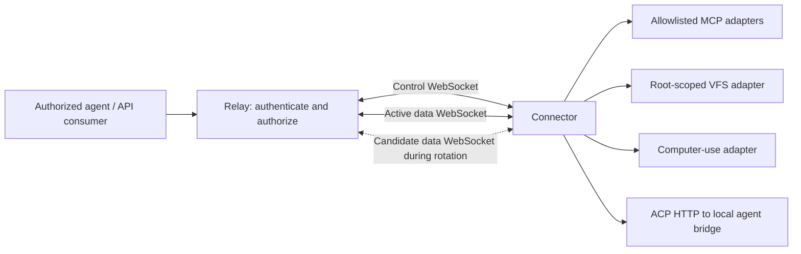
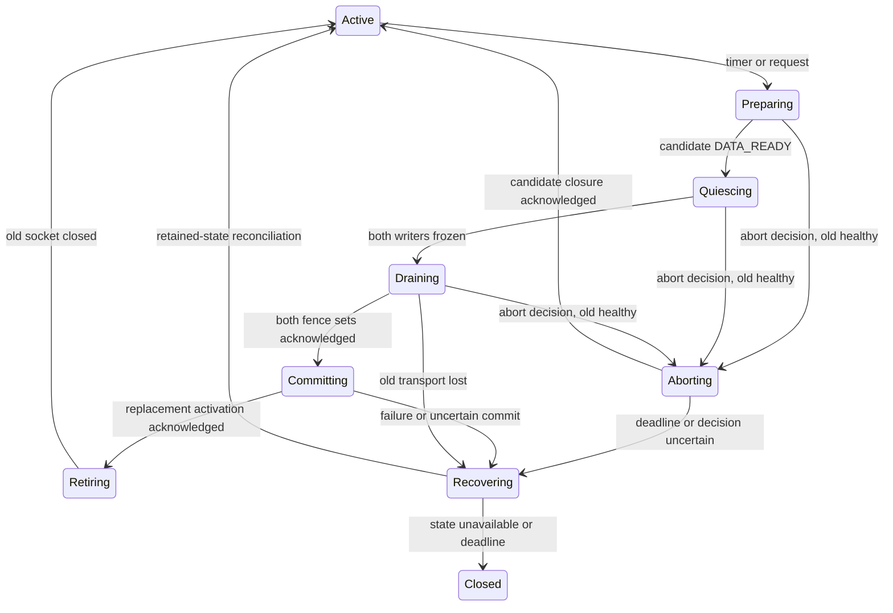

# Tunnel protocol and data socket rotation

Status: the full rotation and recovery protocol below is the M2 design. M1 implements the bounded codec and the finite echo profile described here; its acceptance result is recorded in [m1-harness.md](m1-harness.md).

## M1 finite echo profile

M1 negotiates `m1-control-data`, `authorization-challenge`, and `echo`. It uses exactly one control and one data socket. Each admitted logical stream starts each direction at sequence 1. A request is one DATA frame followed by FIN; the response contains one or two DATA frames (at most 65,536 request bytes plus a 256-byte device canary), followed by FIN. The relay completes the HTTP result only after receiving the response FIN. ACKs are cumulative transport receipt evidence and cannot acknowledge a sequence not assigned by the sender.

M1 rejects gapped or duplicate DATA/FIN, DATA after FIN, and stale session/generation/context fields. It has no replay, rotation, reconnect, or resume feature. A correctly sequenced RESET can abort an open direction; the finite profile rejects RESET after that direction's FIN. Control CANCEL remains available for a pending operation. A queued-frame authorization deadline failure interrupts the socket pair, since silently dropping an assigned frame would create a sequence gap. A fresh connection establishes new session/stream identities. M2 must implement the richer FIN/RESET, duplicate fingerprint, retained terminal, and replay rules below before generic adapters or rotation use them.

**The finite echo on an M2 session** (task rows M7-C92 and M7-C93). The same one-request exchange also runs over an M2 session, where the connector admits it as a stream and journals its `OPEN` like any other. It is therefore bound by the [OPEN retry horizon](#open-retry-horizon-and-journal-reclamation): its journal entry and terminal stream are released only by the owner's `STREAM_FORGET`, and without one a session serves at most 128 finite echoes. The owner forgets a finite echo under the same rule as any stream. It does so only after the connector's FIN was received in sequence and delivered, and after the connector's cumulative ACK has reached the owner's own FIN. It never forgets while a rotation or recovery holds the roster. Because the owner's direction is exactly DATA at sequence 1 carrying the body and FIN at sequence 2, its final cursor evidence is fixed by the body length, the `OPEN` windows and that ACK. A `REJECTED` answering the `OPEN`'s own message ID is forgotten with the no-stream proof, as for any refused `OPEN`. During a rotation a finite echo is a roster member like any stream. Its owner fence is its FIN once DATA and FIN were queued, and nothing before dispatch. An authorization result that arrives while the writer is frozen is held and applied after COMMITTED or ABORTED, so no DATA or FIN passes the fence. An echo that completes after QUIESCE keeps its fence and drain acknowledgement for that attempt, and its `STREAM_FORGET` follows the attempt.

**Every other exit of a finite echo** (task row M7-C94) -- a connector RESET, a CANCEL, an authorization invalidation from either side, a failed dispatch, a consumer that went away, or the operation timeout -- answers the consumer at once but keeps the exchange in the owner's roster until the same two proofs hold. The owner acknowledges the connector's own terminal, FIN or RESET, as it arrives, and discards response bytes nobody will read. If the owner had already dispatched DATA and FIN, its direction is complete. If it had not, it ends its direction itself with `RESET(CANCELLED)` at sequence 1 once the connector is known to hold a stream (its OPENED or its authorization challenge), and never authorizes that stream. That RESET is a sequenced frame, so it waits for a frozen writer to resume. The exchange is forgotten under the rule above once the connector has acknowledged the owner's terminal. The relay RESET's proof is `last_emitted` 1, zero bytes and a RESET terminal. A REJECTED still takes the no-stream proof. An exchange that still lacks its proofs after 60 s means the peer has stopped making progress: the connector ends an admitted stream by its own deadlines. The owner then closes the session (`UNARY_ABANDON_TIMEOUT`) and does not retain the exchange any longer. Before M7-C94 each of these exits dropped the entry. That permanently spent a connector retention slot, and a later connector frame for the stream failed the whole session as `UNKNOWN_STREAM` or `INVALID_RESET`. An exit inside a freeze also dropped a roster member.

## Connection model

A **connector** runs on a computer and opens outbound connections to the **relay**. Each online connector has two WebSockets in steady state:

1. A control WebSocket for authentication, capability discovery, stream creation, cancellation, heartbeats, configuration and rotation coordination.
2. A binary data WebSocket multiplexing the payloads of all admitted logical streams.

Data rotation briefly requires one additional data WebSocket. The maximum is therefore **two steady-state sockets, three during a bounded transition**, per connector. The default rotation interval is five minutes, configurable per connector within relay policy. An exact two-socket maximum would require closing the old data socket before establishing its replacement, producing a delivery pause. That is a different policy and is not the proposed v0 default.

A stream belongs to an authenticated connector session, not to a particular physical data socket. Rotating a socket does not restart an in-flight MCP exchange, a file transfer, or a computer-use operation. Tunnel sessions are internal transport state and do not imply that every MCP protocol version has an MCP session identifier.

Consumer-facing protocols are separate from this internal transport. The planned Axum relay provides authorized MCP, filesystem, computer-use and [ACP HTTP](acp.md) gateways. The [filesystem API](filesystem-api.md) uses authenticated HTTP GET discovery and a 9P2000.L WebSocket data endpoint, with explicit SDK adapters for supported consumers. A native Files SDK HTTP gateway is deferred; HTTP discovery does not imply native compatibility with that SDK. Consumer WebSockets and relay-to-relay HTTP/3 connections are outside the connector's control/data socket count. Consumers do not receive connector credentials or internal data-attachment tickets.

Connectors require no inbound public ports on the controlled computer. A durable per-account cloud environment can host an authorized consumer or the relay, but durability of that environment does not itself make transport or application operations durable.

## Identity, ownership and routing

These identifiers have different meanings:

| Identifier | Meaning |
| --- | --- |
| `tenant_id` | Authorization and quota boundary; a personal account may have its own tenant. |
| `principal_id` | Authenticated user or service account acting within a tenant. |
| `connector_id` | Registered computer/connector identity; stable across reconnects. |
| `session_id` | Random identifier for one live connector session. |
| `epoch` | Monotonically increasing per-device ownership fencing value within the deployment incarnation; see the full owner token in [cluster.md](cluster.md). |
| `generation` | Monotonically increasing data attachment attempt within an epoch; failed attempts consume a generation. |
| `connection_id` | Random 128-bit identifier for one physical control or data WebSocket, bound to its session, epoch, role and, for data, generation. |
| `stream_id` | Relay-allocated logical stream identifier, unique within a session and never reused there; stable through data rotation. |
| `direction` | Explicit endpoint role: `relay_to_connector` or `connector_to_relay`; never inferred from which cluster node received a frame. |
| `operation_id` | Application request identity used to track completion and side effects. |

The relay derives tenant and principal from validated credentials. A client-supplied tenant, connector or stream identifier is never sufficient authorization. Every consumer request is authorized for its tenant, target connector, adapter and operation. One user can control several connectors; several users can receive grants to the same connector; unrelated tenants remain isolated. Concurrent consumers have independent stream and operation identities.

Only one control owner is active for a connector at a time. A replacement connection with valid reconnect credentials acquires a greater epoch atomically. Frames, tickets and control messages from an earlier epoch are rejected, including messages from a previously partitioned connection that becomes reachable again. An unrelated second process presenting the same connector identity must receive an explicit conflict unless the replacement policy and credentials authorize takeover; it must not silently split ownership.

Cluster ownership is part of the first usable core. Both device sockets route to the same session owner, directly or through authenticated relay peers. [Cluster design](cluster.md) defines HTTP/3 peer mTLS, Redis-distributed server public-key records, ownership leases and fencing. Peer authentication does not grant tenant access or replace stream admission. The owner serializes stream and rotation state; an ingress proxy must not originate independent sequence numbers. Owner process loss ends its in-memory sessions; Redis durable-catalog persistence does not provide transport continuity.

## Bootstrap and attachment

1. The Rust CLI connector establishes the control WSS connection with **mutual TLS**: verify the relay server certificate and present an enrolled device client certificate. The relay verifies its trust chain, identity, validity and revocation before WebSocket upgrade. See [runtime and CLI design](runtime.md). HTTP headers claiming a certificate identity are not an authentication substitute.
2. `HELLO` advertises supported protocol major/minor versions, connector identity and supported transport features. The relay authenticates and negotiates a common version before allocating stream resources.
3. `WELCOME` returns the session, epoch, negotiated limits, heartbeat policy, effective rotation policy and an opaque reconnect credential. It also returns a short-lived, single-use attachment ticket for the initial data generation.
4. The connector opens every initial, candidate and recovery data WSS connection using mTLS with the same enrolled device identity. An authorization header carries the attachment ticket. The owner consumes it atomically, verifying expiry and binding to tenant, connector, device certificate public-key fingerprint, session, epoch, generation, connection ID and intended data endpoint. The ticket supplements mTLS; neither alone authorizes a data attachment.
5. The relay reports `DATA_READY` on the control channel after the attachment is accepted. It accepts streams only once an active data socket is ready.

Attachment tickets cannot create a control session, select a different tenant or generation, or be reused. A reconnect credential also supplements device mTLS and must match the original active device credential binding; it never bypasses certificate verification or revocation. Tickets and reconnect credentials are redacted from logs. Retry after an ambiguous attachment failure closes the uncertain transport before a fresh attachment attempt with a new ticket, generation and connection ID.

## Control messages

Control messages use bounded UTF-8 JSON WebSocket messages for initial inspectability. Every message has `type`, a unique `message_id`, and, after bootstrap, `session_id` and `epoch`. Request/reply pairs use `reply_to`. Unknown required fields or unsupported message kinds yield a structured protocol error; optional extension fields can be ignored only as negotiated by version policy.

| Message family | Purpose |
| --- | --- |
| `HELLO`, `WELCOME`, `ERROR` | Authentication, version and limit negotiation. |
| `CAPABILITIES` | Advertise adapter identifiers and supported operations, subject to relay authorization. |
| `OPEN`, `OPENED`, `REJECTED` | Admit a stream with its adapter, operation identity, metadata and initial flow-control windows. |
| `STREAM_FORGET` | Owner-ordered reclamation of terminal stream/tombstone state, serialized with drain snapshots. |
| `CANCEL`, `CANCELLED`, `RESULT_STATUS` | Best-effort cancellation and explicit operation lifecycle status. |
| `PING`, `PONG` | Check control health independently of data traffic. |
| WebSocket Ping/Pong (transport frames, not control messages) | Relay liveness check on the device control socket (M6-C68). The relay sends a WebSocket Ping every 10 s (`DEVICE_CONTROL_PING_INTERVAL`). **Device obligation:** answer each WebSocket Ping with a Pong, or send some other frame, so that at least one inbound frame reaches the relay every 30 s (`DEVICE_CONTROL_IDLE_TIMEOUT`). Otherwise the relay ends the session and records closure cause `liveness_timeout`, releasing the owner slot as a device close does. |
| Authorization challenge/confirmation | Independent, delay-safe device grant freshness with a five-second ceiling; see [cluster.md](cluster.md). |
| Ownership challenge/confirmation | Challenge-bound lease confirmation and connector dispatch permission, as specified in [cluster.md](cluster.md); distinct from a heartbeat. |
| `ROTATE_REQUEST`, `ROTATE_PREPARE`, `DATA_READY` | Request rotation, authorize one candidate and establish its readiness. |
| `ROTATE_QUIESCE`, `ROTATE_FROZEN`, `ROTATE_DRAINED` | Freeze stream admission/writers, exchange immutable per-direction fences and prove both old directions drained. |
| `ROTATE_COMMIT`, `ROTATE_COMMITTED` | Select the already-drained replacement and acknowledge activation. |
| `ROTATE_RETIRE`, `ROTATE_RETIRED`, `ROTATE_COMPLETE` | Close the old transport, report closure and finish the attempt. |
| `ROTATE_ABORT`, `ROTATE_ABORTED` | Discard an uncommitted candidate and acknowledge coordinated old-socket resumption. |
| `RESUME`, `RESUMED` | Reconcile retained stream sequence state after a recoverable connection loss. |
| `GOAWAY` | Stop admitting new streams and begin bounded shutdown. |
| `PRINCIPAL_SESSIONS_END` | Owner to device, advisory (task row M3-16): one consumer's authorization for one service ended, so the export ends that consumer's application sessions. See below. |

**`PRINCIPAL_SESSIONS_END`** (task row M3-16, applied by default pending owner confirmation, 2026-09-25) carries `message_id`, `session_id`, `epoch` (decimal string), `service_id`, `principal_binding` and `reason` (`AUTHORIZATION_REVOKED`). The binding is the opaque 32-hex-digit value the relay already puts on each of that consumer's requests to a session-keyed export (M3-04, [mcp.md](mcp.md#the-principal-binding)); the message never names an identity. The owner relay records, per device session, each consumer it admitted to such an export (at most 64 per session; one past that keeps working and falls back to the export's idle expiry). It re-reads each one's grant from the catalog about once a second. When the grant is gone, expired or no longer allows `http:invoke`, it sends the message once and stops watching. A catalog read that fails ends nothing. The device ignores a message for another session or epoch, and otherwise ends every session the named export holds for that binding: a stdio session's child process group is killed, and a Streamable HTTP export forgets the backend sessions it bound to it. Nothing else is touched, and a second message ends nothing. The message is **not** the authorization decision, which the relay enforces on every request independently. It is not journaled or replayed, and a device session that ends first takes the watches with it; either way the affected sessions fall back to the export's `session_idle_seconds`. A connector that predates the message would refuse it as an unknown kind and end its whole session. The owner therefore sends it **only** to a connector that advertised `principal-sessions-end-v1` in `HELLO`'s `features` (this repository's M2 connector does). For any other connector the revocation is counted as `principal_sessions_end_unsupported`, and its sessions fall back to idle expiry. On the same revocation, the owner refuses any request of that consumer held across a rotation freeze (M3-15), with `Forbidden`, `not_dispatched`, counted as `refused_on_revocation`, so the request is not admitted after the freeze with the grant it was held with. Watched grants are re-read at most 32 at a time per relay, each about every 1 to 1.5 s (a 1 s interval plus up to 500 ms of jitter).

`OPEN` names an advertised adapter and an allowed operation, not an arbitrary local executable, filesystem root or network URL. The connector independently enforces its local allowlist. Adapter metadata is bounded and validated before work starts.

Control-plane state changes are idempotent for an identical `message_id` within a bounded retention period. A reused identifier with different contents is a protocol error. The relay is the only rotation coordinator: the connector may request rotation, but cannot independently commit a competing generation.

An identical pending `OPEN` coalesces with the original request and retains its
original operation and authorization deadlines. After admission, an identical
retry replays only the exact retained `OPENED`; a refused request replays its
retained `REJECTED`. The first admission queues `OPENED` and its independent
authorization challenge atomically. Retrying `OPEN` never issues or replays an
authorization challenge and never refreshes a grant. A new message ID cannot
replace an existing stream or reuse a forgotten stream ID.

The connector's OPEN journal is separate from the data replay budget. Its
canonical requests and retained wire replies have explicit byte charges, at
most the smaller of the configured queue budget and 4 MiB; its total active
entries and tombstones are limited to 128. Uncompacted journal entries also obey the retained stream-table limit of
twice the negotiated active stream limit, capped at128. Nonterminal streams
separately obey the negotiated active limit. The connector counts a stream
against that limit until it has ended its own direction, which it does only
after processing the owner's terminal frame. That frame travels on the data
socket and the next OPEN on control. So the owner counts a stream against the
device's active limit until it has received the connector's own FIN or RESET,
and an OPEN until OPENED or REJECTED settles it (task row M7-C109). Before
that fix the owner released the slot at its own terminal latch. It could then
upgrade a consumer whose OPEN the connector refused "stream limit reached",
and that consumer saw a 101 and then a bare Close instead of the typed,
retryable `STREAM_LIMIT` refusal before the upgrade. Retained terminal streams cannot
consume a free active slot, and each journal entry reserves its future tombstone slot.
Authenticated, operation-matched `STREAM_FORGET` releases retained reply bytes
after the carrier barriers, including for refused requests with no stream.
Canonical tombstones remain bounded, and are released at the OPEN retry
horizon defined below. The journal
never evicts a known ID to admit a new one; exhaustion requires an explicit
resource-exhausted/fresh-session outcome. A permanent retention failure must
not wait indefinitely as if it were temporary writer backpressure.

### OPEN retry horizon and journal reclamation

The owner may retry an `OPEN` message ID only while the connector still
retains that request's entry. The horizon is the owner's own authenticated
`STREAM_FORGET` for the stream and operation that message ID named. Issuing it
is the owner's irrevocable assertion that the entry is reclaimed: it carries
final cursor/terminal evidence, the owner holds no drain or replay reference
to the entry, it is serialized with QUIESCE, and the entry is excluded from
every later snapshot. An owner that could still retry the `OPEN` has not
finished with the stream and must not have sent the `STREAM_FORGET`. Epoch
change, owner change and session loss end every message ID's retry window with
the session that scopes the journal. A connector may therefore release a
journal entry — canonical request, retained reply bytes and tombstone — once
the `STREAM_FORGET` naming its stream and operation has completed its carrier
barriers. The owner publishes a stream's `STREAM_FORGET` as soon as the stream's
own close makes it provable, rather than at the session's next inbound frame
or maintenance tick (M3-31). Reclamation is still not ordered before any later
`OPEN`: a sequential client can have its next requests admitted while earlier
entries wait for their FORGET's barriers, so the number of unreclaimed entries
at any instant is a latency, not a count a client's request pattern fixes.
A session's journal is then bounded by its unreclaimed entries
rather than by the number of streams it has ever admitted, which is what makes
"idempotent for an identical `message_id` within a bounded retention period"
an explicit period for `OPEN` rather than the whole session lifetime.

Releasing the entry does not weaken the guarantees the journal exists for:

- **No duplicate dispatch.** The predicate is a monotonic per-session
  watermark: the highest stream ID whose reclamation has completed. An `OPEN`
  naming a stream ID at or below that watermark, for which the connector holds
  no live stream and no retained entry, is refused `STREAM_EXISTS` before
  admission and before journaling, whatever message ID it carries. A retry
  after the horizon is therefore refused rather than dispatched a second time.
  The refusal is deliberately **not** journaled: the owner has already
  forgotten that stream and will never forget it again, so a retained entry
  for it could never be released, and a rule-violating owner could otherwise
  leak one entry per refusal until the session wedged at `RESOURCE_EXHAUSTED`.
  A stream ID the session still retains keeps its journaled refusal, which its
  own `STREAM_FORGET` releases.
- **No resurrection.** A new message ID still cannot reuse a forgotten stream
  ID at or below the reclamation watermark, and the owner never reuses a stream
  ID within a session.  An ID refused before it was journaled stays above the
  watermark and is admissible to a later `OPEN`: it was never dispatched, so
  that is a first dispatch rather than a resurrection.
- **No fabricated result.** The refusal is the connector's own typed
  `REJECTED`. The connector never replays or invents an `OPENED` for an entry
  it no longer holds. After the horizon it can no longer distinguish a retry
  from a reused message ID carrying different contents, so it refuses such a
  request instead of reporting a conflict; the owner must not reuse a message
  ID within a session.
- **Reclamation stays owner-ordered.** The connector releases nothing on its
  own timer, and nothing before the barriers that already authorize
  compaction.

A `STREAM_FORGET` is authenticated before anything else is decided about it,
including whether it is benign: a message naming another session or a stale
epoch is a protocol error whatever stream ID it carries. An authenticated
`STREAM_FORGET` is benign and idempotent, with no state change, when it names
a stream the connector has already reclaimed, one it refused without
journaling because its retention was exhausted, or any ID at or below the
reclamation watermark. The watermark is a benign condition in its own right
because the owner allocates stream IDs monotonically within a session and can
consume one without ever naming it in an `OPEN` — a control encode or a full
control queue can discard the message — so an ID below the watermark was
allocated by this owner in this session even when the connector never saw it.
A `STREAM_FORGET` naming an ID **above** the watermark that this session never
retained remains the protocol error it is.

The control and data sockets are independent, so an owner's `STREAM_FORGET`
can legally overtake the owner's final data-channel ACK for the connector's
terminal. A connector whose proof fails **only** because that ACK (or bounded
carrier-control debt) is still outstanding retains the message for one bounded
revalidation window (5 s, an absolute deadline that neither a duplicate
message nor a barrier retry extends) and revalidates it as data progresses.
The proof is validated before the clock is consulted, so a proof that is
complete when it is examined completes even if its last evidence arrived after
the deadline; the deadline bounds retention, not safety. A proof still
incomplete at the deadline ends the session, and nothing is reclaimed. That
failure is **not** a protocol violation when everything except the owner's
final ACK already holds -- the owner's sender evidence, the receive-side
match, the sequence reconciliation and the owner snapshot's own invariants,
with only the connector sender's pending-ACK state and that ACK's queued
carrier control treated as satisfied. Missing evidence is what a stalled or
lossy device produces: a process stopped (a monotonic clock keeps running
through SIGSTOP, so the deadline has passed when the process resumes and can
fire before the buffered ACK is read), or a data path gone, including a host
suspended long enough for the relay's 30 s idle eviction, after which the ACK
never arrives. (A suspended host's monotonic clock does not advance on macOS
or Linux, so suspend reaches this only through that eviction.) The connector
cannot distinguish missing evidence from a relay that never sent the ACK. It
is a retryable transport failure, and the successor session starts with an
empty journal, so nothing is replayed; the relay answers exchanges that were
still in flight with an explicit unknown execution outcome (task row M6-C105).
Evidence that **contradicts** the proof -- a mismatched cursor, byte count,
terminal or identity -- or an owner snapshot that is invalid in itself stays a
non-retryable protocol error, before or after the window.

The connector also keeps a bounded monotonic record of reclaimed stream IDs,
which covers the IDs it refused before journaling them: those can be above the
watermark, since nothing was ever forgotten for them. That record is held as
disjoint ranges. Its range count is **not** bounded by the tracked-entry cap:
a gap can be a stream the session still retains, but it can equally be an ID
the owner allocated and never named in either an `OPEN` or a `STREAM_FORGET`,
so sustained control-queue pressure can open arbitrarily many gaps. The bound
is enforced rather than derived: an implementation that would exceed its range
limit coalesces its lowest gap and counts the coalescence in payload-free
diagnostics. Coalescing can only make the record more permissive about an ID
it never saw, never less, and never permissive about admitting one; every ID
it absorbs is below the watermark and therefore already benign, so the counter
is an observability signal about control-queue pressure and not a safety
condition.

**Known limitation.** Because the refusal predicate is a watermark rather than
an exact set, an `OPEN` that is still waiting in the connector's bounded
admission queue when a *later* stream ID is forgotten is refused
`STREAM_EXISTS` if it reaches admission afterwards, even though it was never
dispatched. The owner sees a typed refusal and no dispatch, so no operation is
duplicated or lost ambiguously; the request is simply refused where it could
have been admitted. This predates journal reclamation and is unchanged by it.

Exhaustion keeps its meaning for genuinely concurrent work. A session whose
live entries reach the tracked-entry cap still refuses admission with
`RESOURCE_EXHAUSTED` and the fresh-session outcome. The connector also
carries that outcome out itself (task row M7-C95). Suppose it refuses an OPEN
because its journal is full or its retained stream table is full. While the
negotiated active limit of streams is live the session is busy, not wedged,
so the clock restarts at every check; it counts only from the last check at
which fewer streams were live. It restarts rather than stops (task row
M6-C196): a session whose retention filled while it was at its live limit
still gives up once those streams end unreclaimed, without waiting for a
later OPEN to be refused.
If no entry is then reclaimed for longer than the rotation overlap deadline
plus one handshake budget plus 5 s, it ends the session with the typed,
retryable `RESOURCE_EXHAUSTED` (`OpenRetentionFull`). The owner withholds
`STREAM_FORGET` only while a rotation holds the roster, and that window is
bounded, so a longer stall is retention the owner will never reclaim. Any
reclamation restarts the clock. The clock counts only time during which the
connector is reading control (task row M6-C148): while back-pressure has
stopped control reads (the critical-control spill lacks headroom, task row
M6-C120), the `STREAM_FORGET`s that would reclaim retention cannot be read,
so the clock is paused, and when reads resume the paused time that fell
inside the exhaustion is credited back. The rule therefore bounds how long
a session may stay exhausted *while reading control*, not its total wall
time. Paused time is bounded separately, per spilled item: every critical
control spilled while reads are stopped carries a 5 s deadline, and one that
expires before the writer takes it ends the session as a retryable transport
failure. A supervisor such as `connect` then starts a
fresh session, whose journal is empty. What no longer exists is a
lifetime ceiling: an unattended long-lived session serves an unbounded number
of sequential streams.

Decoded pending OPEN requests use a separate bounded pool. Each retained
request reserves its parsed strings, metadata tree, authorization clones and
conservative allocation overhead; dropping the pending request releases that
reservation exactly once. Duplicate requests reuse the existing reservation
and deadlines. The pool is capped by the configured queue budget and the
negotiated stream count times a hard per-request estimate. This cap, the
journal cap and the data replay/output cap are separate; the configured queue
value is not a single combined process-memory limit.

Every attempt-bearing rotation phase identifies `rotation_id`, owner, epoch, old/new generation and old/new connection ID. `ROTATE_REQUEST` carries only the currently active session, owner, generation and connection; the owner allocates the candidate attempt identity in `ROTATE_PREPARE`. Acknowledgements apply only to that exact attempt and phase. Encode 64-bit control counters as decimal strings so consumers cannot lose precision through JSON numbers. Bounded tombstones reject stale messages after an attempt finishes; expired context requires explicit recovery, never inference from a reused ID.

For a fresh normal-phase message, `reply_to` must bind the preceding message
below before state changes. Identical message-ID retries use the retained
journal, including after completion; a fresh ID cannot replace an already
accepted phase message. Retain completed attempt context through its original
deadline even when a later attempt begins.

| Message | Required `reply_to` |
| --- | --- |
| Owner QUIESCE | Owner PREPARE |
| Connector FROZEN | Owner QUIESCE |
| Owner FROZEN | Connector FROZEN |
| Connector DRAINED | Owner FROZEN |
| Owner DRAINED | Connector FROZEN |
| Owner COMMIT | Connector DRAINED |
| Connector COMMITTED | Owner COMMIT |
| Owner RETIRE | Connector COMMITTED |
| Connector RETIRED | Owner RETIRE |
| Owner COMPLETE | Connector RETIRED; empty only for a forced completion whose connector RETIRED never arrived (see Retire) |
| Owner ABORT | Empty: unsolicited coordinator decision |
| Connector ABORTED | Owner ABORT |
| Final owner ABORTED | Connector ABORTED |

The owner can measure its local writer fence first, but queues its FROZEN
message only after the connector's FROZEN identity is known. Neither endpoint
waits for peer fences before flushing its own old writer.
One request can produce multiple phase replies over time: the owner's FROZEN
and DRAINED both bind the connector's FROZEN. Its bounded response journal
therefore retains an ordered reply prefix and appends each new reply by its
own message ID. An identical append is idempotent; the same reply ID with
different bytes is a conflict. A request retry replays the retained prefix
without repeating state transitions. Appending never extends the deadline
or evicts an earlier unexpired reply.

## Proposed binary data framing

Each WebSocket binary message contains exactly one tunnel frame. WebSocket-level fragmentation is handled by the WebSocket library before tunnel parsing. Reject text frames and malformed lengths on the data socket. Compression is disabled initially to avoid uncontrolled decompression costs and cross-request compression state.

The proposed v1 header is 64 bytes, with unsigned integers in network byte order:

| Offset | Bytes | Field |
| --- | ---: | --- |
| 0 | 4 | Magic `ATUN` |
| 4 | 1 | Protocol major version |
| 5 | 1 | Frame kind: `DATA`, `FIN`, `ACK`, `WINDOW_UPDATE` or `RESET` |
| 6 | 2 | Negotiated flags |
| 8 | 2 | Header length, initially 64 |
| 10 | 2 | Reserved; zero |
| 12 | 8 | Session epoch |
| 20 | 8 | Data generation |
| 28 | 8 | Stream ID |
| 36 | 8 | Sequence number, or zero for unsequenced housekeeping frames |
| 44 | 8 | Cumulative acknowledgement of the opposite direction |
| 52 | 8 | Absolute cumulative byte limit for the opposite direction; meaningful on `WINDOW_UPDATE` |
| 60 | 4 | Payload length |

The data WebSocket is already bound to a session and connection ID by mTLS and its attachment ticket; no user-provided routing field can change that binding. Header epoch and generation must match the receiving socket's binding. The physical connection ID stays in authenticated attachment/control state and diagnostics rather than expanding every data header.

`DATA`, `FIN` and `RESET` are sequenced independently in each direction of each stream, starting at one. The exact ordered-delivery/deduplication key is **`(session_id, stream_id, direction, sequence)`**. Epoch, data generation and connection ID validate the carrier; they do not create a fresh sequence space. A retained stream's counters never reset during rotation, data recovery or an explicitly supported control resume. Stream 7's sequence 10 has no ordering relationship to stream 8's sequence 10, or to sequence 10 in its opposite direction. There is no global data ordering across streams.

A `FIN` consumes a sequence number and half-closes its direction after all preceding data. The receiver delivers contiguous frames to the adapter only once, holds bounded gaps, and never delivers data after `FIN`. Track `last_emitted`, `peer_acked`, `recv_contiguous` and `delivered_contiguous` separately per stream/direction. Retain sequence metadata through the corresponding drain/replay window. Stream identifiers and counters never wrap; exhaustion produces an explicit scoped error. A duplicate sequence with different content or terminal meaning is a protocol error while its comparison state is retained; a sequence already delivered can never be dispatched again.

`ACK` acknowledges the greatest contiguous sequence retained by the receiver or already handed to the adapter; a reset tombstone can instead acknowledge bytes deliberately discarded under that explicit terminal state. It does **not** acknowledge successful application execution or durable storage. Duplicate/delayed ACKs cannot decrease progress; an ACK of an unsent sequence is a protocol error. `RESET` terminates adapter delivery without undoing a submitted operation. It consumes one sequence, participates in fences/ACK/replay, and may follow FIN solely to reset the stream; no DATA/FIN follows either terminal state. At most one RESET is emitted per direction. FIN has no payload; RESET carries one unsigned 16-bit reason code in network byte order and uses reserved terminal-frame capacity, not application byte credit. Its frame count and bytes still count against hard session limits, so exhausted credit cannot prevent bounded termination or create unlimited RESET traffic.

Local reset stops adapter work immediately, retains a tombstone and accounts for any pre-reset in-flight peer frames in sequence as terminal discard. Receipt of peer RESET initiates local RESET if none has been emitted/queued; this closes both sequence directions without an endless reset exchange. Local cancellation may stop work before its queued RESET is transmitted. Terminal state and receive cursors remain until both directions' outstanding frames are accounted for. Only the owner initiates reclamation using `STREAM_FORGET`, carrying final cursor/terminal evidence. The connector retains even zero-frame REJECTED tombstones until that ordered message; it validates the evidence before releasing state. The owner serializes FORGET with QUIESCE and excludes an entry from a snapshot only when its FORGET precedes QUIESCE. An active drain/replay reference prohibits reclamation.

`WINDOW_UPDATE` advertises an absolute cumulative DATA payload byte limit, scoped to stream and direction. Only increases extend credit; duplicate and delayed updates are harmless. A sender counts newly sequenced DATA bytes against that limit across all generations, while replay consumes no additional credit and terminal frames use the reserved capacity above. The receiver grants additional credit when adapter consumption releases buffer capacity, within the session-wide budget. Initial limits are exchanged during stream admission. Counters never wrap; exhausting their range closes the stream explicitly.

Application encodings are negotiated by adapter capability. MCP, filesystem and computer-use operations keep their own schemas; large objects use bounded data frames. The filesystem WebSocket profile carries ordered 9P2000.L bytes. ACP's HTTP binding uses [http-forward/1](http-forwarding.md) and the application bridge defined in [acp.md](acp.md), preserving its request bodies and response streams without making application JSON-RPC IDs into tunnel sequence IDs. WebSocket frame boundaries do not imply application message boundaries. Every adapter defines bounded reassembly, request/response correspondence and terminal results.

### Filesystem profile: 9P2000.L over WebSocket

One authorized consumer filesystem WebSocket maps to one logical, bidirectional tunnel stream and one Rust 9P server session for a selected filesystem export. The tunnel's existing binary header remains unchanged: 9P length-prefixed records are opaque payload bytes that may span tunnel frames. The adapter uses 9P's own little-endian framing inside those payloads; the outer tunnel header remains network byte order. Negotiate and enforce a bounded 9P `msize` before accepting other requests, and bound both record reassembly and the number of outstanding tags. See the [upstream 9P message format](https://9fans.github.io/plan9port/man/man9/intro.html).

The consumer authenticates to the gateway before opening the filesystem stream. The authorized export is selected at admission; a 9P `uname`, `aname` or caller-chosen path cannot confer access to a different tenant or filesystem root. The local Rust server enforces root confinement and operation permissions independently of the relay. File paths, names, attributes and file contents travel on the data channel as 9P records, not as unbounded control messages.

9P fids, request tags and negotiated session state belong to the logical filesystem session and remain intact through scheduled data socket rotation. The relay neither duplicates `Tattach` nor reconstructs fids during cutover. Tunnel sequence deduplication prevents replayed transport frames from dispatching the same 9P record twice within the retained session. An operation's internal identity is separate from a reusable 9P tag.

The first filesystem profile restores no fids across a consumer WebSocket reconnect, control-session reconnect or adapter/connector/relay process restart: terminate that filesystem session, fail pending calls explicitly and create a fresh 9P session. Generic tunnel resume support must not silently opt the filesystem adapter into stronger recovery guarantees. Replacement of a failed data socket may preserve the filesystem session only while the same control owner and all ordered stream state are retained.

`Tflush` requests cancellation of an outstanding request; neither transport cancellation nor a flush response promises to roll back a filesystem mutation that already happened. Honor a normal response that arrives before `Rflush`, including any state changes it confirms, and do not reuse the original request tag until `Rflush` arrives. The server must preserve these [upstream flush ordering semantics](https://9fans.github.io/plan9port/man/man9/flush.html). If a write or rename outcome becomes ambiguous after a transport or process failure, the just-bash adapter reports that ambiguity and does not blindly resubmit the operation in the new session. Compatibility tests must cover flushing in-flight operations, tag reuse, fid lifetime and reads/writes spanning rotations.

## Rotation state machine

Use monotonic time. Initial policy values are a 300-second rotation interval, a 10-second candidate attachment deadline and a 30-second total overlap deadline measured from the start of the candidate WebSocket connection attempt, including its handshake. Configuration must satisfy `0 < handshake_timeout < overlap_timeout < rotation_interval` and relay limits; the negotiated effective values are visible in `WELCOME`. Scheduling jitter, if enabled, is explicit in that policy. Timer-driven rotation, configuration changes and operator requests all enter the same state machine. The repository's initial configuration scaffold validates these values; the state machine described here remains planned implementation work.

Both endpoints enforce a local monotonic deadline; the coordinator starts its budget when issuing preparation, conservatively before the dial, and the connector starts no later than beginning its dial. Messages carry remaining budget, never an extension or a wall-clock comparison. Quiescing, draining, committing and the old WebSocket close handshake all share the original overlap budget.

| State | Live sockets | Transition |
| --- | --- | --- |
| `Connecting` | Control plus at most one connecting data socket | Initial `DATA_READY` enters `Active(g)`. |
| `Active(g)` | Control + data `g` | Allocate one fresh generation `n > g`; enter `Preparing(g,n)`. |
| `Preparing(g,n)` | Control + old data + at most one candidate | Old data serves streams; candidate readiness permits quiescing, not payload cutover. |
| `Quiescing(g,n)` | Control + both data sockets | Freeze OPEN admission and both old sequenced-frame writers; exchange immutable stream fences. |
| `Draining(g,n)` | Control + both data sockets | Receive and ACK through every old-socket fence in both directions; candidate carries no sequenced frames. |
| `Committing(g,n)` | Control + both data sockets | Only after both drain proofs, select `n` and obtain its activation acknowledgement. |
| `Retiring(g,n)` | Control + new data + closing old data | New data serves retained streams while the old transport closes within the original deadline. |
| `Active(n)` | Control + data `n` | Old transport is gone and the rotation attempt is complete. |
| `Aborting(g,n)` | Control + old data + closing candidate | A known uncommitted attempt returns to `Active(g)` only after both endpoints release candidate resources. |
| `Recovering` | At most one control and two data transports | Freeze admission, reconcile retained stream state or explicitly fail affected operations. |
| `Closed` | None | Lease expires, authentication fails, shutdown completes or recovery is impossible. |

### Scheduled handover: prepare, fence, drain, commit, retire

1. **Prepare.** The owner issues `ROTATE_PREPARE` with one fresh generation, connection ID and single-use ticket. Repeated requests coalesce. Old data remains active while the candidate completes mTLS, attachment and readiness. Candidate readiness alone never authorizes DATA/FIN/RESET.
2. **Quiesce admission.** The owner's session state machine serializes `OPEN` admission with `ROTATE_QUIESCE`. It pauses new OPEN requests and fixes a `snapshot_id` and bounded stream roster containing all live, pending-admission and unreclaimed terminal entries. OPEN already sent is ordered before QUIESCE on control; the connector must account for it even if OPENED is in flight. Unknown or missing roster entries fail the attempt. New requests wait in the owner's bounded admission hold described below; nothing is sent to the connector for them until the freeze ends.

   **Admission hold across the freeze** (task row M3-15; owner decision, 2026-09-25). A new request that reaches the owner while an attempt is frozen (`Quiescing`, `Draining`, `Committing` or `Aborting`) is held by the owner and runs ordinary admission once the freeze ends, so a scheduled rotation is invisible to a consumer that does not retry. Two kinds are held: a consumer stream OPEN (the echo stream, `http-forward/1` and the filesystem upgrade) and a finite unary echo. The hold is a bounded FIFO, not an open-ended queue. It lasts at most 1.5 s, never more than the negotiated rotation handshake budget, and never more than half of any deadline that waits on the held request: the relay's operation timeout, on a cluster relay the peer idle timeout, and for the filesystem upgrade the client's handshake budget (the descriptor's `requestTimeoutSeconds`). It holds at most 8 requests per device (never more than the device's stream limit), 64 per tenant and 256 per relay. A held stream OPEN carries no request bytes. A held unary echo carries its body, at most 64 KiB. Those bytes are **not** charged to the session's `queue_budget`: the echo is charged only when it is dispatched. Instead they are bounded by the hold's fixed ceilings, at most 512 KiB per device, 4 MiB per tenant and 16 MiB per relay. Nothing held is in the roster or reaches the device, so the roster fixed at QUIESCE and the two-socket steady state are unchanged. Each held request leaves the hold once, with an explicit outcome:

   | End of the hold | Consumer outcome |
   | --- | --- |
   | The attempt commits (`ROTATE_COMMITTED`) | Ordinary admission on the new carrier, in arrival order, after the writes frozen at the fence are flushed |
   | The attempt aborts and the old carrier resumes (final `ROTATE_ABORTED`) | Ordinary admission on the old carrier, after its frozen writes resume |
   | The attempt enters recovery | Ordinary admission, which gives the existing fault refusal (owner-not-ready; `RESOURCE_EXHAUSTED` for a unary echo) |
   | The freeze outlasts the bound | `503 ROTATION_FREEZE`, `not_dispatched`, `retryable`, `retry_after_ms` 250, `Retry-After: 1` (the filesystem endpoint: `503 ROTATION_FREEZE` in its own error body, with `Retry-After`) |
   | The consumer goes away | Dropped; nothing reached the device |
   | The device session ends or is replaced, or the relay shuts down | The existing fault refusal, `not_dispatched` (owner-not-ready; `DEVICE_OFFLINE` for a unary echo); a successor session never inherits a held request |

   An OPEN that arrives while the hold is full gets the same `ROTATION_FREEZE` answer at once. That code is used only for the scheduled freeze, so a consumer or gateway can retry it without other evidence. The owner-not-ready fault states (no active carrier, an unfenced cluster owner, an unknown owner write, recovery) keep their existing `503 PEER_UNAVAILABLE` body and are never held. On a cluster the owner decides the hold, because only the owner knows its session's rotation phase; a forwarded request's refusal reaches the ingress through its own `rotation_freeze` peer admission marker and the consumer still sees `ROTATION_FREEZE`. The relay snapshot's `rotation_freeze_hold` counts held requests and how each left the hold (commit, abort, recovery, bound, cancellation, session loss, cap), without payloads. Every relay in a cluster must run the same version with the same operation and peer idle timeouts; see [cluster.md](cluster.md#scheduled-data-rotation-and-the-admission-hold).
3. **Freeze each writer.** Each endpoint stops accepting additional old-generation DATA/FIN/RESET into its writer. It finishes already queued old frames and flushes that writer before reporting `ROTATE_FROZEN`; no sequenced frame can be emitted on old after this local barrier unless the coordinator explicitly aborts the attempt. New adapter output, including a later FIN/RESET, stays bounded and applies backpressure until activation or abort. For each roster entry, FROZEN records the local direction's `last_emitted` fence, zero if none, including any emitted FIN/RESET. Both immutable fence sets reference the same snapshot and rotation attempt.
4. **Drain both directions.** Receivers continue accepting old frames through the advertised peer fences. ACKs, credit updates, heartbeats and cancellation remain responsive; they do not extend deadlines. A control FROZEN marker can arrive before old data, so it is not a drain proof. Each receiver sends `ROTATE_DRAINED` only when its contiguous receive cursor reaches every peer fence. DRAINED carries the snapshot/peer-fence reference and corresponding cumulative ACK cursors. The sender validates these against its emitted state. The owner requires both DRAINED proofs and acknowledgement of every sequence through both fence sets. There can be no gap below a fence. Neither endpoint sends sequenced frames on the candidate during drain.
5. **Commit.** The owner records the decision for this attempt in its live session state, enables candidate reception and sends `ROTATE_COMMIT` referencing both drain proofs. The connector validates the phase and proofs, activates candidate reception, sends `ROTATE_COMMITTED`, then resumes its writer on `n` (task row M7-C98: before that fix the connector held its writer until `ROTATE_COMPLETE`). A connector frame on `n` can therefore reach the owner before `ROTATE_COMMITTED`, because the sockets are independent. The owner enabled candidate reception before COMMIT, so it receives that frame in order and acknowledges it on `n`. The connector's FROZEN fence binds only the old carrier. After COMMITTED the owner keeps it for the attempt, but the connector's new sequences on `n` continue above it and are not a fence violation. The relay resumes its writer only after that acknowledgement. New sequences follow the old fences without resetting counters; FIN already emitted remains terminal. A scheduled successful drain requires **no replay** of the drained prefix.
6. **Retire.** The owner sends `ROTATE_RETIRE`. Both sides close the old WebSocket and send `ROTATE_RETIRED` identifying its connection ID only when their old transport is closed. WebSocket Close/Close acknowledgement maps to transport retirement, never to stream FIN or operation completion. `ROTATE_COMPLETE` ends the attempt after retirement evidence; deadline-forced closure is recorded distinctly. Retirement evidence is the connector's own `ROTATE_RETIRED`, which the owner never fabricates, or, only after the absolute overlap deadline has force-closed the old transport, the owner's forced closure itself. The owner waits at most one further handshake budget after that deadline for the connector's attestation; if it has still not arrived, the attempt completes on the forced closure alone with `ROTATE_COMPLETE` marked `forced`, an empty `reply_to`, a distinct missing-retirement reason and a distinct diagnostic record, and any later `ROTATE_RETIRED` for that attempt is stale and ignored. That grace bounds only the wait for a control message, never the old transport's lifetime, and it does not extend any budget. Long-lived streams, fids, HTTP responses and operations continue on `n` without reopening their adapters. No next candidate is admitted while old transport resources remain; after a forced completion the owner's old transport resources are already released, and a connector that still holds its half is required by its own deadline to force-close it before the next attempt.

All stream entries, including cancelled/reset tombstones, stay in the drain roster until that attempt completes. Cancellation can stop adapter delivery while the transport still receives and accounts for old bytes in order. A stream's FIN or cancellation must not remove an unacknowledged prefix from the snapshot. Final-state reclamation requires both directions' outstanding frames to be accounted for and no drain/replay reference; admission stops when the negotiated tracked-entry cap is full. Roster and fence messages must fit both the entry cap and the control-message byte cap. There is no unbounded snapshot pagination.

**Drained means a transport prefix is safely retained, delivered or terminally discarded at the receiver.** It does not require adapter consumption, durable storage, HTTP completion or the end of a long-running operation. Drain moves the transport boundary of an open stream; it does not wait for that stream to close. ACKs and application completion remain separate.

### Abort, deadline and loss during handover

- **Known uncommitted attempt, old healthy:** only the owner chooses `ROTATE_ABORT`. Close the candidate and retain all stream counters/credits. The owner enables old reception before issuing ABORT; ABORT records a decision, not candidate-closure evidence. The connector enables old reception, fully releases its candidate transport resources, replies `ROTATE_ABORTED`, and keeps old writes frozen. After that acknowledgement and its own confirmed candidate closure, the owner sends a final `ROTATE_ABORTED` whose `reply_to` is the connector acknowledgement ID. The owner queues and journals this final confirmation before resuming old writes; the connector resumes old writes only after validating it. Both acknowledgements identify the exact abandoned candidate. Duplicate requests replay their cached response without repeating closure or changing the original deadline. No fresh attachment begins earlier. This explicitly releases the attempt's freeze; bytes already emitted stay in the same sequence space. A later attempt uses a fresh generation/snapshot and newly measured fences. An abort never rewinds cursors or reuses identities, and must complete before the original deadline. If the old transport is lost while the abort is in flight, the abort decision becomes uncertain: the final owner `ROTATE_ABORTED` is never sent (it would resume writes on a carrier that is gone), the candidate is closed, both abandoned connection identifiers enter the recovery closure delta, and the owner enters retained-state recovery with a fresh greater generation exactly as for old-transport loss before drain. A `ROTATE_ABORTED` that arrives after the episode began names an attempt the session no longer owns and is ignored.
- **QUIESCE crossing a candidate loss:** the owner sends `ROTATE_QUIESCE` once the candidate is data-ready, so the connector can observe its candidate close (or its dial fail) while that QUIESCE is already in flight. A connector that holds the closure of the exact attempt the QUIESCE names, awaiting the owner's decision, accepts the QUIESCE without applying it: it has no candidate to barrier, and admission and old writes are already frozen. It sends nothing for it; the rotation journal keeps it as a pending entry, so a retransmission is a pending duplicate. The owner's `ROTATE_ABORT` then settles the attempt as above, and if no ABORT arrives the overlap deadline ends the attempt in recovery. A QUIESCE whose attempt matches neither a pending, an installed nor a just-closed candidate is still a protocol error (task row M2-07).
- **Commit uncertain:** a connector timeout is not permission to resume old writes. If COMMIT may be in flight or the control connection is unavailable, remain quiesced and enter recovery. The owner's serialized decision prevents both ABORT and COMMIT for one attempt. A stale message cannot change that decision; an accepted commit is never rolled back to `g`.
- **Old transport fails before drain completes:** do not declare a successful drain or discard an unacknowledged prefix. Close failed/candidate transports as needed to preserve the socket bound and enter retained-state recovery with a fresh greater generation. The original overlap deadline still retires the abandoned attempt.
- **Committed replacement fails:** retire the old transport within the deadline; never promote it again. Recover with a fresh greater generation and retained stream cursors, or fail explicitly.
- **Absolute overlap deadline:** after commit, forcibly close any old transport still lingering. An unfinished abort or drain cannot resume old at timeout: force-close both attempt data transports and enter retained-state recovery with a fresh greater generation, or fail. No slow stream, retransmission, close handshake or duplicate message extends the budget. A candidate attachment failure before this deadline may still complete a safe coordinated abort.

Retained-state recovery exchanges two fixed `RESUME` messages, one for each logical direction, before enabling payload admission. Each message carries at most 128 stream entries with decimal `stream_id`, `last_emitted`, `peer_acked`, `recv_contiguous`, `delivered_contiguous`, `sent_bytes`, `received_bytes`, `send_credit`, `receive_credit`, and compact FIN/RESET terminal evidence. Terminal sequence numbers are derived from `last_emitted` and `recv_contiguous`; a terminal without its corresponding nonzero cursor is invalid. The retained replay floor is derived as `peer_acked + 1` exactly when `last_emitted > peer_acked`, and is absent after all emitted sequences are acknowledged, so a missing retained prefix cannot be hidden by an omitted counter. Receiver progress must not be lower than any ACK the sender has already observed; missing receipt/deduplication state prevents safe resume. Replay **only** the missing range above the reconciled contiguous receive cursor through the sender's last emitted sequence, from retained bounded buffers, using original stream IDs/sequences and the new carrier epoch/generation. Duplicate arrivals never dispatch an adapter record again and replay consumes no new logical credit. Missing retained bytes, conflicting terminal state or exhausted recovery deadlines fail affected streams, with `outcome_unknown` where side effects may have occurred. Both direction messages and every roster entry remain within the 32 KiB control bound; recovery does not use unbounded snapshot pagination.

#### Recovery control handshake

The surviving authenticated control socket carries recovery. Control loss ends
the session in M2. Only the relay coordinates recovery; a connector reports
data loss with a current-context ROTATE_REQUEST whose reason is `data_loss`.

1. The relay sends RECOVERY_BEGIN with a fresh attempt, a fixed `episode_id`,
   attempt number 1..3, exact stream roster and remaining budget. One absolute
   30-second episode deadline includes resource closure, attachment, replay and
   readiness. Each endpoint retains its own monotonic deadline; subsequent
   messages can shorten but never restart or extend it.
   A queued RESUME carries the sender's earlier remaining-duration sample.
   Validate that sample as nonzero and within the protocol bound; it does not
   replace the receiver's established absolute episode or candidate deadline.
   ROTATE_PREPARE establishes the candidate deadline, capped by the retained
   episode. An expired candidate rejects RESUME before journal updates or replay,
   even when control input arrives before the maintenance timer runs.
2. Both endpoints freeze admission and application writes and close every
   abandoned data carrier. RECOVERY_CLOSED is sent only after local reader,
   writer and dial tasks have released those resources. Its sorted connection
   list is checked against the prior allocated set. A canonical role-specific
   digest binds the attempt, episode, attempt number and closed IDs. Both sides
   retain both closure records; their fixed-order combined digest binds the
   next attachment. An empty list is valid only when the recorded set is empty.
   The list is a per-attempt closure delta: on attempt 1 it contains the
   currently allocated abandoned carriers; on a retry it contains only the
   newly released candidate since the preceding authenticated closure pair.
   Connection IDs from earlier pairs remain authenticated in the immutable
   recovery fence/history and cannot be reattached, but they are not repeated
   on the next wire list. This keeps each closure message within the physical
   bound while making every retry's failed candidate explicit.
3. Only after both closure records agree does the relay issue ROTATE_PREPARE
   with attachment purpose `RECOVERY`, episode/attempt number and the combined
   closure digest. The one-use ticket record binds that purpose and complete
   attempt as well as the existing session, owner and device mTLS identity.
   `ROTATION_CANDIDATE` is the distinct scheduled purpose. DATA_READY identifies
   the exact prepare message and candidate context; it is not permission for
   new application traffic.
4. The relay sends two RESUME messages with stage `SNAPSHOT`, one per logical
   direction. The connector returns matching RESUMED messages after validating
   the complete pair and exact roster. Both endpoints retain the initial
   emitted fences and derive replay from their sequence state. The candidate
   admits only those retained replay ranges and housekeeping while this round
   runs. Replay never allocates a new operation or new logical credit.
   Initial snapshots establish immutable obligations: each local receive
   cursor must cover the peer's emitted fence, and each local emitted fence
   must be acknowledged. The peer's SNAPSHOT receive cursor is itself that
   acknowledgement. Each endpoint applies it as a cumulative ACK once the
   complete SNAPSHOT pair has reconciled, never before and never for a pair
   that fails reconciliation: the connector when it queues its replay, the
   relay when it prepares its replay plans, before READY. An ACK for a frame
   received on the failed carrier can die with that carrier, and a peer with
   nothing to replay and frozen writes sends no later frame to carry another
   (M6-C163). Track progress against those fences; do not compare
   an advanced acknowledgement cursor against a stale initial snapshot as if
   it were a new peer assertion. ACKs, window updates and in-range replay must
   remain processable before activation. Replay rides the candidate data socket and the
   peer's RESUMED rides control, so replay can arrive before the snapshot that
   classifies it; the relay holds such frames, bounded and charged with its other
   deferred frames, and classifies them when the snapshot arrives (task row
   M4-48). Credit is not reconciled by the snapshots, so each side reissues its
   whole cumulative receive credit on the successor at activation, and the relay
   retries a refused reissue from its tick until it is queued (M4-50, M4-52).
   Because a credit update rides data while a snapshot rides control, an update
   issued after a snapshot can arrive before it; a peer snapshot advertising
   **less** receive credit than this side already holds is therefore stale, not a
   conflict, and reconciliation accepts it without adopting the lower figure.
   A peer claiming **more** send credit than this side granted is still refused. Final reconciliation uses the fresh
   READY pair and verifies its terminal, credit and cursor evidence.
5. After its replay and received prefixes are accounted for, the relay sends
   both RESUME messages with stage `READY`. This is the coordinator's decision
   to accept normal candidate reception; it enables reception before sending
   them so data cannot race ahead of control acknowledgements. The connector
   waits for the complete pair and its own reconciled state, enables reception,
   and queues both RESUMED `READY` responses before resuming its writer. The
   relay resumes its writer only after both responses. READY carries no replay;
   emitted fences and sender terminal state cannot change from SNAPSHOT.
   Receiver terminal state may advance only consistently with replayed peer
   terminal frames. Message IDs, reply IDs, direction, stage and roster all
   remain bound to the same attempt. Uncertain readiness never permits a return
   to an abandoned generation.

A failed candidate is fully released before the next attempt. The first
attempt is eligible immediately after the closure and attachment barriers. If
it fails, the relay's owned recovery timer waits 100 ms before attempt 2 and
200 ms before attempt 3; those delays are measured from the completed preceding
attempt and cannot extend the immutable episode deadline. M2 permits at most
three physical attempts. Each attempt has fresh generation, connection and
attempt IDs, a new ticket and a new closure binding. The closure list on each
retry remains the per-attempt delta described above; prior authenticated IDs
stay fenced in the retained episode state. Exhaustion fails affected operations
explicitly, including unknown outcomes when necessary. Recovery cannot
accumulate sockets or silently reset the last successful rotation timestamp;
it is not a shortcut around the scheduled drain gate.

Rotation limits socket lifetime; it is not a substitute for authorization expiry or application credential rotation. Revoking a user grant, connector credential or capability takes effect independently of the five-minute timer.

A session retains every physical connection identifier it has claimed, including aborted and recovery candidates, in a bounded immutable history of 256 entries; identifiers are never evicted or reused because delayed closure evidence references them. The claim that would exceed that bound, whether for a scheduled candidate or a recovery attempt, is an explicit resource-exhausted outcome: the owner closes the session with the typed reason `CONNECTION_HISTORY_EXHAUSTED`, surfaces the used-history counter and terminal reason in its payload-free diagnostics, and the connector establishes a fresh session rather than continuing on a carrier that can no longer rotate.

## Delivery guarantees and side effects

Transport sequence tracking provides ordered, duplicate-suppressed delivery within a retained live session. It cannot provide exactly-once execution across process crashes or ambiguous application failures.

Track application operations separately using states such as `accepted`, `running`, `succeeded`, `failed`, `cancelled` and `outcome_unknown`. A terminal result identifies the operation and is retained for a bounded lookup period. An adapter can offer stronger retry guarantees only when it implements durable idempotency or a verifiable reconciliation mechanism.

For example, a click may have happened just before the connector crashed. A filesystem write may have reached disk before its result was lost. A generic MCP tool may have sent an email. The relay must report `outcome_unknown` where appropriate and must not automatically resubmit these operations under a new operation ID. A transport ACK does not resolve that ambiguity.

Read-only calls may be retried according to adapter policy. Non-idempotent calls require explicit application retry authorization or an adapter-specified idempotency key and deduplication guarantee. Cancelling a request is best effort and cannot reverse completed external effects.

## Failure and reconnect behavior

| Failure | Intended behavior |
| --- | --- |
| Candidate fails before commit | Coordinate abort and preserve old stream cursors if the old socket is healthy; uncertain decision enters recovery. |
| Active data socket fails while control is healthy | Stop payload admission, authorize a replacement generation and resume from retained sequence state. |
| Control socket is lost | Stop admitting operations and initiating new side effects; pause delivery from the data channel and fence stale traffic when a new epoch is acquired. Already executing adapter work follows its cancellation policy. |
| Control reconnect succeeds within retention window | With the same owner process and retained state, authenticate, acquire a greater epoch, replace attachments and reconcile bounded sequence/terminal state. Resume only adapters whose explicit contract permits an epoch change; the v0 filesystem mount ends instead. Owner change requires fresh sessions. |
| Lease or resume retention expires | Close data sockets, release bounded transport resources and expose terminal or unknown operation status as available. A later connection creates a fresh session. |
| Connector process restarts | A fresh session is required in v0. Surface unknown outcomes for in-flight side-effecting operations; do not pretend in-memory sequence state survived. |
| Session-owner relay process restarts or loses its fenced lease | Its sessions end; a new owner requires a fresh session. Other owners continue subject to cluster routing/lease health. No cross-owner transport replay is promised. |
| Selected owner is lost before or after admission | The relay never reselects an owner for the request, on any method, admitted or not: the request ends with one typed outcome (`not_dispatched`, `dispatched` or `unknown`) and no second dispatch. A GET, HEAD or OPTIONS shaped request at the POST-only echo route is a typed `405 METHOD_NOT_ALLOWED` / `not_dispatched` before authentication or owner selection. The only bridge across the owner change is a consumer-driven retry of a `not_dispatched` request, which performs a fresh authoritative owner lookup; see [cluster.md](cluster.md). |
| Service label matches more than one active service | Every path that resolves a service (public echo, public stream upgrade, owner-side peer ingress) uses one shared resolver and fails closed with the typed `409 SERVICE_AMBIGUOUS` / `not_dispatched` outcome before owner selection and before any body read. The relay never selects the first match; a consumer addresses one candidate by identifier instead. |
| Duplicate/stale socket attaches | Reject before binding or allocating stream buffers. |
| Malformed/oversized data | Reject before payload allocation where possible; reset the scoped stream or close the connection for framing/authentication violations. |

The recovery handshake above is in-session data-carrier recovery only: it requires the authenticated control socket, the same owner and connector actors, and retained logical stream state. It replaces failed data carriers inside that session/epoch; it does not reconnect the control socket, acquire a new owner, or recreate a session. Whole-session control reconnect, process restart, owner change, and recovery after retention expiry remain separate fresh-session lifecycle work and are not implemented by this retry path. A side-effecting operation that crosses one of those boundaries keeps its known/unknown result rules and is not automatically replayed.

Control recovery must preserve the total socket bound: close the old control transport before establishing its replacement; close any rotation candidate before establishing replacement data sockets. A valid new epoch invalidates old-generation tickets and sockets. Whether to retain an existing operation result is separate from whether its old transport remains authorized.

Heartbeats and timeouts are independent of rotation. Proposed defaults are a control heartbeat every 20 seconds and loss detection after 60 seconds without a valid response. A heartbeat does not renew ownership: the earlier owner-lease/connector dispatch-permission deadline in [cluster.md](cluster.md) fences work even if the socket remains reachable. The maximum retention interval, data replacement deadline and operation deadlines are explicit policy values. A stalled peer cannot keep a session or a privileged operation alive by sending unrelated bytes.

## Flow control and fairness

WebSocket transport backpressure alone is insufficient when many logical streams share one connection. Enforce both per-stream receive credit and a session-wide outstanding byte cap. Charge queued frames, quiesced new writes, reorder buffers and replay buffers to the same bounded memory budget. Candidate sockets do not receive a second full budget. Pausing data admission during drain must not pause reserved bounded capacity for ACKs, cancellation and rotation control. Reserved capacity makes a refused cancellation exceptional, not impossible: if a `CANCEL` for a pending operation still cannot enter the bounded control queue (slot bound reached or control writer gone), the relay fences the session with the typed `CANCEL_UNDELIVERABLE` close instead of discarding the refusal, because a device that never learns of the cancellation would keep executing an operation the consumer already treats as cancelled. The consumer's result stays `CANCELLED` with unknown execution either way; a delivered `CANCEL` leaves the session live and is sent exactly once per pending operation.

"Reserved bounded capacity" above has two separate dimensions, and the distinction was ambiguous until it was measured. Message **slots** are reserved structurally: control and data use separate bounded channels of `max_queue_messages` each, so data frames can never consume a control slot. Reserved **bytes** are carved out of the same `max_queue_bytes` session budget rather than held in a second budget: the relay reserves `4 * 32 KiB = 131,072` bytes (four control messages at the 32 KiB control bound, enough for a rotation's back-to-back pair plus a cancellation and a revocation close) for control-lane charges, and refuses every data-lane charge (pending request bodies, retained replay chunks, encoded data frames and reassembled response payloads) once the total charge would exceed `max_queue_bytes - 131,072`. Control-lane charges are refused only at the full `max_queue_bytes`, so the total bound stays a single explicit number, data admission can never consume the reserved control bytes, and a control message always has at least the reservation available while data is saturated. Data refusals keep their existing typed shape. **Flow-control frames are not data** (task row M4-37): the relay's `ACK`, its `WINDOW_UPDATE` and the `RESET` it sends in answer to a connector `RESET` are charged to the reserved capacity, up to the full `max_queue_bytes`, never to the data lane, because they are what releases data-lane pressure. They may therefore occupy part of the 131,072-byte control reservation -- at most one data channel's worth of 64-byte header-only frames, 8 KiB at the default 128 slots, each released as its socket task takes it -- so the guaranteed control headroom is the reservation less that bound, not four whole 32 KiB messages. If even that refuses one on a **live** carrier -- the full budget reached, or the carrier's bounded channel out of slots -- the frame is **owed, not dropped and not fenced** (task row M6-C160): an `ACK` is cumulative, so the relay keeps the highest refused `ACK` per stream on the carrier it belongs to and retries it before the next `ACK` and on every tick; a refused `WINDOW_UPDATE` is absolute credit and is reissued by the credit redrive (M4-29); a refused `RESET` answer stays the stream's pending terminal and is retried in order. Only when the carrier takes none of the owed `ACK`s for 5 s, or no refused terminal for 5 s, does the relay fence the session with the typed `FLOW_CONTROL_UNDELIVERABLE` (or `TERMINAL_FIN_TIMEOUT`) close, on `CANCEL_UNDELIVERABLE`'s reasoning: an acknowledgement or credit the device never receives can stall a stream forever. The `ACK` window restarts whenever an owed `ACK` reaches the wire; each refused terminal's window runs from that stream's own first refusal, so one stream's progress never extends another's. Every owed entry names a stream the session still retains, so the table is bounded by the session's retention: at most `2 × max_streams_per_device × 2` entries (256 at the defaults; M2 streams and unary echoes each retain at most `max_streams_per_device × 2`), and a session asked to owe more closes `FLOW_CONTROL_OWED_LIMIT`. An entry is dropped when its stream is no longer retained, or when a later `ACK` for the stream at an equal or higher sequence reaches any carrier. At a rotation commit each entry owed on the retired carrier is re-addressed to the activated carrier (new generation, same cumulative sequence) and re-sent there: the drain fence proves sequence cursors, not the connector's view of acknowledgements, so the `ACK` must still arrive. An owed `ACK` whose carrier closes is dropped silently; that is safe because carrier loss is detected and recovered on its own path and the connector replays any frame the relay has not acknowledged. A stream whose `ACK` is still owed is not offered for STREAM_FORGET, because the connector's forget proof needs that `ACK`. Before M6-C160 the first refusal fenced, so a momentarily full 128-slot data channel under consumer load (hosted MCP load at 32 closed-loop workers) ended the device session for every user. `REVERSE_CHANNEL_UNAVAILABLE` is reserved for a carrier whose receiver is gone. Receive credit a consumer read released while no carrier could carry its `WINDOW_UPDATE` is owed, and the owner pays it when a carrier becomes the active writer and on its periodic tick (M4-29). The configured minimum `max_queue_bytes` of 256 KiB is exactly twice the reservation. Before this reservation the state was reachable by arithmetic: with `max_queue_messages = 2 * max_streams_per_device` and one in-flight record per public consumer stream, `max_streams_per_device` concurrent records of 32,732 bytes each charged exactly `max_queue_bytes`, leaving zero control bytes; the same workload now admits 62 records against the `4,063,232`-byte data limit and every control class still enqueues. Session diagnostics expose `control_reserved_bytes`, `data_bytes_limit` and `data_bytes_high_water` (the highest total charge at which a data reservation was admitted) so a gate can prove that `max_queue_bytes - data_bytes_high_water` never fell below the reservation at the data-byte peak. See `verify-m7-queue-saturation` in [testing.md](testing.md).

Proposed starting limits, to validate through load testing:

| Resource | Initial limit |
| --- | ---: |
| Data frame payload | 64 KiB |
| Control message | 32 KiB |
| Concurrent streams per connector session | 64 |
| Tracked stream entries, including pending admission and terminal tombstones | 128, also subject to the control-message byte cap |
| Per-stream outstanding payload | 1 MiB |
| Session-wide outstanding payload across both directions | 8 MiB |
| Simultaneous rotation candidates per connector | 1 |

Also require configurable per-tenant/per-principal connector counts, stream admission and operation rates, aggregate bandwidth, maximum queued bytes, idle lifetimes and global memory limits. Reject excess work with a retryable overload response before starting side effects. Limits have hard ceilings even if a peer advertises larger values.

Schedule stream traffic fairly, with bounded priority for latency-sensitive actions. Large file transfers and screenshots cannot starve MCP replies or cancellation messages. Control queues themselves are bounded and rate-limited so control traffic cannot bypass quotas. A blocked adapter eventually exhausts its stream's credit, not the whole process's memory.

## Versioning and observability

Negotiate a common protocol major version during bootstrap; incompatible majors fail before data attachment. Minor versions add explicitly negotiated capabilities and optional fields. Reserved frame fields and unknown required flags are rejected until a version defines them. Keep protocol fixtures under source control and test supported version pairs.

Structured logs identify tenant, connector, owner, session, epoch, generation, connection ID, rotation ID, stream, direction and operation without recording secrets or payloads by default. Emit one event per state transition with its reason, negotiated deadline and outstanding fence/ACK counts. Record quiesce/drain/commit/retirement duration, forced old-socket closures, missing sequence ranges, replay bytes, duplicate frames, credit-blocked time, bounded queue use and unknown outcomes. Keep high-cardinality identifiers in traces/logs, not metric labels. Audit authorization decisions and computer-use/write operations separately. State-machine snapshots expose counters and phase history, never raw file, screenshot or tool content.

## Testable invariants

1. A connected connector has one control and one active data socket in steady state, with no more than one candidate data socket during transition.
2. Overlap never exceeds its configured deadline; repeated rotation requests cannot extend it.
3. Attachment attempt generations and acquired epoch values strictly increase; aborted attempts are not reused and stale owners cannot submit work after fencing.
4. A ticket attaches exactly once to its authorized tenant, connector, device certificate public key, session, epoch, generation and connection ID; it cannot replace mTLS or be exchanged for control access.
5. A frame cannot address a stream belonging to another connector or tenant, even when numerical stream IDs coincide.
6. Each `(session, stream, direction)` has its own persistent sequence space and delivers payloads in order at most once; changing physical sockets or generations cannot reset it or impose cross-stream ordering.
7. A long-lived stream can span multiple successful rotations without reopening the adapter operation or changing its operation ID.
8. Scheduled handover admits no candidate DATA/FIN/RESET before both drain proofs; recovery replays only missing retained ranges without new credit, duplicate delivery or excess memory.
9. Missing ACKs, sequence gaps, a slow receiver and repeated disconnects cannot grow buffers beyond negotiated limits.
10. An old socket cannot be held open by a stalled long-lived stream; bounded recovery produces either continuity or an explicit failure.
11. Transport acknowledgement is never reported as successful application completion; ambiguous side effects produce `outcome_unknown`.
12. Control loss stops new admission, and reconnect cannot create two concurrent owners or duplicate an operation under a new identity.
13. Unsupported versions, malformed frames, expired tickets and unauthorized operations fail before adapter invocation.
14. Many authorized users and connectors can operate concurrently while cross-tenant routing and capability access remain denied.
15. No old DATA/FIN/RESET is emitted after that writer's freeze until an explicit coordinated abort; new sequenced frames remain bounded/backpressured until activation or abort.
16. Commit requires both complete immutable fence sets and cumulative receipt through every fence, including pending-OPEN, half-closed and cancelled/reset entries; a control marker alone is insufficient.
17. Old transport retirement and its WebSocket close acknowledgement do not close logical streams or claim application completion. Drain does not wait for long-lived operations to finish.
18. An uncertain/accepted commit cannot roll back to old. Timeout either coordinates safe abort, retires an already-drained old socket, or enters explicit bounded recovery/failure.
19. The OPEN journal is bounded by its unreclaimed entries, not by the streams a session has ever admitted: sequential open/forget cycles far beyond the tracked-entry cap stay bounded, a retry for a live entry is still deduplicated, a retry after the OPEN retry horizon is refused without a second dispatch and without journaling the refusal, repeated post-horizon retries cannot fill the journal, a `STREAM_FORGET` for a reclaimed stream ID or one at or below the reclamation watermark is benign once it authenticates, and one for an unretained ID above the watermark is still a protocol error.

Validate these with pure state-machine/property tests, parser fuzzing, deterministic clocks, real-WebSocket integration tests and fault injection before/after every state transition. Race OPEN/OPENED, FIN, RESET/CANCEL, duplicate drain messages, ACK loss, candidate failure and control loss against freeze/commit. Delay control and data independently to prove that a FROZEN marker cannot hide a data gap. Test abort after quiesce followed by a new attempt with greater fences, all 128 tracked entries, exhausted queue credit, missing replay buffers, stale connection IDs and lost close acknowledgements.

End-to-end tests keep MCP requests, a checksummed file transfer, a streamed ACP HTTP response and a fake computer-use command stream active across repeated short-interval rotations, then inject stalled reads, duplicate frames, owner loss and process termination. Test each adapter's recovery restrictions separately; transport resume never silently strengthens its guarantees. An instrumented side-effect adapter must prove recovery cannot execute an ambiguous command twice.
